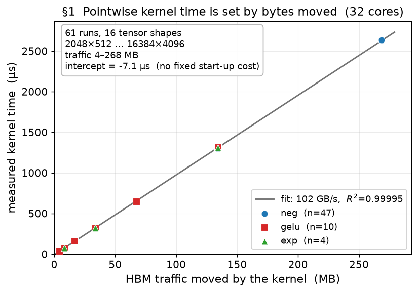
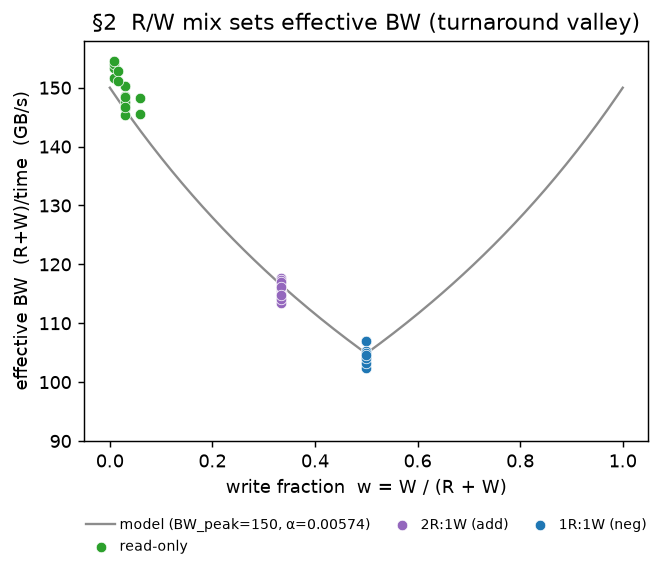
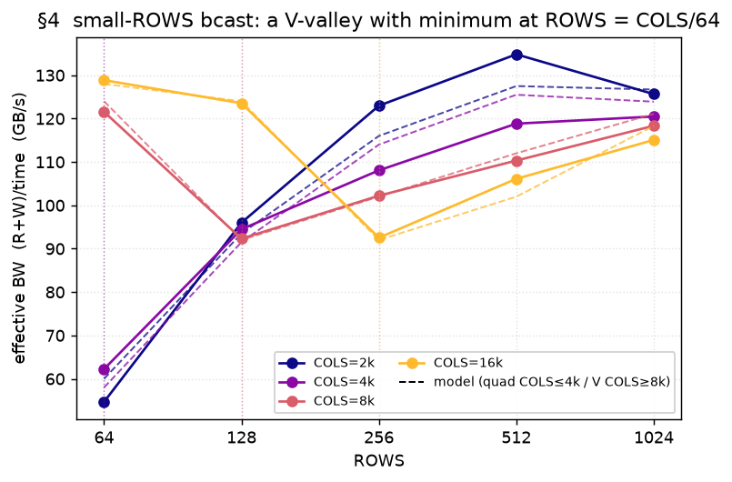
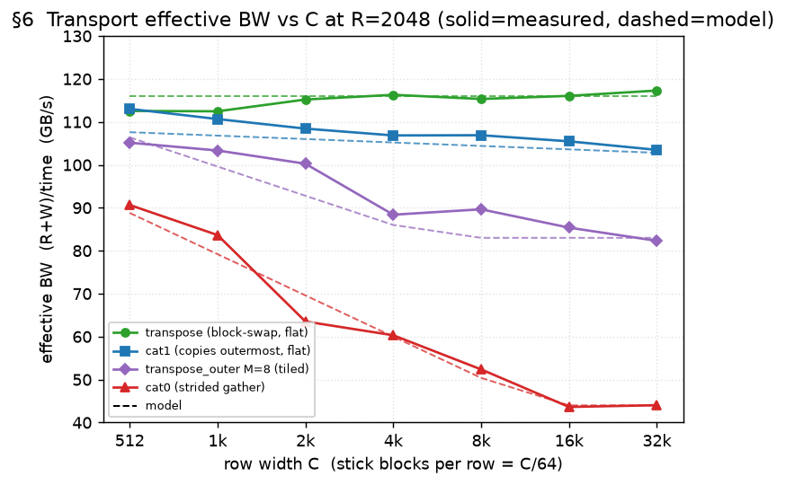
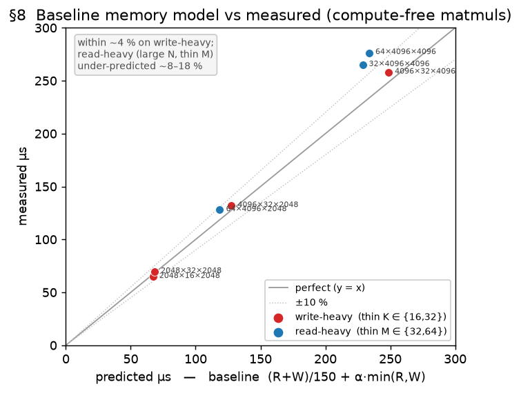
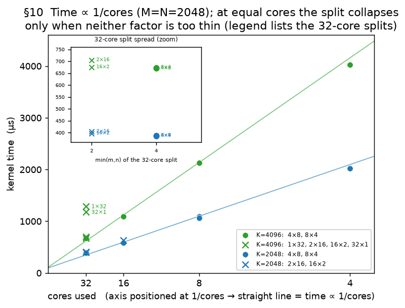
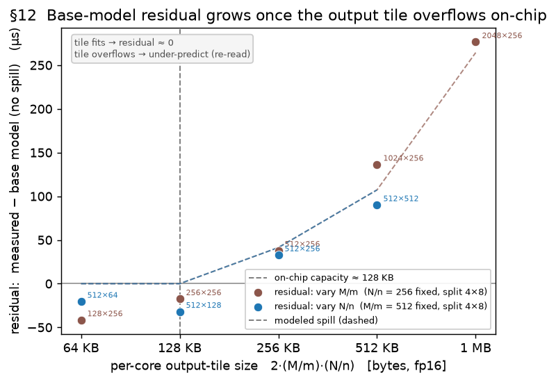
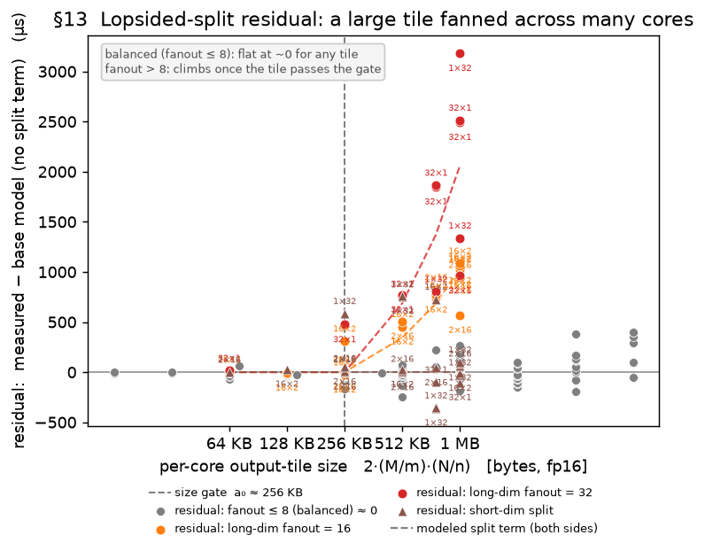
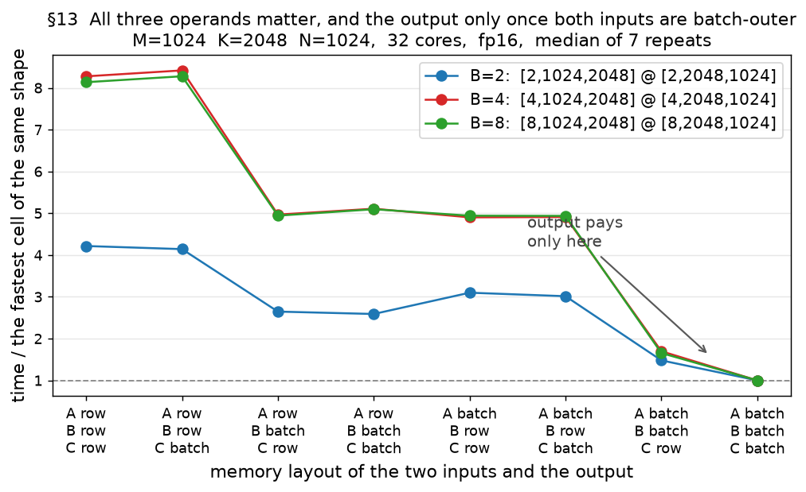
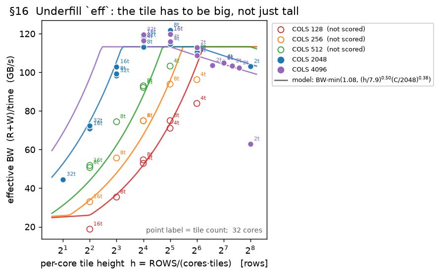

# Deriving a Cost Model for the IBM Spyre Accelerator

*An analytical model that predicts kernel runtime on Spyre from the loop-level IR, without
running it. This is the derivation: each term starts from an observation in the measurement
data, states the question it raises, and is settled by an isolation experiment before being
given a form. Every figure and accuracy number is regenerated from the live model against
`tools/cost_model/sweep_records.json`.*

---

## The ops we test, and the model at a glance

The model in full, with each term linked to the section that derives it. Parts I–IV give the
route: what was observed, what it raised, and what settled it.

### The data every number here is scored against

**2828 measurements recorded, 2023 in scope, 1563 scoreable.** Every accuracy figure in this report
is recomputed from the live model against the measurement database, so nothing here is
hand-typed. That database is **not committed**: it is measured device time and belongs to the
build that produced it (`tools/cost_model/records.py` explains how to generate one). These
figures were computed on a PyTorch 2.11 build, and kernel performance moves as the compiler
develops — a later spot-check measured 261 µs where this database has 390 µs for the same
softmax configuration, after an upstream change began pinning a shared graph input into LX.
Re-run the sweep and re-score to get numbers for your build.
Regenerate the per-section accuracy lines and tables with `python3 tools/cost_model/report_tables.py`, and the
figures with `python3 tools/cost_model/plot_report.py`.

The three counts differ for reasons worth stating. *In scope* applies the permanent exclusions
below. *Scoreable* additionally requires that a record carry enough information to be re-costed by
the **current** model — either the logged per-op features, or an I/O block the features can be
reconstructed from and verified against. Runs made before feature logging existed can still be
compared against the prediction baked into them at the time, but they cannot test a model that has
since changed, so they are excluded from every accuracy figure here.

Measured time is each record's `kernel_us`. (Runs that repeat a configuration also store a
`kernel_us_min`; it exists on only ~45 % of rows, so using it would quietly reduce every
population to a repeat-backed subset.)

Three classes of measurement are **permanently excluded**, so that a number quoted anywhere in
this report always refers to the same population:

| excluded | why |
|---|---|
| fewer than 8 cores | never a target regime, and the few points were confounded — core count moved together with per-core area and split fanout, so they could only have been fitted, not explained |
| a fused reduction narrower than 1024 columns | the reduced-axis length dominates that rate; the short-row corner is a different regime and drags the shape term toward a case we do not care about |
| two early logs with corrupted features | the same measured configuration is recorded with a 16× different per-core row count than in every later log. The *measurements* agree to 0.8 %, so only the features drifted — such rows cannot judge the model in either direction |
| the `write` outer product | `b[1,C] + c[R,1]` costs far more than its bytes, and the fitted surface that charged for it was removed as an unexplained black box (§4). Nothing models it now, so scoring against it measures a deliberate gap rather than the model. The runs stay in the database as the evidence |
| a coarse-tiled matmul whose work division is 16×2 or 2×16 | we do not choose that split — the coarse-tiling hint makes the planner pick it, and it sits far outside the point where the matmul/bmm compute rate was calibrated (one split, 4×8). A plain matrix multiply at the same splits is modelled well (10.8 % over 35 runs) and is deliberately kept |

**Accuracy of the single-operation model** (Parts I–III; coarse tiling is scored separately
in Part IV):

| section | n | RMS % | mean % | beyond ±10 % |
|---|---:|---:|---:|---:|
| Part I — single pointwise | 89 | 3.6 | −1.5 | 4 |
| §4 — broadcast operands | 234 | 5.0 | +0.1 | 14 |
| §5 — reduction | 97 | 7.2 | +3.0 | 14 |
| §6 — transport | 203 | 6.1 | −0.0 | 15 |
| §12 — matmul split shape | 318 | 29.8 | −25.7 | 291 |
| §13 — batched matmul | 135 | 38.6 | −28.9 | 92 |

Pointwise, reduction and transport sit inside ±10 %. The rest carry a **one-sided,
systematic under-prediction** — §12 at −25.7 % mean, §13 at −28.9 % — and the cause is
known: compute and memory are charged as `max(compute, memory)`, which assumes the shorter
of the two hides completely behind the longer. It does not, and nothing here charges for the
part that fails to hide (§10). A fitted coefficient used to absorb that residual and has been
removed; what it bought in absolute accuracy it cost in mechanism.

**Read these as relative numbers, not wall-clock predictions.** The error is an offset rather
than scatter, so the ordering survives it: rank correlation between predicted and measured is
+0.978 on §12, +0.947 on row-tiled matmul and +0.875 on §13. The model still picks the faster
of two plans; it will under-state how long either takes.

Two gaps worth stating plainly. **§7–10 has no scoreable data**: all 21 plain `mm` records
predate feature logging and carry no reconstructable I/O block, so the memory, compute and
overlap terms those sections derive are in practice validated through `mmwd` (§12) rather than
through `mm` itself. And there is no plain-`mm` IR dump on disk. Both are worth closing.

### The harness ops (what each benchmark actually runs)

| group | ops | torch expression |
|---|---|---|
| pointwise | `neg` `gelu` `exp` `mul` `add` `copy` | `-x`, `gelu(x)`, `exp(x)`, `a*b`, `a+b`, `x+1.0` (`copy` is a broadcast op) |
| reduction | `sumrow` `sumcol` `amax` `mean` `sumall` `read` | `sum(x,dim=1)`, `sum(x,dim=0)`, `amax(x)`, `mean(x,dim=1)`, `sum(x)`, `x` (pure read) |
| broadcast | `bcast` `mulbcast` `bcastcol` `write` | `a[R,C]+b[1,C]`, `a[R,C]*b[1,C]`, `a[R,C]+b[R,1]`, `b[1,C]+c[R,1]` |
| transport | `transpose` `transpose_outer` `cat0` `cat1` | `[R,C].transpose(0,1)` (the stick dimension is swapped into a row); `[R,8,C].transpose(0,1)`→`[8,R,C]` (swap the two **outer** axes, the innermost dimension `C` stays whole); `cat([x,x],dim=0/1)` |
| matmul | `mm` `mmwd` | `a@b`, with the work division either chosen by the compiler (`mm`) or forced by the harness (`mmwd`) |
| coarse-tiling | `softmax_row_tiling` `matmul_row_tiling` | `softmax(x,dim=-1)`, `a@b` — split into a loop so each step's working set fits in LX |

### One term to fix

**Effective bandwidth** here means bytes moved divided by time taken. It is not a hardware
constant: it is what a particular operation *achieved*, and most of this report is about why
it varies. Traffic is counted in the padded on-device layout rather than the logical tensor
size, because the padding is moved too.

### The model — full form

Per kernel, with `R` and `W` the bytes read from and written to HBM. Every term is shown; each is 0 / 1 when it
does not apply. The right column names the section where it is derived.

```text
T   = max( compute , mem ) + split          mem = HBM / (eff · s_lx)

  HBM     = [ (R+W)/BW + α·min(R,W) ]  +  spill  +  reread
  compute = MACs / cores / (peak · pt_eff)
  s_lx    = min(1, (cap / ws)^s)        for a coarse-tiled kernel with ws > cap    (else 1)
```

| term | form | derived in |
|---|---|---|
| `(R+W)/BW` | `BW` = 150 GB/s (pointwise and matmul); `BW_red(ROWS)=min(150, 114+61·e^(−ROWS/3700))·g(cores)` (row reductions; `g` is a derate for running on fewer than 32 cores, and is 1 on the full machine); per-op `BW_eff` for access-pattern ops | §1, §5, §6, §8 |
| `α·min(R,W)` | `α = 0.00574 ns/B` — read↔write bus **turnaround** (0 for one-directional traffic) | §2 |
| `spill` | `(A_bytes+B_bytes)·f(area)`, `area=(M/m)·(N/n)`, `f=min(1.5, max(0, 0.45·log₂(area/65536)))` — matmul operand **re-read** when the per-core output tile overflows on-chip capacity | §11 |
| `split` | `max(0,area−a₀)·[c_L·max(0,log₂(fan_long/8)) + c_S·max(0,log₂(fan_short/16))]`, `area=(M/m)·(N/n)`, `a₀ = 131072 elements`, `c_L = 2.6e−3`, `c_S = 2.9e−3 µs per element` — extra matmul operand re-read when a **large** per-core tile is **also** split many ways; two-sided (splitting the longer output dim bites sooner than the shorter); 0 for balanced or small tiles | §12 |
| `compute` | `multiply-accumulates / cores / (peak · pt_eff)`, `peak = 1140 per nanosecond per core`; a batched matmul (B≥4, cores≥8) in the compiler's default operand layout takes `peak = 160` instead; 0 for non-matmul. Combined with memory as `max(compute, memory)` — the two overlap | §9, §13 |
| `pt_eff` — **array fill** (derates arithmetic) | how full the arithmetic array is: `min(1,(rows/64)^0.35)` (`rows` = per-core rows); a coarse-tiled matmul's extra per-tile underfill is flagged, not modeled (`pt_eff=1`) | §9, §16 |
| `eff` — **pipeline fill** (derates memory) | `min(1.08, (h/7.9)^0.50·(COLS/2048)^0.38)`, `h = per-core tile height = ROWS/(cores·tiles)` — how full the memory pipeline is, set by the **size** of the tile a core streams, not its height alone; a tiled multiply keeps the older rows-only form `min(0.95, (h/13)^0.68)` | §16 |
| `s_lx` — **spill derate** (derates memory) | `min(1, (cap/ws)^s)` for `ws > cap`, `ws` (the working set one core holds) `= 2·(rows per core)·COLS·2 bytes`; `cap` = 512 KB and `s = 0.06` for a tiled reduction, 2 MB and `s = 0.15` for a tiled matmul — a per-core tile too large for LX moves at a lower rate | §17 |
| `moves` (scales **every** arg) | `Π over loop levels of (the loop's trip count if the tensor's address does not vary along the dimension that level tiles, else 1)` — how many times a coarse-tiled loop transfers each tensor; 1 when there is no loop | §14 |
| `reread` | `size · (moves−1) · 0.85` — the repeated pass a loop-invariant operand makes, charged at peak and exempt from `eff`/`s_lx` | §15 |

Per-operation effective bandwidth, in GB/s: transpose `116` (flat); the block-shuffling transports `cat0`/`transpose_outer`/
`cat1` share `clamp(a − b·log₂(C/64) − d·log₂R, floor, peak)` (falls with the number of sticks per row, `C/64`; §6); summing down each column `113`; the broadcast operations `118`. The compiler never divides the summed dimension across cores.

---

## Part I — Pointwise: the gold baseline

### §1. Pointwise kernels are memory-I/O bound

Pointwise ops are the simplest kernels on the device: read one or more tensors, apply an
elementwise function, write one tensor. We use them to establish the reference every later
op is measured against.

**Traffic** throughout means the bytes a kernel actually transfers to or from HBM.

**Observation 1 — time is linear in bytes, with no fixed cost.** Sweeping `neg`, `gelu`
and `exp` (each reads one tensor and writes one) across sizes, kernel time is a straight
line in traffic that passes through the origin:

| op | R×C | HBM traffic | kernel time |
|---|---|---|---|
| `neg` | 2048×1024 | 8.4 MB | 76.7 – 78.5 µs |
| `neg` | 2048×4096 | 33.6 MB | 317.6 – 322.5 µs |
| `neg` | 4096×4096 | 67.1 MB | 639.9 – 644.8 µs |
| `neg` | 2048×16384 | 134.2 MB | 1307.1 – 1311.5 µs |

A straight-line fit `time = a·bytes + b` over all 61 full-machine runs (4–268 MB,
16 tensor shapes) gives **R² = 0.99995**, a slope of **102 GB/s**, and an intercept of
**b = −7.1 µs**. The intercept is slightly *negative* and is 9 % of the smallest kernel
measured, so there is no fixed start-up cost to charge.

All runs here use the full machine (32 cores). Fewer cores move the same bytes more
slowly — at one core the intercept reaches +245 µs — which is a separate effect,
derived in §9.



**Observation 2 — the arithmetic is free.** `gelu` and `exp` compute far more than `neg`
does (`exp` is a transcendental function), yet at the same tensor size all three take the
same time:

| tensor | traffic | `neg` | `gelu` | `exp` |
|---|---|---|---|---|
| 2048×1024 | 8.4 MB | 76.7 – 78.5 µs | 77.3 – 78.5 µs | 77.6 µs |
| 2048×16384 | 134.2 MB | 1307.1 – 1311.5 µs | 1314.5 µs | 1310.4 µs |

The spread across the three functions is under 1 %, which is the run-to-run spread of a
single one of them. So the arithmetic contributes nothing measurable: **the kernel time is
set entirely by moving bytes.**

**Model.** `time = bytes / BW`. No arithmetic term, no fixed start-up cost.

**How well understood is this term?** *Fully.* Both claims are direct readings of the
measurement, and the mechanism — a kernel that streams memory and does trivial work per
byte is limited by memory — needs no assumption about the hardware.

One thread is left open. The fitted rate is 102 GB/s, but a read-only kernel reaches about
150 GB/s. So `BW` is not one constant. §2 explains what it depends on.

### §2. The read/write ratio changes the effective bandwidth

**Observation — one bandwidth is not enough.** §1 measured 102 GB/s on a kernel that reads
one tensor and writes one. A kernel that almost only reads runs far faster per byte.

Two quantities are used from here on. **Effective bandwidth** is simply the traffic
divided by the measured time, `(R+W)/time`, where `R` and `W` are the bytes read and
written. The **write fraction** `w = W/(R+W)` says how one-sided the traffic is: 0 means
read-only, 1 means write-only, 0.5 means balanced.

| traffic mix | example op | write fraction `w` | effective bandwidth |
|---|---|---|---|
| almost all reads | `sumrow`, `read` (reduce to a tiny result) | 0.03 | **147 GB/s** |
| 2 reads : 1 write | `add` | 0.33 | **116 GB/s** |
| 1 read : 1 write | `neg`, `gelu`, `exp` | 0.50 | **106 GB/s** |
| almost all writes | `write` = `b[1,C] + c[R,1]`, both inputs tiny | 0.95 | **144 GB/s** |

These come from one sweep that varies only the traffic mix, at a single tensor height
(2048 rows) so tensor size cannot confound the comparison. A single `BW` is therefore
wrong: the rate is highest when traffic runs one way, and lowest when reads and writes
are balanced.

**Question.** What makes balanced traffic slower per byte than one-directional traffic?

**Hypothesis.** HBM is a shared bus that pays a **turnaround** cost when it switches
between reading and writing. The penalty falls on the overlap `min(R,W)`, which is 0 for
pure read or pure write and maximal at a balanced 1:1:

```text
T = (R+W)/BW_peak + α·min(R,W)      ⇒   effBW = 1 / (1/BW_peak + α·f),  f = min(R,W)/(R+W)
```

This predicts a **symmetric valley**: the full rate at `w = 0` and `w = 1`, the minimum at
`w = 0.5`.



The two ends of the valley reach the **same height** — 147 GB/s reading, 144 GB/s writing.
Reads and writes therefore share one rate, so the model needs a single `BW_peak`, not a
separate read rate and write rate. The minimum sits at `w = 0.5`, exactly where `min(R,W)`
is largest.

**Model.** `time = (R+W)/BW_peak + α·min(R,W)`, with `BW_peak = 150 GB/s` and
`α = 0.00574 ns per byte`.

**How well understood is this term?** *Fully.* Bus turnaround is standard DRAM behaviour,
the predicted shape is symmetric and the measurement is symmetric, and the term vanishes
for one-directional traffic exactly as the mechanism requires. Nothing here is fitted
except the size of the penalty.

### §3. Reading a value another operation just wrote costs extra — a program-level condition

The two terms so far describe **one** operation. This section shows one thing they cannot
see, and states plainly that the model does not carry it.

**Observation.** Adding several tensors, `a + b + c + …`, is not a single instruction. It
compiles to a chain of two-input additions, each writing a result the next one reads. Every
one of those intermediate values is written to memory and read back, and the byte count
already includes all of it — so an `n`-way sum should cost exactly `n − 1` plain additions.
It costs more. At 2048 × 4096, where one addition takes 437 µs:

| sum | runs | predicted from bytes (µs) | measured (µs) | over |
|---|---:|---:|---:|---:|
| 3 inputs | 7 | 875 | 935 | +7 % |
| 4 inputs | 7 | 1312 | 1521 | +16 % |
| 5 inputs | 6 | 1749 | 2036 | +16 % |
| 6 inputs | 6 | 2186 | 2526 | +16 % |

**Question.** The extra bytes are already counted, so what is left?

**A control rules out the bytes.** Two *independent* additions, `(a + b)` and `(c + d)`,
move exactly the same bytes as the 3-input sum but have no dependency between them. They
measure 875 µs against a 875 µs prediction — **no margin at all**. The bytes are not the
problem; the dependency is.

**A second control rules out fusion.** Running the same dependent chain as three separate
kernels instead of one fused kernel gives 935 µs — the same as the fused version to within
1 µs. The penalty is present with or without fusion, so it belongs to the dependency, not to
the fused kernel.

**A third control identifies it.** Turning on the on-chip scratchpad keeps the
intermediate values in LX, so the chain no longer round-trips through HBM. The
same 3-input sum falls from 935 µs to **581 µs**, and the 6-input sum from 2526 µs to
**957 µs** — far below even the byte-count prediction, because most of the traffic has
stopped happening. Remove the round trip and the penalty goes with it.

**What it costs.** The excess grows with the length of the chain — about 0.14, 0.48, 0.66
and 0.78 extra additions' worth of time for one to four dependent reads — and the
separate-kernel version tracks it closely.


**Status — deliberately out of scope.** This is a cost *between* operations, and the model
in this report predicts *one* operation at a time. A single operation has no round-tripped
intermediate, so the term has nothing to attach to. It is recorded here because any future
model of a whole program must carry it, and because it is the same phenomenon as §17: a
value that does not fit in LX and therefore makes a trip to HBM. Every chained-sum
measurement is excluded from the accuracy figures in this report, and the exclusion is
stated wherever those figures appear.

### Part I data — every pointwise run

Predictions recomputed from the live model. Configurations measured more than once are
pooled to their median and the run count is shown, so a configuration measured many times
does not outvote one measured twice.

Over the whole population the model is **RMS 3.6 %, mean −1.5 %** across 89 runs, four of
them beyond ±10 %. Those four are not scattered: at the 32 cores the rate was calibrated
for, the model is **RMS 2.2 % over 85 runs with nothing beyond ±10 %**, and every one of
the four outliers was measured on a *fraction* of the machine — two at 8 cores, two at 16 —
all under-predicting by 13–15 %. The flat peak bandwidth is a full-machine number, and a
pointwise kernel evidently does not reach it on part of the machine, exactly as a reduction
does not (§5 needed an explicit core-count derate for the same reason). Four runs is far too
thin to fit one here, so it is recorded as a known residual; the deciding measurement is a
pointwise core-count ladder at fixed shape, which does not exist yet.

Two exclusions. Chained sums (§3) are multi-operation dependent chains, not single
operations, and their read-after-write cost is a program-level effect this model does not
carry. Adding a constant is excluded too: it lowers to an addition against a resident
constant, which makes it a broadcast operation, reported in §4.

| operation | n | RMS % | mean % | worst % | beyond ±10 % |
|---|---:|---:|---:|---:|---:|
| negate | 19 | 6.5 | -3.1 | -14.6 | 4 |
| add two tensors | 9 | 3.5 | -2.5 | -5.9 | 0 |
| apply a smooth activation | 3 | 1.9 | -0.3 | -2.6 | 0 |
| exponentiate | 3 | 2.2 | +0.3 | +3.1 | 0 |
| multiply two tensors | 3 | 1.7 | -1.1 | -2.3 | 0 |
| **all** | **37** | **5.0** | **-2.3** | **-14.6** | **4** |

A representative subset follows — full machine, ordinary shapes. All 37 configurations: `python3 tools/cost_model/part_tables.py 1 --full`.

‼ marks a run beyond ±10 %.

| operation | rows | columns | cores | runs | measured µs | predicted µs | err % |
|---|---|---|---|---|---|---|---|
| `add` | 2048 | 1024 | 32 | 11 | 108.3 | 108.0 | -0.3 |
| `add` | 2048 | 2048 | 32 | 1 | 215.0 | 215.9 | +0.4 |
| `add` | 2048 | 4096 | 32 | 14 | 436.4 | 431.8 | -1.0 |
| `add` | 8192 | 1024 | 32 | 2 | 451.4 | 431.8 | -4.3 |
| `exp` | 2048 | 1024 | 32 | 1 | 77.6 | 80.0 | +3.1 |
| `exp` | 2048 | 4096 | 32 | 1 | 319.7 | 320.0 | +0.1 |
| `exp` | 2048 | 16384 | 32 | 1 | 1310.4 | 1280.0 | -2.3 |
| `gelu` | 2048 | 1024 | 32 | 1 | 78.5 | 80.0 | +1.9 |
| `gelu` | 2048 | 4096 | 32 | 1 | 321.1 | 320.0 | -0.3 |
| `gelu` | 2048 | 16384 | 32 | 1 | 1314.5 | 1280.0 | -2.6 |
| `mul` | 2048 | 1024 | 32 | 1 | 107.4 | 108.0 | +0.5 |
| `mul` | 2048 | 4096 | 32 | 1 | 439.2 | 431.8 | -1.7 |
| `mul` | 2048 | 16384 | 32 | 1 | 1767.1 | 1727.4 | -2.3 |
| `neg` | 1024 | 4096 | 32 | 2 | 150.6 | 160.0 | +6.3 |
| `neg` | 2048 | 1024 | 32 | 2 | 78.4 | 80.0 | +2.0 |
| `neg` | 2048 | 16384 | 32 | 1 | 1311.5 | 1280.0 | -2.4 |
| `neg` | 4096 | 4096 | 32 | 2 | 642.4 | 640.0 | -0.4 |

---

## Part II — Other memory-bound ops

### §4. An operand small enough to stay resident raises the effective bandwidth

**Observation.** Several operations combine a full tensor with a much smaller one — a single
row, a single column, or a constant — reused across the whole output. The small operand is
read at its actual size, not expanded to match the output, so the traffic is one pass over
the large tensor and almost nothing else. That should make these run at the plain
read-then-write rate of §2, about 105 GB/s. They run faster: 115–123 GB/s at ordinary sizes,
for three additions and a multiplication alike, so it is the resident operand and not the
arithmetic that lifts the rate.


**Question.** A single flat rate is a fair first cut, but it leaves errors up to 50 % once
the shape varies. How does the rate depend on shape?

**Two regimes, split at 1024 rows.** Above that the rate eases down with both dimensions, and
a two-term surface in `log₂(columns)` and `log₂(rows)` fits it to a few percent. Below it the
rate stops being monotonic and forms a **valley**, lowest exactly at `rows = columns / 64` —
that is, where the tensor is square measured in blocks rather than elements — and rising
steeply on the low side, gently on the high side. Fitting the two halves separately brings
the short-tensor error from 22 % to about 4.5 %.



The two row-broadcast operations run a few GB/s faster than the column and constant ones, so
each family carries its own constants; the shape is the same for both. Notably that shape is
*not* a property of the small operand — adding a constant, which has no operand to speak of,
collapses at short lengths exactly as broadcasting a row does.

**The `write` outer product is no longer modelled.** `write` builds a grid from two lines
(`b[1,C] + c[R,1]`) and costs far more than its bytes. That extra traffic used to be charged
by a fitted surface in the output shape — an unexplained black box — and it was removed. The
operands this section *does* model are unaffected — with `write` excluded from scoring the
category reads 5.0 % RMS, better than the 5.7 % it scored while the surface was carried. The
op is kept in the database and listed here so the gap stays visible:

| op | runs | RMS % | mean % |
|---|---:|---:|---:|
| `bcast` | 59 | 3.0 | −0.1 |
| `mulbcast` | 62 | 3.1 | +0.0 |
| `copy` | 56 | 6.3 | −1.1 |
| `bcastcol` | 57 | 6.6 | +1.7 |
| `write` — **out of scope** | 47 | 41.1 | −32.3 |

**How well understood is this term?** *The direction is understood; the surface is fitted.*
That an operand small enough to stay resident is read once rather than streamed is plain, and
it correctly predicts the higher rate. The shape of that rate is not derived: it is a fitted
surface in two pieces with a boundary at 1024 rows, and the valley floor at
`rows = columns / 64` is a reproducible measurement with no established cause. The two
row-broadcast operations are essentially solved — 121 runs, none beyond ±10 % — and the
residual sits on the regime boundary.

### §5. Reduction: read-bound, at a rate that falls with ROWS

**Observation.** A reduction — summing or taking the maximum along each row — reads a whole
tensor and writes almost nothing. Traffic is essentially all reads, so the turnaround cost of
§2 does not apply and the rate should simply be the read peak. It is not. The achieved rate
starts near the 150 GB/s peak on a short tensor and **falls as the tensor gets taller**,
settling around 113 GB/s: 149, 134, 121, 115 GB/s at 2048, 4096, 8192 and 16384 rows.

**Question.** Is that a size effect or a shape effect?

**Shape.** It tracks the number of *rows*, not the total size: holding the row count at 8192
and varying the width from 1024 to 4096 columns leaves the rate flat at 119–125 GB/s, even
though the tensor grows fourfold. All five reduction operations trace the same curve, so it
is not a property of the arithmetic being done.

**Model.** One curve in the row count:

```text
read bandwidth = min(150, 114 + 61 · exp(−rows / 3700))   GB/s
```


**One exception.** Summing *down* the columns instead of along the rows walks memory
differently and shows no such falloff; it keeps a flat rate of about 113 GB/s. When that axis
is divided across cores each holds a partial result and they must be combined, but the
combine is small enough never to matter.

**A second effect: fewer cores reach less of the bus.** The curve above is the rate on the
full machine. A reduction is a streaming read over a shared bus, so with fewer cores active
fewer requests are in flight and less of the peak is realised. The derate is strongly
sub-linear — one core reaches 11 % of the bus, not the 3 % a proportional law would give:

| cores | 1 | 2 | 4 | 8 | 16 | 32 |
|---|---:|---:|---:|---:|---:|---:|
| fraction of full-machine rate | 0.11 | 0.22 | 0.43 | 0.54 | 0.54 | 1.00 |

Without it a reduction on few cores is mispredicted by up to −89 %. It is 1.0 on the full
machine, so nothing calibrated there moves.

**How well understood is this term?** *The read-bound part is understood; both rates are
fitted.* That a reduction reads a whole tensor and writes almost nothing is structural and
sets the shape of the cost correctly. Neither rate is derived. The core-count derate deserves
a sharper warning than that: it was calibrated largely on 1-, 2- and 4-core measurements that
the standing scope rules now exclude, so the only values the scored population still
exercises are 0.54 at 8 and 16 cores and 1.0 at 32 — most of the curve is no longer testable
against the data this report scores against. Every outlier in this section is the same shape
at 8 and 16 cores, over-predicted by about 20 %, which says the plateau is in the right place
and its value is wrong there. A repeated 8- and 16-core sweep across several shapes would
settle whether 0.54 is simply too low or whether the derate needs to depend on shape too.

### §6. Rearranging data costs what its access pattern costs, not what its bytes cost

**Observation.** Four operations move data without doing arithmetic: transposing a tensor,
swapping the two outer dimensions of a three-dimensional one, and joining two tensors along
either axis. Each compiles to a plain byte copy, so a byte model predicts one rate for all
four. Measured, two hold a flat rate at every shape — transposing at 116 GB/s, joining along
the columns at 106 — while the other two **fall as the row gets wider**, from about 110 GB/s
down to 44.



**Hypothesis.** What differs is how each walks memory. The hardware stores a row of `C`
values as `C/64` blocks, and building one output row means collecting its blocks from
scattered places. A wider row is more scattered fetches, so the cost should track the number
of blocks per row rather than the byte count.

**It does.** At a fixed byte count a wide operand is far slower than a tall one: joining
along the rows runs at 90 GB/s on a 2048 × 512 tensor and 44 on a 2048 × 32768 one. The two
flat operations are the two whose access stays contiguous.

**Model.** Each access pattern carries its own rate — flat for the two contiguous ones, and
for the other two a rate that declines with the number of blocks per row and, weakly, with
the operand length.

**One correction.** Swapping the outer dimensions has a sweet spot: sweeping the middle
dimension at a fixed shape, the rate peaks near 8 and falls off on both sides — 70, 100 and
72 GB/s at 2, 8 and 64. Eight blocks is the length of the contiguous run each core writes, so
below it the writes drop under a kilobyte and the rate falls about 13 GB/s per halving. That
penalty is modelled and takes those runs from a mean of −19.6 % to +0.1 %. The decline
*above* 8 is real but deliberately left alone: it is not separable from the row count (at
512 rows the large-middle points are accurate, at 2048 rows they reach −22 %) and it is
confounded with the compiler changing how it divides the work at large sizes. It is the
largest single contributor to this section's spread.

**How well understood is this term?** *The mechanism is identified; the rates are fitted.*
These operations move the same bytes and reach different rates, and the ordering follows how
scattered their access is in blocks — that much is mechanism. Each pattern then carries a
fitted rate rather than one derived from how scattered it is. The one modelled correction is
gated to the regime its data supports; the opposite end contradicts itself across shapes and
is left unmodelled.

### Part II data — every run behind the terms above

Predictions recomputed from the live model, not read from storage. Configurations measured more than once are pooled to their median and the run count is shown.

| operation | n | RMS % | mean % | worst % | beyond ±10 % |
|---|---:|---:|---:|---:|---:|
| broadcast a row across every row | 38 | 3.2 | -0.3 | -8.9 | 0 |
| multiply by a broadcast row | 38 | 3.3 | -0.2 | -8.9 | 0 |
| broadcast a column across every column | 36 | 6.6 | -0.1 | -18.5 | 5 |
| add a constant | 36 | 7.5 | -2.8 | -18.4 | 7 |
| join two tensors along the rows | 29 | 6.5 | +0.7 | +18.2 | 2 |
| transpose the outer dimensions | 27 | 6.0 | +1.8 | -12.0 | 2 |
| join two tensors along the columns | 23 | 5.7 | +0.8 | -21.8 | 1 |
| build a grid from a row and a column | 22 | 10.7 | -2.8 | -30.2 | 6 |
| transpose | 21 | 1.7 | -0.7 | -5.0 | 0 |
| sum along each row | 15 | 8.5 | +3.7 | +20.6 | 3 |
| read a tensor | 15 | 7.8 | +3.4 | +19.2 | 3 |
| maximum along each row | 13 | 8.8 | +3.4 | +19.8 | 3 |
| mean along each row | 13 | 8.8 | +3.7 | +19.8 | 3 |
| sum every element | 7 | 3.1 | +1.5 | +6.1 | 0 |
| sum down each column | 5 | 3.6 | +3.3 | +5.2 | 0 |
| **all** | **338** | **6.5** | **+0.3** | **-30.2** | **35** |

A representative subset follows — full machine, ordinary shapes. All 338 configurations: `python3 tools/cost_model/part_tables.py 2 --full`.

‼ marks a run beyond ±10 %.

| operation | rows | columns | cores | runs | measured µs | predicted µs | err % |
|---|---|---|---|---|---|---|---|
| `amax` | 2048 | 2048 | 32 | 2 | 57.9 | 58.0 | +0.2 |
| `amax` | 2048 | 8192 | 32 | 2 | 221.6 | 226.8 | +2.4 |
| `amax` | 4096 | 2048 | 32 | 2 | 129.7 | 129.0 | -0.5 |
| `amax` | 8192 | 1024 | 32 | 1 | 146.6 | 147.7 | +0.8 |
| `bcast` | 1024 | 2048 | 32 | 1 | 66.8 | 66.2 | -0.8 |
| `bcast` | 1024 | 8192 | 32 | 1 | 283.7 | 277.2 | -2.3 |
| `bcast` | 8192 | 2048 | 32 | 2 | 572.3 | 564.4 | -1.4 |
| `bcast` | 16384 | 2048 | 32 | 1 | 1165.2 | 1154.1 | -1.0 |
| `bcastcol` | 1024 | 2048 | 32 | 1 | 73.6 | 70.9 | -3.7 |
| `bcastcol` | 1024 | 8192 | 32 | 1 | 324.5 | 288.9 | -11.0 ‼ |
| `bcastcol` | 8192 | 2048 | 32 | 2 | 612.4 | 600.0 | -2.0 |
| `bcastcol` | 16384 | 2048 | 32 | 1 | 1251.9 | 1223.7 | -2.3 |
| `cat0` | 1024 | 1024 | 32 | 2 | 67.6 | 77.1 | +14.1 ‼ |
| `cat0` | 1024 | 32768 | 32 | 1 | 4428.5 | 4575.6 | +3.3 |
| `cat0` | 4096 | 1024 | 32 | 1 | 308.2 | 327.7 | +6.3 |
| `cat0` | 8192 | 2048 | 32 | 2 | 1700.9 | 1553.4 | -8.7 |
| `cat1` | 1024 | 1024 | 32 | 1 | 53.8 | 58.9 | +9.5 |
| `cat1` | 1024 | 4096 | 32 | 1 | 225.5 | 239.2 | +6.1 |
| `cat1` | 4096 | 4096 | 32 | 2 | 933.3 | 956.9 | +2.5 |
| `cat1` | 16384 | 2048 | 32 | 2 | 1964.5 | 1899.3 | -3.3 |
| `copy` | 1024 | 2048 | 32 | 1 | 83.0 | 69.8 | -15.9 ‼ |
| `copy` | 1024 | 8192 | 32 | 1 | 334.8 | 287.8 | -14.0 ‼ |
| `copy` | 8192 | 2048 | 32 | 3 | 605.1 | 590.7 | -2.4 |
| `copy` | 8192 | 4096 | 32 | 1 | 1221.6 | 1200.5 | -1.7 |
| `mean` | 2048 | 2048 | 32 | 2 | 58.9 | 58.0 | -1.5 |
| `mean` | 2048 | 8192 | 32 | 2 | 221.9 | 226.8 | +2.2 |
| `mean` | 4096 | 2048 | 32 | 2 | 128.7 | 129.0 | +0.2 |
| `mean` | 8192 | 1024 | 32 | 1 | 145.6 | 147.7 | +1.4 |
| `mulbcast` | 1024 | 2048 | 32 | 1 | 65.5 | 66.2 | +1.1 |
| `mulbcast` | 1024 | 8192 | 32 | 1 | 284.9 | 277.2 | -2.7 |
| `mulbcast` | 8192 | 2048 | 32 | 2 | 575.1 | 564.4 | -1.9 |
| `mulbcast` | 8192 | 4096 | 32 | 1 | 1173.1 | 1156.1 | -1.4 |
| `read` | 2048 | 1024 | 32 | 1 | 30.1 | 29.9 | -0.6 |
| `read` | 2048 | 4096 | 32 | 1 | 112.8 | 114.3 | +1.4 |
| `read` | 4096 | 2048 | 32 | 2 | 130.4 | 129.0 | -1.1 |
| `read` | 8192 | 2048 | 32 | 4 | 283.2 | 286.8 | +1.2 |
| `sumall` | 2048 | 2048 | 32 | 2 | 54.1 | 56.3 | +4.0 |
| `sumall` | 2048 | 8192 | 32 | 1 | 212.2 | 225.1 | +6.1 |
| `sumall` | 4096 | 2048 | 32 | 1 | 128.0 | 125.1 | -2.3 |
| `sumall` | 8192 | 1024 | 32 | 1 | 139.4 | 139.0 | -0.3 |
| `sumcol` | 2048 | 2048 | 32 | 2 | 70.6 | 74.3 | +5.2 |
| `sumcol` | 2048 | 8192 | 32 | 1 | 292.9 | 297.1 | +1.4 |
| `sumcol` | 4096 | 2048 | 32 | 1 | 145.1 | 148.5 | +2.3 |
| `sumcol` | 8192 | 2048 | 32 | 1 | 286.5 | 297.0 | +3.7 |
| `sumrow` | 2048 | 1024 | 32 | 1 | 30.6 | 29.9 | -2.4 |
| `sumrow` | 2048 | 4096 | 32 | 1 | 111.4 | 114.3 | +2.6 |
| `sumrow` | 4096 | 2048 | 32 | 2 | 128.2 | 129.0 | +0.6 |
| `sumrow` | 8192 | 2048 | 32 | 3 | 279.0 | 286.8 | +2.8 |
| `transpose` | 1024 | 1024 | 32 | 1 | 38.1 | 36.2 | -5.0 |
| `transpose` | 2048 | 16384 | 32 | 1 | 1156.5 | 1157.0 | +0.0 |
| `transpose` | 4096 | 1024 | 32 | 2 | 142.3 | 144.6 | +1.6 |
| `transpose` | 4096 | 4096 | 32 | 2 | 576.5 | 578.5 | +0.4 |
| `transpose_outer` | 1024 | 1024 | 32 | 2 | 316.0 | 332.9 | +5.3 |
| `transpose_outer` | 4096 | 1024 | 32 | 1 | 1310.6 | 1364.0 | +4.1 |
| `transpose_outer` | 8192 | 2048 | 32 | 11 | 5429.1 | 5938.8 | +9.4 |
| `transpose_outer` | 8192 | 4096 | 32 | 1 | 12783.8 | 12843.8 | +0.5 |
| `write` | 2048 | 1024 | 32 | 3 | 31.8 | 31.8 | +0.1 |
| `write` | 4096 | 8192 | 32 | 1 | 1130.1 | 872.3 | -22.8 ‼ |
| `write` | 8192 | 1024 | 32 | 3 | 134.7 | 131.2 | -2.6 |
| `write` | 16384 | 1024 | 32 | 1 | 284.6 | 271.0 | -4.8 |

---

## Part III — Matmul: memory *and* compute

A matrix multiply `A[M,K] @ B[K,N] → C[M,N]` is the first op here that can be **compute-bound**
rather than purely memory-bound, and the first with non-trivial dataflow across cores: it
performs `M·N·K` multiply-accumulate operations (MACs) on the systolic array. The planner tiles
the output into an `m × n` grid (it can also split the shared `K` into `k`, but strongly avoids
it), using `m·n·k` cores. Two quantities recur below: the **per-core tile** (`M/m` rows × `N/n`
columns each core computes) and the **HBM bytes read/written**, `R` and `W`.

### §7. Matmul takes two terms: the form of the model, and how it was fitted

**Observation.** For every op in Parts I–II, kernel time was fully accounted for by the bytes
moved. Matmul is different: its measured time is far larger than its HBM bytes would predict
under the copy model, and the excess grows with `M·N·K` — the MAC count — not with the byte
count. A `2048³` matmul moves the same order of bytes as a large copy but takes several times
longer. So matmul needs a second term, a **compute** term, on top of memory.

**Assumption.** We model matmul kernel time as a function of exactly two quantities: the compute
work (the MAC count) and the HBM memory traffic (`R`, `W`) — `T = f(compute, memory)`. Sections
§8–§11 pin down the form of `f`.

**Question.** How do the memory term and the compute term **combine** into one kernel time —
do they simply add, or does the accelerator do them at the same time?

**Strategy.** We build the model one term at a time, each in a regime where that term
dominates: first the memory term (on matmuls with almost no compute), then the compute rate (on
matmuls that are almost all compute), then how the two overlap. Only the compute rate (§9) is
truly isolated — it is fixed by a slope that does not depend on the other terms. The memory rate
(§8) and the overlap factor (§10) are correlated and were co-fit.

### §8. The memory term — measured on compute-free matmuls

**Isolation.** To measure the memory term alone, use matmuls where compute is negligible: a
very thin `K` (the output dominates → **write-heavy**) and a very thin `M` (large operands, tiny
output → **read-heavy**).

**Model.** In these compute-free corners the kernel runs at or below the §1 copy peak of
150 GB/s, and the read and write corners do not separate into distinct rates. So the memory term
is the §2 form with a single rate:

```text
memory = (R + W) / 150 + α·min(R,W)    (α = 0.00574 ns/B)
```



**Accuracy.** On the compute-free sweep (write-heavy `K ∈ {16,32}`, read-heavy `M ∈ {32,64}`,
`N` up to 4096) this baseline predicts the **write-heavy** corner to within ~4 %, but
**under-predicts the read-heavy corner — the large-`N`, thin-`M` shapes — by ~8–18 %** (figure):
there the read runs a little below the copy peak, plus a small fixed floor at tiny `M`. That
residual is minor next to the compute term that dominates real matmuls (§9), so it is carried
in the memory term rather than fit away. (The degenerate `K = 64` write-heavy point is dropped: a
single-stick contraction dim runs off-trend — `2048×64×2048` measures 56.6 µs, *below* both `K = 16`
and `K = 32`. It is a padding-free kernel — `K = 16` and `K = 32` pad the thin operand up to a full
64-element stick, adding preamble traffic — and it runs at ~158 GB/s, *above* the 150 GB/s copy peak
this term is built on, so it is not a clean memory-term point. And at fixed cores the §8 prediction is
independent of the `m·n` split: the byte count (`_fused_hbm_bytes`) carries no split dependence, and
the per-core tile area `M·N/(m·n)` is identical for every 32-core split, so the spill term is identical
too — `4×8`, `8×4`, `16×2` give the *identical* §8 prediction. Work-division dependence appears only
where the split changes the per-core geometry, in the compute and spill terms, §9 and §11, where the
split sweeps live.)

**How well understood is this term?** *Well.* It is the Part I bandwidth model applied
to a multiply's operands, measured on multiplies whose arithmetic is negligible so that the
memory cost is what remains. No new coefficient is introduced.

### §9. The arithmetic term — time per multiply-accumulate, divided by cores

**Observation.** With the memory term of §8 subtracted, the leftover time is arithmetic. The
simplest model is perfect parallelism: each core does an equal share at the same rate, so the
time should be linear in the number of multiply-accumulates and in one over the core count.

```text
arithmetic = multiply-accumulates / cores / peak
```

It holds. Doubling the cores halves the time, and doubling the summed dimension doubles it.
What matters is the *product* of the two division factors, not how the work is factored: the
two most balanced divisions of 32 cores land on the same time. A thin factor costs a few
percent, and a fully lopsided one about twice as much — that is §12's effect, not this one.



**Fitting the rate without circularity.** The rate is the *slope* of time against one over
cores, and a slope is immune to any constant offset — including the overlap term of §10. So
unlike the memory rate, it is pinned without circularity. Two problem sizes swept from 4 to 32
cores give straight lines whose slopes differ by exactly the factor their arithmetic does. The
fits carry a positive intercept of about 100 µs, which is the memory floor, and is exactly why
the rate is read off the slope rather than the intercept.

**How well understood is this term?** *The form is understood; the rate is measured, not
derived.* The proportionality is clean and directly measured. The sustained rate of 1140 per
nanosecond per core is fitted on the runs where arithmetic dominates; it sits below the
array's nominal peak and nothing here explains the gap. Its absolute level is mildly
correlated with the overlap fraction of §10, so it is quoted as a small range rather than a
spuriously exact number.

### §10. Arithmetic and memory overlap — the kernel takes the longer of the two

**Observation.** §8 and §9 give a multiply two costs: moving its operands, and doing its
arithmetic. Adding them over-predicts, and by more as the two costs approach each other in
size.

**Mechanism.** The array computes on one block of operands while the next streams in, so
the two happen at the same time rather than one after the other. A kernel then takes the
longer of the two, not their sum:

```text
time = max(arithmetic, memory)
```

**This under-predicts, and the report does not hide it.** Overlap is not perfect — some of
the shorter stream fails to hide behind the longer — so charging none of it leaves a
one-sided error: matmul split shape reads **29.8 % RMS at −25.7 % mean**, row-tiled matmul
**25.1 % at −22.5 %**. A fitted fraction of `min(arithmetic, memory)` closes most of that
(15.1 % and 7.7 %), but the fraction has no derivation, and different populations want
different values in opposite directions. It was removed rather than shipped: a coefficient
that only exists to absorb an unexplained residual makes the model look better understood
than it is, and this compiler is still moving underneath the measurements.

**What survives is the ranking.** The error is a systematic offset, not scatter, so the
model still orders configurations correctly even where the absolute number is low. Rank
correlation between predicted and measured, over every scored run in the category:

| category | runs | Spearman ρ |
|---|---:|---:|
| matmul, split shape | 318 | +0.978 |
| matmul, row-tiled | 153 | +0.947 |
| batched matmul | 101 | +0.875 |

Use it to choose between plans, not to predict a wall-clock number.

**How well understood is this term?** *The mechanism is established; the residual is not
modelled.* That compute and memory overlap is not in question — the additive form
over-predicts everywhere, and the shortfall grows as the two costs balance, exactly as
overlap predicts. What is unresolved is why the overlap is imperfect, which is what the
removed coefficient was standing in for.

### §11. A per-core tile too large for the accumulator forces the operands to be re-streamed

**Observation.** With the memory, arithmetic and overlap terms in place, balanced matmuls on
many cores still leave a residual, and it **grows once each core's output tile passes about
128 KB**. Below that the residual sits near zero; above it, it climbs steeply, reaching +277 µs
at the largest tile measured.



**What overflows is not LX.** The obvious reading is the scratchpad, and it is
wrong: the compiled programs show a matmul allocating **none** of it, on all 316 runs. The
resource that overflows is on the compute side — the accumulator the array holds the running
output in. When the tile no longer fits, both operands must be streamed again for reuse.

**Model.** Charge that re-stream as extra read traffic, with the re-read fraction growing as
the tile passes the threshold:

```text
spill = (operand A bytes + operand B bytes) · min(1.5, max(0, 0.45 · log₂(area / 65536)))
```

**How well understood is this term?** *The cause is identified, the shape is fitted.* The
threshold is measured and its location is consistent across the sweep, and the section
establishes what it is *not* — the scratchpad — which is worth more than the fitted curve. The
0.45 slope and the 1.5 ceiling are chosen to fit; because the trigger is compute-side,
charging the re-stream to memory rather than to arithmetic is partly arbitrary and the data
do not separate the two. This term is also entangled with the overlap fraction of §10:
freeing both together gains about half a point out of sample, more than either alone, so
neither is independently pinned. Past the ceiling the largest balanced tiles are under-predicted
by about 15 %.

### §12. Splitting one output dimension many ways makes cores re-read a shared operand

**Observation.** With the four matmul terms so far in place, a *lopsided* division of work
still under-predicts badly. On 32 cores at a fixed problem, dividing the output `8 × 4` is
accurate; `16 × 2` misses by 40 %, and `32 × 1` by 61 %. Each core's tile has the same *area*
in every case, so the spill term of §11 sees no difference — what matters is the *shape* of
the division, not the size of the tile.



**Hypothesis.** Cores that split the same output dimension need the same operand. The cores
sharing the row dimension all want the same weight columns; those sharing the column
dimension all want the same activation rows. Past a group of about eight, that shared
operand is fetched again from HBM rather than broadcast once. This should bite only
when the tile is large *and* a dimension is divided many ways — and it should be
**asymmetric**, because slicing the *longer* output dimension thinly hurts more than slicing
the shorter one. It does: at 32 cores on the long dimension the cost is about twice the same
fanout on the short one.

**Model.** Two additive terms, one per output dimension, charged after the overlap of §10:

```text
split = c_L · max(0, area − a₀) · max(0, log₂(long fanout / 8))
      + c_S · max(0, area − a₀) · max(0, log₂(short fanout / 16))
area = per-core tile;  a₀ = 131072 elements (≈ 256 KB);  c_L = 2.6e−3, c_S = 2.9e−3 µs per element
```

The threshold of eight on the longer dimension is the compiler's own group limit; the
sixteen on the shorter one is fitted. Both terms are exactly zero for a balanced division
and for small tiles, so nothing in §8–§11 changes. On the lopsided runs the error falls from
**36 % to 15 %**, and the mean bias from −29 % to −2 %. The deepest case — splitting a very
long dimension 32 ways — is improved but still 24 % under.

**How well understood is this term?** *Partly.* That a lopsided division wastes cores is
clear, and the term fires only where the division is lopsided. Which geometry is penalised,
and by how much, is fitted. One residual sits alongside it and survives a noise check: error
is markedly worse when each core gets very few output columns — 18.5 % below 128 columns per
core against 8.3 % between 128 and 512. Sixty-four columns is one hardware block, the
narrowest tile a core can be given, so array underfill is the natural reading.

### §13. A batched multiply is set by its three operands' memory layouts, not their bytes

**Observation.** A batched multiply performs the same multiply once per batch, and the
compiler never spreads a batch across cores — it keeps each one on the same cores and
iterates — so the cost should be the number of batches times the cost of one multiply. It is
not. Past four batches the measured time settles at a shape-dependent **2.1–4.7×** that
figure and stays there as the batch grows, while a plain unbatched multiply of the same
per-batch shape is predicted correctly.

**The three operands.** `torch.bmm(A, B) -> C` takes two inputs, `A` of shape `[B, M, K]`
and `B` of shape `[B, K, N]`, and writes an output `C` of shape `[B, M, N]`.

**The two orders.** A rank-3 tensor's innermost device axis is the 64-element stick; which
of the remaining two axes is slowest-varying is a free choice, expressed as a `dim_order`.
For `[4, 1024, 2048]` the two choices give:

| name | `dim_order` | device shape | slowest-varying axis |
|---|---|---|---|
| **row-outer** | `[0,1,2]` | `[1024, 32, 4, 64]` | row (M); the batch axis sits just inside the stick |
| **batch-outer** | `[1,0,2]` | `[4, 32, 1024, 64]` | batch (B) |

Row-outer is what the compiler emits by default. Under it the values belonging to one batch
element are strided across the whole tensor; batch-outer keeps each batch element
contiguous. Both keep the stick axis in place, so switching between them changes no byte
count and inserts no re-layout copy.

**The experiment.** All eight combinations of the three operands' orders, at
`M = 1024, K = 2048, N = 1024` in fp16 on 32 cores and three batch sizes. The inputs are
placed with an explicit `dim_order`; the output's layout is chosen by the compiler, so it is
requested through `matmul_preferred_layout` and the layout that actually came back is read
off the result and recorded per cell. Every cell is the median of 7 repeats of device kernel
time, and all 24 were measured in one session — a cell from a different compiler build would
be indistinguishable from a layout effect. Times in µs, generated by
`docs/source/user_guide/examples/run_layout_cube.sh` into `tools/cost_model/layout_cube.json`:

| A | B | C | B=2 | B=4 | B=8 | ÷ fastest (B=4) |
|---|---|---|---:|---:|---:|---:|
| row | row | row | 961 | 3792 | 7459 | 8.28× |
| row | row | batch | 944 | 3857 | 7589 | 8.42× |
| row | batch | row | 603 | 2276 | 4531 | 4.97× |
| row | batch | batch | 590 | 2340 | 4672 | 5.11× |
| batch | row | row | 706 | 2246 | 4530 | 4.90× |
| batch | row | batch | 687 | 2249 | 4526 | 4.91× |
| batch | batch | row | 337 | 777 | 1516 | 1.70× |
| **batch** | **batch** | **batch** | **228** | **458** | **917** | **1.00×** |



**Layout spans a factor of eight, at identical byte traffic.** Between the slowest and the
fastest arrangement of the same computation: **8.3× at B=4**, 8.1× at B=8, 4.2× at B=2. The
compiler's default — row-outer everywhere — is the slowest of the eight.

**The two inputs do not act independently.** At B=4, switching A alone is worth 1.69× and
switching B alone 1.67×; independent effects would combine to about 2.8×. Switching both
gives **4.88×** (1.65×, 1.65× and 4.92× at B=8). Half-converting the inputs captures far
less than half the speedup.

**The output pays only after both inputs are fixed.** With either input still row-outer,
making C batch-outer moves the time by at most 3 % in either direction and not consistently
— slightly faster at B=2, slightly slower at B=4 and B=8, which is no effect at all. Once
both inputs are batch-outer it is worth **1.70× at B=4**, 1.65×
at B=8 and 1.48× at B=2. Mapped onto the three `matmul_preferred_layout` settings at B=4:
off gives 3792 µs, `"output"` gives 3857 µs, and `"on"` gives **458 µs**. The whole benefit
is in `"on"`.

**Past four batches the penalty is a constant rate.** From B=4 to B=8 every cell scales by
1.95–2.02×, so the ratios above are batch-independent there. At B=2 they are not: the slow
cells grow superlinearly into B=4 (row/row/row by 3.95×) while the fastest grows exactly
linearly (2.01×), which is why B=2 shows only 4.2× of a spread that is really 8.3×.

**Slower memory or slower arithmetic?** Arithmetic. Time per unit of arithmetic is **flat at
about 215 µs per billion multiply-accumulates** across the whole default-layout group, 16
shapes over a 16-fold range. A memory effect would track each shape's ratio of bytes to
arithmetic; it does not. The default order walks the batch on the inside, so consecutive
batches share no operand locality and the array is starved.

**These numbers are build-specific.** Kernel performance moves as the compiler develops, and
during this work both the absolute times and the size of the penalty ratio itself changed
between builds. Re-run the cube rather than quoting these µs figures forward. The whole cube
was measured in one session for the same reason: adding output cells to an older input-only
sweep would fold a compiler shift into the output axis.

**Only the default order is modelled.** The faster arrangements are reachable only by opting
into `matmul_preferred_layout`, so every batched multiply the compiler emits today has both
operands row-outer. The model charges one measured rate for that case, **160 MAC/ns/core**,
and prices nothing else. An earlier version fitted the input combinations with three
constants in an additive form; it reproduced them well, but it spent that complexity on
configurations nothing emits, and it has been removed. Rows that force a non-default order
are excluded from scoring for the same reason — the 34 both-default `bmm_layout` rows below
are scored, the other 104 are not — and `run_cost_model_sweep.py` skips the op entirely,
since re-measuring it needs a layout preference that is not part of this feature. The cube
above stands as the measurement of what layout is worth, which is what a planner would need
if it ever chose the order.

| batched matmul, default layout | runs | RMS % | mean % | beyond ±10 % |
|---|---:|---:|---:|---:|
| `bmm_wd` | 64 | 41.7 | −25.7 | 35 |
| `bmm_wd_3d2d` | 37 | 15.7 | −5.7 | 5 |
| `bmm_layout` (both-default rows) | 34 | 28.0 | −11.7 | 9 |
| **all** | **135** | **33.0** | **−16.7** | **49** |

**How well understood is this term?** *The cause is established; the rate is fitted.* That
layout rather than byte count sets the rate is settled by a controlled experiment — 8.3× at
byte-identical traffic with no copy inserted, and a flat cost per unit of arithmetic that
rules out a memory explanation. What the experiment does **not** explain is how the operands
combine: no per-operand cost, additive or multiplicative, predicts both the
super-multiplicative input pair and the conditional output. Sweeping N at the
all-batch-outer cell would settle it — if the output's 1.70× tracks its share of total
traffic the effect is a per-operand rate, and if it does not, the writing path is involved.
The rate itself is fitted at one work division and 32 cores, so it is confounded with that
geometry. Three regimes keep the plain rate because their data cannot support one: fewer
than 8 cores, a batch of 2, and the shared-weight variant, where a flat rate is refuted
outright. The group's 33.0 % is the largest in this Part, and `bmm_wd` at 41.7 % is the bulk
of it — 101 of those runs predate layout recording and cannot be checked against this term
at all.

### Part III data — matmul

Over the whole scored population of divided matmuls the model is **RMS 15.1 %, mean −0.3 %,
range −48…+48 %**. That is the honest headline, and matmul is the weakest Part: the mean says
the model is unbiased, the spread says it is not precise, and the error is two-sided so no
single scaling fixes it.

Splitting the power-of-2 shapes by regime shows where the spread lives:

| regime | runs | RMS % | mean % | range % |
|---|---:|---:|---:|---|
| balanced division, ordinary shape | 167 | 14.4 | −1.1 | −48…+35 |
| divided more than 8 ways | 50 | 15.5 | −4.0 | −45…+46 |
| very short summed dimension (K ≤ 128) | 17 | 14.1 | +2.8 | −28…+33 |
| small output (either side ≤ 512) | 19 | 27.0 | +22.4 | −8…+48 |
| **all** | **253** | **15.9** | **+0.4** | **−48…+48** |

The split term of §12 does its job — a lopsided division is no longer distinguishable from an
ordinary one. That leaves the *ordinary* case at 14.4 %, which is the real weakness: the
spread runs through the regime the model is built for, not through an exotic corner that
could be gated away. The one distinct group is a small output, over-predicted by 22 %, where
the per-core tile underfills the array and no term accounts for it.

Predictions recomputed from the live model, not read from storage. Configurations measured more than once are pooled to their median and the run count is shown.

| operation | n | RMS % | mean % | worst % | beyond ±10 % |
|---|---:|---:|---:|---:|---:|
| plain matrix multiply, work division forced | 177 | 17.1 | +0.1 | +48.2 | 64 |
| batched multiply, operand layouts varied | 93 | 19.2 | -7.0 | -68.4 | 22 |
| batched multiply, a weight matrix per batch | 40 | 41.8 | -26.7 | -92.2 | 22 |
| batched multiply, one shared weight matrix | 24 | 19.3 | -8.4 | -53.0 | 5 |
| **all** | **334** | **22.2** | **-5.7** | **-92.2** | **113** |

A representative subset follows — full machine, ordinary shapes. All 264 configurations: `python3 tools/cost_model/part_tables.py 3 --full`.

‼ marks a run beyond ±10 %.

| operation | M | K | N | batches | layouts | division | cores | runs | measured µs | predicted µs | err % |
|---|---|---|---|---|---|---|---|---|---|---|---|
| `bmm_layout` | 1024 | 1024 | - | 2 | default/default | - | 32 | 1 | 253.1 | 139.7 | -44.8 ‼ |
| `bmm_layout` | 1024 | 1024 | - | 8 | fast/fast | - | 32 | 1 | 806.8 | 654.9 | -18.8 ‼ |
| `bmm_layout` | 1024 | 2048 | - | 4 | default/fast | - | 32 | 3 | 1296.5 | 1319.4 | +1.8 |
| `bmm_layout` | 2048 | 2048 | - | 2 | fast/default | - | 32 | 2 | 616.8 | 399.0 | -35.3 ‼ |
| `bmm_wd` | 1024 | 2048 | - | 1 | - | - | 32 | 1 | 1846.2 | 1838.6 | -0.4 |
| `bmm_wd` | 1024 | 2048 | - | 4 | - | - | 32 | 4 | 2207.8 | 1838.6 | -16.7 ‼ |
| `bmm_wd` | 1024 | 2048 | - | 16 | - | - | 32 | 1 | 7356.3 | 7354.5 | -0.0 |
| `bmm_wd` | 2048 | 2048 | - | 4 | - | - | 32 | 4 | 4383.3 | 3616.9 | -17.5 ‼ |
| `bmm_wd_3d2d` | 1024 | 2048 | - | 2 | - | - | 32 | 2 | 279.0 | 263.8 | -5.5 |
| `bmm_wd_3d2d` | 1024 | 2048 | - | 8 | - | - | 32 | 2 | 1394.3 | 1390.6 | -0.3 |
| `bmm_wd_3d2d` | 2048 | 2048 | - | 2 | - | - | 32 | 2 | 549.6 | 512.5 | -6.8 |
| `bmm_wd_3d2d` | 2048 | 2048 | - | 8 | - | - | 32 | 2 | 2723.5 | 2766.0 | +1.6 |
| `mmwd` | 1024 | 1024 | 1024 | 1 | - | 4×8 | 32 | 1 | 67.4 | 69.9 | +3.6 |
| `mmwd` | 1024 | 4096 | 1024 | 1 | - | 4×8 | 32 | 3 | 191.4 | 201.4 | +5.3 |
| `mmwd` | 2048 | 4096 | - | 1 | - | - | 32 | 10 | 1322.2 | 1398.5 | +5.8 |
| `mmwd` | 4096 | 2048 | 4096 | 1 | - | 8×4 | 32 | 2 | 1706.4 | 1450.6 | -15.0 ‼ |

---

## Part IV — Coarse tiling: when one operation becomes a loop

**Coarse tiling** splits one large operation into a sequence of smaller ones and runs them
in a loop. The compiler does this so that each step works on a piece small enough to keep
in LX instead of going back to HBM. Two examples run here: `softmax(x)`, which is a chain of five steps fused into one
loop, and a matrix multiply whose rows are processed a block at a time.

Tiling changes something the earlier Parts never had to consider: **the same tensor can be
transferred more than once.** Parts I–III could count each tensor once because each kernel
touched it once. Inside a loop that is no longer true, and getting the count right is most
of this Part.

### §14. Tiling changes how many times each tensor moves

**Observation — traffic grows with the number of tiles, while the arithmetic does not.**
Take one matrix multiply, `4096×2048 @ 2048×2048`, and run it at several tile counts. The
multiply performs exactly the same arithmetic every time. The bytes transferred do not:

| tiles | runs | traffic (MiB) | mean measured time (µs) |
|---:|---:|---:|---:|
| 1 | 10 | 40.0 | 839.3 |
| 2 | 7 | 48.0 | 781.9 |
| 4 | 10 | 64.0 | 678.9 |
| 8 | 12 | 96.0 | 873.2 |
| 16 | 8 | 160.0 | 1310.1 |

(Traffic is what the current extraction charges; an older extraction of the same runs
recorded no repeats at all and is excluded from scoring for that reason.) Traffic
quadruples. Time first falls, then rises. Charging each tensor once reproduces the
**fall** — smaller pieces spill less, which §17 covers — but nothing in a once-counted
byte model can produce the **rise**.

**Question.** Which tensor is moving repeatedly, and how many times?

**Hypothesis.** A loop re-runs its body once per tile. If a tensor's address varies along
the dimension being tiled, each pass touches a different slice and the whole tensor is
transferred once. If its address does not vary along that dimension, every pass re-reads
the same bytes.

Two pieces of the compiled program are needed to decide this, and neither is sufficient
alone.

*Which dimension is tiled* comes from metadata the tiling pass attaches to each operation:
a trip count, and the position of the tiled dimension. In the dumped program for this
multiply at four tiles, that reads a trip count of 4, tiled dimension 0 (the rows), and the
row extent shrinking from 4096 to 1024 — one tile's worth.

*Which operands vary along it* comes from the addressing. Writing `i0` for the row index
and `r0_0` for the summed index:

```text
A  at  r0_0 + K·i0     contains i0  -> varies along the tiled dimension
B  at  i1   + N·r0_0   no i0        -> identical bytes on every pass
```

The addressing on its own proves nothing: it is character-for-character the same before
and after tiling. It is the metadata that says dimension 0 is now traversed in 4 blocks;
the addressing then says `A` follows those blocks and `B` does not.

**Model.** Each tensor argument gets a **move count** — how many times the loop transfers
it:

```text
moves(tensor) = product over loop levels L of
                  ( trip count of L   if the address does not vary along L's tiled dimension
                    1                 otherwise )
```

Traffic is the sum of `size × moves` over every tensor, except that an input shared by
several operations of one fused loop is counted once rather than per consumer.

Four cases occur in the measurements:

| what the loop tiles | output | operand A | operand B |
|---|---:|---:|---:|
| rows | 1 | 1 | **tiles** |
| the summed dimension | **tiles** | 1 | 1 |
| both (nested) | **inner tiles** | 1 | **outer tiles** |
| helper steps a tiled reduction adds (below) | — | — | — |

The second row is worth reading twice: when the loop splits the dimension being summed
over, both operands advance, but the *output* is revisited every pass, because each pass
adds its partial result into the same place.

**The fourth case is not a footnote.** Tiling a reduction makes the compiler insert extra
steps — initialising the running result, accumulating each tile into it, sometimes copying it
out. These are separate operations with their own tensors, and they carry **30 %** of a
summed-dimension multiply's traffic and **37 %** of a nested one's at eight tiles, rising to
about half at two. They obey the same rule, but they are why the loop, not the operation, is
the unit that has to be costed.

**How well understood is this term?** *The rule is derived, its application is not yet
settled.* The move counts are read from the compiled loop rather than fitted, and the
nested case is the one a single number per operation cannot express. But three successive
readings of the same loops produced three different answers for the helper steps above,
differing by up to 2.6× in charged traffic, so those counts are only as good as the current
reading. Only the first row of the table currently has tiled measurements that survive the
data checks; rows two and three rest on the rule plus untiled anchors, and their
re-measurement is still outstanding.

### §15. What a repeated read actually costs

§14 established *which* tensor repeats. This section asks what one repeat costs.

**Observation.** Hold the multiply's shape fixed and add tiles. Each extra tile is one
extra pass over operand `B`, so the cost of a pass can be estimated from the difference
between two tile counts. Using `(time at 16 tiles − time at 8 tiles) / 8` over every
in-scope run at 4096 rows and 2048 summed elements, widening the output to vary the size of
`B`:

| cores | size of `B` (MiB) | runs at 8 / 16 tiles | cost of one extra pass (µs) | one full pass at 150 GB/s (µs) |
|---:|---:|---:|---:|---:|
| 32 | 2 | 2 / 2 | 17.1 | 14.0 |
| 32 | 4 | 3 / 3 | 27.4 | 28.0 |
| 32 | 8 | 4 / 4 | 54.6 | 55.9 |
| 32 | 16 | 3 / 3 | 100.3 | 111.8 |
| 16 | 2 | 2 / 2 | 16.4 | 14.0 |
| 16 | 4 | 2 / 2 | 31.1 | 28.0 |
| 16 | 8 | 2 / 2 | 18.3 | 55.9 |
| 16 | 16 | 2 / 2 | −3.4 | 111.8 |

**What this does and does not show.** On the full machine the cost tracks the size of `B`
closely enough to rule out a fixed per-tile overhead, which would be constant down the
column where these span 5.9×. That is what this section rests on. The rest of the table is a
warning: the 16-core rows do not scale at all — they rise, fall and go negative, so the
estimator is unstable there — a second, equally reasonable estimator contradicts the 32-core
result at two of four sizes, the fitted exponent is 0.865 rather than the 1.0 strict
proportionality needs, and three of the eight rows exceed a full pass, which a transfer
cannot do. The *existence* of a size-dependent transfer is established; its coefficient is
not.

**Is the repeat served from LX instead?** No, and the compiler settles this
without appeal to timing. On-chip residency for an input is granted by copying it in once
and reusing the copy, which the compiler grants only when the tensor is read more than
once. Its bookkeeping is per operation, and the whole loop is one operation, so it records
a single use, declines the copy, and every pass goes to HBM. Across the coarse
matmul runs, **every** operand read is marked as coming from HBM and **none** from
LX — 1180 reads over all six coarse operations, 266 of them in scope, zero
on-chip under every filter tried. The same accounting gives a fused softmax on-chip
placement for two-thirds of its inputs, so the mechanism works; it does not reach this case.

**Model.** A repeated read is charged as memory traffic at the Part I rate, scaled by a
constant:

```text
extra traffic = size(tensor) × (moves − 1) × reread_scale        reread_scale = 0.85
```

charged at the peak rate, and **not** subject to the per-tile derates of §16 — those
describe a short stream, whereas this is one long pass over a whole operand.

**How well understood is this term?** *The effect is established, the coefficient is
fitted.* That the operand is re-read follows from two independent places — the loop
structure of §14, and the compiler's own residency decision above. The value 0.85 does not:
it is chosen to fit, it sits below 1.0 without a reason that predicts *how far* below, and
it acts on the same runs as the underfill term of §16, so the present data does not divide
the two.

### §16. Underfill: a small per-core tile runs the pipeline below peak — the `eff` term

**Observation.** Tiling an output dimension hands each core a tile `h = ROWS / (cores · tiles)`
rows tall and `COLS` wide. Make that tile small and the **effective bandwidth drops** — from
about 120 GB/s to 19 GB/s at the smallest tile measured. **Both** dimensions matter: at 2048
columns a 16-row tile already runs at full speed, while at 128 columns even a 64-row tile
reaches only 84 GB/s.



**It is the tile's size that governs, not its height.** This section previously reported the
opposite, on the strength of a control at 2048 versus 4096 columns that found the per-byte cost
equal to ±4 %. That control was blind rather than wrong: at both those widths the efficiency is
already at its plateau for every height it sampled. Sweeping down to 128 columns, the
efficiency a fixed 4-row tile requires runs **0.18 / 0.32 / 0.49 / 0.68** at 128 / 256 / 512 /
2048 columns. Fitting both exponents freely gives 0.50 on height and 0.38 on width — close
enough that the quantity the pipeline responds to is roughly `h · COLS`, the elements a core
streams per tile. That is what the mechanism predicts: a stream too short to amortise pipeline
fill.

**Model.** An efficiency keyed on both dimensions of the tile multiplies the memory term:

```text
raw = (h / 7.9) ^ 0.50 · (COLS / 2048) ^ 0.38

raw >= 0.248 :  eff = min(1.08, raw)
raw <  0.248 :  eff = 0.248 · (raw / 0.248) ^ 0.1      anchored, NOT the fitted exponent
```

`7.9` is the height at which the pipeline fills **at 2048 columns**; halve the width and it
takes about 1.7× the height. The second line stops the curve being read below the smallest tile
ever measured (128 columns, 4 rows): as an unbounded power law it reached `eff = 0.0065` on a
flash bundle whose tile is 0.0078 rows per core — less than one row, which the hardware cannot
be in — and inflated that bundle's prediction **42×**. A tiled matrix multiply keeps the earlier
rows-only form, `min(0.95, (h/13)^0.68)`: every run behind this surface is a softmax run.

**How well it does.** The efficiency each run *requires* is backed out of the measurement with
this derate and §17's both switched off — `required = predicted / measured`, valid because these
kernels are memory-bound — and set beside the one the model supplies:

| `h` | COLS 2048 | COLS 4096 |
|---:|---:|---:|
| 2 | 0.43 / 0.50 | — |
| 4 | 0.68 / 0.71 (2) | — |
| 8 | 0.96 / 1.01 (3) | — |
| 16 | 1.11 / 1.08 (4) | 1.13 / 1.08 (2) |
| 64 | 1.05 / 1.08 (2) | 1.06 / 1.04 (2) |
| 256 | 0.98 / 0.99 | — |

Cells are `required / modelled`, averaged over the runs at that shape (count in brackets), for 6
of the 11 tile heights measured. Over the 33 scored softmax runs on the full machine this takes
the error from **26.6 % to 12.0 % RMS** and the worst over-prediction from **+54 % to +22 %** —
and that +22 % is an *untiled* run, which this term never touches.

**How well understood is this term?** *The mechanism is clear and the surface now agrees with
it; two things around it do not.* A pipeline handed too little data per tile cannot fill, and
the measured rate climbs and plateaus as a function of tile size exactly as that predicts, which
is why the width term reads as a correction the mechanism wanted rather than a curve bolted on.
Against that:

*The plateau does double duty.* `1.08` is not a physical efficiency — nothing runs at 108 % of
peak. A coarse-tiled softmax with a large tile simply runs about 8 % faster than the modelled
memory term, and because that offset is specific to this kernel family it is absorbed here
rather than in `BW`. Telling a base-rate offset from a tiling one needs an untiled width sweep
on the full machine.

*Below 32 cores the memory term has no core-count scaling at all,* and a coarse-tiled softmax
badly needs one: at matched tile shape the achieved rate falls to 0.60× at 16 cores and 0.44× at
8, so those runs are under-predicted by 30–50 %. That is a base-rate gap rather than this term
in disguise — at matched shape the per-core tile is *identical* and only the core count differs,
and pointwise on 8 cores misses by only −13 % against −42 % for softmax. It is left unmodelled:
the deciding experiment is a width × rows core ladder with repeats, and the cells that exist are
one shape, one run apiece.

### §17. A tile too large for LX moves at a lower rate — the `s_lx` term

**Observation.** §16 explained why a *small* tile is slow. A tile too *large* is slow too, for
an unrelated reason. Grouping the tiled softmax runs on the full machine by the working set
each core holds — about `2 × (rows per core) × columns × 2 bytes` — the achieved bandwidth
peaks once the tile is big enough to fill the pipeline and then falls steadily as that working
set keeps growing:

| per-core working set (MB) | runs | achieved bandwidth (GB/s) |
|---|---:|---:|
| 0 – 0.25 | 10 | 95.2 |
| 0.25 – 0.5 | 5 | 118.5 |
| 0.5 – 1 | 4 | 113.7 |
| 1 – 2 | 5 | 107.2 |
| above 2 | 6 | 96.8 |

(`tools/cost_model/coarse_tables.py`; the smallest band is the *underfill* end of §16, where
the tile is too small rather than too large — the spill trend is the four bands above it.)

**Question.** Are those bytes being missed by the byte count, or are the same bytes simply
moving more slowly?

**They are moving more slowly.** At the largest working set the byte count already marks
those intermediates as memory traffic and includes them — 940 MB of reads and writes for the
largest tile measured, against 201 MB for the next one down. If bytes were missing, the
predicted *traffic* would be too low; what is wrong instead is the predicted *rate*.


**Model.** Keep the bytes and lower the rate:

```text
bandwidth ×= (cap / working set) ^ s             when working set > cap
```

with `cap = 512 KB, s = 0.06` for a tiled reduction and `cap = 2 MB, s = 0.15` for a tiled
matrix multiply. It is inert below the cap, so it touches only the tall-tile end.

**The reduction exponent was re-fitted from 0.15 to 0.06 alongside §16's surface, and the
term barely survives it.** The two act on the same runs and both fall off with the per-core
tile, so fitting either alone hands it the other's error — and the 0.15 was fitted while §16
still keyed on rows alone. Re-fitting them jointly, 0.15 over-derates the large-tile end by up
to 24 % where the measurement wants about 7 %. The decline itself is real and survives: with
both derates removed, the required efficiency falls from 1.13 at a 256 KB working set to 0.98
at 3 MB. But on the scored population it is now **not identifiable** — over the 30 tiled
softmax runs at 32 cores, `s = 0` gives 11.5 % RMS and `s = 0.06` gives 11.4 %, while the old
`s = 0.15` gives 14.8 %. So the data exclude the old value and cannot distinguish the new one
from switching the term off. It is kept because the mechanism and the trend are real, at the
value the joint fit prefers.

**How well understood is this term?** *The direction is right; the thresholds are fitted
and one of them is unexplained.* That a tile too large for LX costs extra is not
in question, and the error grows with working set exactly as that predicts. Four things are
weaker than they look:

*The reduction exponent is no longer identified.* See above: on the scored population,
switching the term off costs 0.1 percentage points.

*The 512 KB threshold does not match the hardware.* This repository documents 2 MB of
scratchpad per core, of which the compiler can allocate about 1.6 MB. The reduction cap of
512 KB is roughly three times smaller than any documented capacity, and is not derived from
one — an earlier draft of this section claimed it matched the usable capacity, which was
simply the fitted value restated.

*The second cap is barely identified.* Sweeping the multiply cap over the 19 runs it acts
on, everything from 1 MB to infinity lies within 0.44 percentage points of error. 2 MB is
the best value by that measure, but 512 KB is not excluded, and it gives the smaller mean
bias. So the honest statement is not that a multiply *needs* a different capacity — it is
that the data do not determine one. The 2 MB value is at least the documented per-core
capacity; the 512 KB one is not.

*The population is narrow.* The table is softmax on 32 cores; widening it to other tiled
reductions or fewer cores changes both the levels and the trend, so the curve is calibrated
on one operation at one core count and applied beyond it.

### Part IV data — every coarse-tiling run

Every coarse-tiling measurement in the band the accuracy claim covers: at least 2048 rows
and 2048 columns, on all 32 cores, excluding flash attention (a fused attention kernel, out of scope here). Runs whose recorded byte
counts predate the per-tensor move-count fix of §14 are excluded, because scoring any model
against a byte count known to be wrong measures nothing; that exclusion is applied by a
structural test (a tiled multiply must have a repeating operand) rather than by naming
logs. Predictions are recomputed from the live model, not read from storage.

#### Accuracy, by operation

| op | n | RMS % | mean % | worst % | >20 % |
|---|---:|---:|---:|---:|---:|
| `matmul_row_tiling` | 136 | 7.5 | -1.9 | +19.1 | 0 |
| `softmax_row_tiling` | 64 | 7.2 | -0.3 | +21.7 | 1 |
| `softmax_noexp_row_tiling` | 3 | 5.3 | +5.3 | +5.9 | 0 |
| `matmul_k_tiling` | 1 | 7.7 | -7.7 | -7.7 | 0 |
| `mm_nested_m_k` | 1 | 7.7 | -7.7 | -7.7 | 0 |
| **all** | **205** | **7.4** | **-1.3** | **+21.7** | **1** |

| \|err\| band | count |
|---|---:|
| 0-5 % | 96 |
| 5-10 % | 71 |
| 10-15 % | 28 |
| 15-20 % | 9 |
| 20-&infin; % | 1 |

#### Runs in that band

‼ marks a run beyond ±20 %.  `t` is the number of tiles the loop runs.

| op | M | K | N | tiles | rows per core | measured µs | predicted µs | err % |
|---|---:|---:|---:|---:|---:|---:|---:|---:|

A representative 28 of the 205 scored runs; all of them: `python3 tools/cost_model/coarse_tables.py`.

| `matmul_k_tiling` | 4096 | 2048 | 2048 | 1 | 512 | 846.2 | 781.2 | -7.7 |
| `matmul_row_tiling` | 2048 | 2048 | 2048 | 2 | 128 | 340.8 | 362.4 | +6.3 |
| `matmul_row_tiling` | 2048 | 2048 | 2048 | 4 | 64 | 440.5 | 427.8 | -2.9 |
| `matmul_row_tiling` | 2048 | 2048 | 2048 | 8 | 32 | 653.4 | 595.5 | -8.9 |
| `matmul_row_tiling` | 2048 | 2048 | 4096 | 2 | 256 | 752.4 | 758.0 | +0.8 |
| `matmul_row_tiling` | 2048 | 2048 | 4096 | 8 | 64 | 1131.3 | 1136.7 | +0.5 |
| `matmul_row_tiling` | 4096 | 2048 | 512 | 1 | 512 | 206.0 | 241.4 | +17.2 |
| `matmul_row_tiling` | 4096 | 2048 | 1024 | 4 | 128 | 435.3 | 395.7 | -9.1 |
| `matmul_row_tiling` | 4096 | 2048 | 2048 | 1 | 512 | 844.8 | 781.2 | -7.5 |
| `matmul_row_tiling` | 4096 | 2048 | 2048 | 2 | 256 | 783.5 | 707.9 | -9.7 |
| `matmul_row_tiling` | 4096 | 2048 | 2048 | 4 | 128 | 677.7 | 719.5 | +6.2 |
| `matmul_row_tiling` | 4096 | 2048 | 2048 | 8 | 64 | 872.1 | 846.5 | -2.9 |
| `matmul_row_tiling` | 4096 | 2048 | 4096 | 1 | 1024 | 1577.3 | 1450.6 | -8.0 |
| `matmul_row_tiling` | 4096 | 2048 | 4096 | 8 | 128 | 1450.3 | 1602.5 | +10.5 |
| `matmul_row_tiling` | 4096 | 4096 | 2048 | 1 | 512 | 1477.8 | 1398.5 | -5.4 |
| `matmul_row_tiling` | 4096 | 4096 | 4096 | 2 | 512 | 2621.4 | 2575.5 | -1.8 |
| `matmul_row_tiling` | 8192 | 2048 | 2048 | 1 | 1024 | 1627.6 | 1582.0 | -2.8 |
| `matmul_row_tiling` | 8192 | 2048 | 2048 | 4 | 256 | 1576.1 | 1403.4 | -11.0 |
| `matmul_row_tiling` | 16384 | 2048 | 2048 | 2 | 1024 | 3265.1 | 2934.6 | -10.1 |
| `softmax_noexp_row_tiling` | 16384 | 2048 | - | 16 | - | 1284.0 | 1347.4 | +4.9 |
| `softmax_row_tiling` | 4096 | 2048 | - | 1 | - | 263.0 | 320.0 | +21.7 ‼ |
| `softmax_row_tiling` | 4096 | 2048 | - | 8 | - | 360.1 | 336.8 | -6.5 |
| `softmax_row_tiling` | 6144 | 4096 | - | 2 | - | 1160.4 | 1191.6 | +2.7 |
| `softmax_row_tiling` | 8192 | 2048 | - | 8 | - | 665.6 | 673.7 | +1.2 |
| `softmax_row_tiling` | 8192 | 2048 | - | 16 | - | 676.0 | 673.7 | -0.3 |
| `softmax_row_tiling` | 16384 | 2048 | - | 4 | - | 1544.4 | 1495.0 | -3.2 |
| `softmax_row_tiling` | 16384 | 2048 | - | 16 | - | 1337.5 | 1347.4 | +0.7 |
| `softmax_row_tiling` | 16384 | 4096 | - | 4 | - | 3132.8 | 3317.6 | +5.9 |

The single run beyond ±20 % is a **data** conflict rather than a model failure: the same
configuration measures 389.8 µs in one log and 263.0 µs in another — 48 % apart, with each
log internally stable to under 1 %. Of the 52 configurations measured in more than one log,
51 agree within 10 %. Two operations, `matmul_k_tiling` and `mm_nested_m_k`, contribute one
scoreable run each; the rest of their measurements carry the stale byte counts described
above and are being re-collected.

### Appendix — reproducibility

- **Offline scoring:** `tools/cost_model/eval_model.py` recomputes accuracy for any model version from
  the stored `(features, measured_time)` dataset — no hardware. `--params k=v` re-scores a
  proposed parameter instantly.
- **Figures:** `tools/cost_model/plot_report.py` regenerates every figure from `sweep_records.json`.
- **Sweeps:** each section's data comes from the profiling sweeps under
  `docs/source/user_guide/examples/` (a master runner chains them and folds the results into
  `sweep_records.json`).
