# Deriving a Cost Model for the IBM Spyre Accelerator

*Working draft. This is the long-form DERIVATION: how each term of the model was arrived
at, starting from an observation in the sweep data, then a question, a hypothesis, an
isolation experiment, and the resulting model form — validated offline with
`notes/eval_model.py` against the stored measured times (no re-run needed to re-score).
Every section follows that same arc.*

*Section skeleton — filled in iteratively, one section at a time; figures are generated
by `notes/plot_report.py` from `sweep_records.json`.*

---

## The ops we test, and the model at a glance

This section is the **destination**; Parts I–IV are the route — each term below is *derived*
from the data in the section noted, starting from an observation. Read this for the shape of the
whole model, then the Parts for why each piece takes the form it does.

### The harness ops (what each benchmark actually runs)

| group | ops | torch expression |
|---|---|---|
| pointwise | `neg` `gelu` `exp` `mul` `add` `copy` | `-x`, `gelu(x)`, `exp(x)`, `a*b`, `a+b`, `x+1.0` (`copy` is a broadcast op) |
| reduction | `sumrow` `sumcol` `amax` `mean` `sumall` `read` | `sum(x,dim=1)`, `sum(x,dim=0)`, `amax(x)`, `mean(x,dim=1)`, `sum(x)`, `x` (pure read) |
| broadcast | `bcast` `mulbcast` `bcastcol` `write` | `a[R,C]+b[1,C]`, `a[R,C]*b[1,C]`, `a[R,C]+b[R,1]`, `b[1,C]+c[R,1]` |
| transport | `transpose` `transpose_outer` `cat0` `cat1` | `[R,C].transpose(0,1)` (stick dim swapped into a row); `[R,8,C].transpose(0,1)`→`[8,R,C]` (swap the two **outer** axes, inner 64-stick `C` kept); `cat([x,x],dim=0/1)` |
| matmul | `mm` `mmwd` | `a@b` (planner split / forced `WD_M×WD_N×WD_K` split) |
| coarse-tiling | `softmax_row_tiling` `matmul_row_tiling` | `softmax(x,dim=-1)`, `a@b` — tiled so an intermediate stays in LX |

### The model — full form

Per kernel, with `R`, `W` = HBM bytes read / written. Every term is shown; each is 0 / 1 when it
does not apply. The right column names the section where it is derived.

```text
T   = compute + mem − γ·min(compute, mem) + split      mem = HBM / (eff · s_lx)

  HBM     = [ (R+W)/BW + α·min(R,W) ]  +  spill  +  write_extra
  compute = MACs / cores / (peak · pt_eff)
  s_lx    = min(1, (512KB / ws)^0.15)   for a coarse-tiled kernel with ws > 512KB   (else 1)
```

| term | form | derived in |
|---|---|---|
| `(R+W)/BW` | `BW` = 150 (pointwise / matmul); `BW_red(ROWS)=min(150, 114+61·e^(−ROWS/3700))·g(cores)` (row-reductions; `g` derates below 32 cores, `g(32)=1`); per-op `BW_eff` for access-pattern ops | §1, §5, §6, §8 |
| `α·min(R,W)` | `α = 0.00574 ns/B` — read↔write bus **turnaround** (0 for one-directional traffic) | §2 |
| `spill` | `(A_bytes+B_bytes)·f(area)`, `area=(M/m)·(N/n)`, `f=min(1.5, max(0, 0.45·log₂(area/65536)))` — matmul operand **re-read** when the per-core output tile overflows on-chip capacity | §11 |
| `split` | `max(0,area−a₀)·[c_L·max(0,log₂(fan_long/8)) + c_S·max(0,log₂(fan_short/16))]`, `area=(M/m)·(N/n)`, `a₀=131072`, `c_L=2.6e−3`, `c_S=2.9e−3 µs/elem` — extra matmul operand re-read when a **large** per-core tile is **also** split many ways; two-sided (splitting the longer output dim bites sooner than the shorter); 0 for balanced or small tiles | §12 |
| `write_extra` | `min(2.0e-9·ROWS^1.75·COLS^2.6, 2.4·out_bytes)` (÷BW) — `write` outer-product, empirical + capped | §4.5 |
| `compute` | `MACs / cores / (peak · pt_eff)`, `peak = 1140 MAC/ns/core` (→ **160** for a default-`[0,1,2]`-layout bmm, B≥4, cores≥8); 0 for non-matmul | §9, §13 |
| `pt_eff` (derates **compute**) | systolic-array fill: `min(1,(rows/64)^0.35)` (`rows` = per-core rows); a coarse-tiled matmul's extra per-tile underfill is flagged, not modeled (`pt_eff=1`) | §9, §16 |
| `eff` (derates **memory**) | `min(0.95, (h/13)^0.68)`, `h = per-core tile height = ROWS/(cores·tiles)` — streaming-pipeline fill, coarse memory-bound | §16 |
| `s_lx` (derates **memory**) | `min(1, (512KB/ws)^0.15)` for `ws > 512KB` (coarse-tiled), `ws = 2·(rows/core)·COLS·2B` — per-core working set overflows LX; spilled traffic runs slower | §15 |
| `γ·min(compute,HBM)` | `γ = 0.46` — compute/HBM **overlap** (0 when `compute=0`) | §10 |

Per-op `BW_eff`: transpose `=116` (flat); the stick-plane transports `cat0`/`transpose_outer`/
`cat1` share `clamp(a − b·log₂(C/64) − d·log₂R, floor, peak)` (falls with the per-row block count
`C/64`; §6); `reduce_outer` (sumcol) `=113`; `broadcast` (`copy`/`bcast`/`bcastcol`/`mulbcast`)
`=118`. The planner always keeps `K` whole (`WD_K=1`).

---

## Part I — Pointwise: the gold baseline

### §1. Pointwise kernels are memory-I/O bound

Pointwise ops are the simplest kernels on the device: read one or more tensors, apply an
elementwise function, write one tensor. We use them to establish the reference every later
op is measured against.

**Observation 1 — time is linear in bytes, with no fixed cost.** Sweeping the balanced
1-read/1-write op `neg` (and `gelu`, `exp`) across sizes, the kernel time is a straight
line in the HBM bytes moved (device / stick-padded), passing through the origin:

| op | R×C | HBM traffic | kernel |
|---|---|---|---|
| `neg` | 2048×1024 | 8.4 MB | 77.6 µs |
| `neg` | 2048×4096 | 33.6 MB | 320.8 µs |
| `neg` | 4096×4096 | 67.1 MB | 646.6 µs |
| `neg` | 2048×16384 | 134.2 MB | 1314.3 µs |

A linear fit `T = a·bytes + b` over the 1R:1W set (16 points, 8.4–134 MB) gives
**R² = 0.99996**, slope → **~102 GB/s**, and intercept **b = −7 µs ≈ 0** (−9 % of the
smallest kernel — no *positive* per-kernel floor).

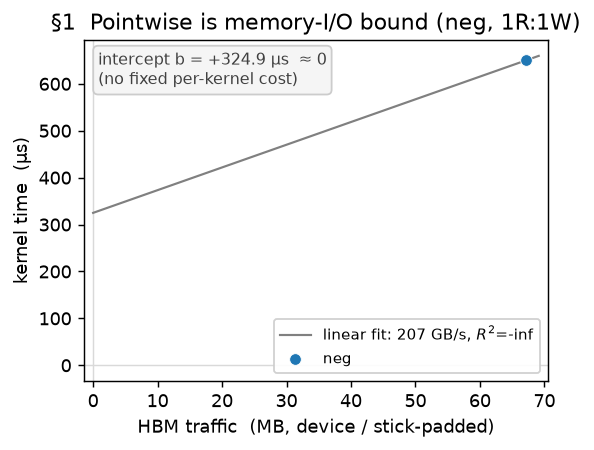

**Observation 2 — the arithmetic is free.** `gelu` and `exp` (a transcendental) land within
~1 % of `neg` at every size (e.g. at 8.4 MB: 78.3 / 77.1 / 77.6 µs; at 134 MB:
1312.7 / 1314.5 / 1314.3 µs). Doing real math costs the same as negating → **there is no
compute term**; the kernel time is set entirely by moving bytes.

**Model (baseline).** `T = bytes / BW` — no compute term, no fixed per-kernel cost. This
is the gold reference. One thread is deliberately left for the next section: the fitted rate here is
~102–108 GB/s, *below* the read-only peak (~150) — i.e. the effective BW is **not** a
single constant; it depends on the read/write mix (§2).

### §2. The read/write ratio changes the effective bandwidth

**Observation — the effective BW is not a single constant.** §1's fit gave ~102–108 GB/s
for `neg`, but a read-dominated op runs far *faster* per byte. Grouping ops by their
read/write mix (effective BW = `(R+W)/time`, and `w = W/(R+W)` the write fraction):

| class | example op | `w` | effBW |
|---|---|---|---|
| read-dominated | `sumrow`/`read`/`amax` (reduce → tiny write) | ~0 | ~150 GB/s |
| 2 reads : 1 write | `add`/`mul` | 0.33 | ~116 GB/s |
| 1 read : 1 write | `neg`/`gelu`/`exp` | 0.50 | ~108 GB/s |
| write-dominated | `write` = `b[1,C] + c[R,1]`: both inputs broadcast → tiny reads, full write | ~1 | ~144 GB/s |

So `bytes/BW` with one BW is wrong — the effBW falls as the traffic becomes balanced, then
climbs back toward write-only.

**Question.** What makes balanced traffic slower per byte than one-directional traffic?

**Hypothesis.** HBM is a shared bus that pays a **turnaround** cost when it switches
between reading and writing. The penalty falls on the overlap `min(R,W)`, which is 0 for
pure read or pure write and maximal at a balanced 1:1:

```
T = (R+W)/BW_peak + α·min(R,W)      ⇒   effBW = 1 / (1/BW_peak + α·f),  f = min(R,W)/(R+W)
```

This predicts a **symmetric valley** in effBW vs `w`: the peak rate at `w=0` and `w=1`,
the minimum at `w=0.5`.

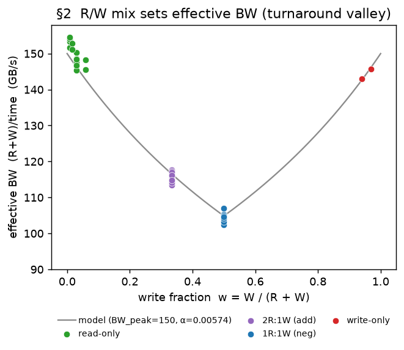

Each class is one op swept at several sizes, so each shows several points; the small
vertical spread within a class is a mild size drift (~2–3 %). The key thing to read off the
plot: the two ends of the valley reach the **same height** — read-dominated (~150) ≈
write-dominated (~144) — so reads and writes share **one** rate, and a single `BW_peak` is
right (not separate read/write rates).

**Model.** `T = (R+W)/BW_peak + α·min(R,W)`, with `BW_peak = 150`, `α = 0.00574 ns/B`.

### §3. A dependency effect in chained OPs — chained adds

**Setup.** An n-input sum `a + b + c + …` is not a native op. The loop-level IR fuses only a
**2-input → 1-output** add, so `add_n` compiles to a **chain of binary adds**, each writing an
intermediate that the next reads:

```
add3:  op0 = arg0 + arg1            add4:  op0 = arg0 + arg1
       op1 = buf0 + arg2  (= out)          op1 = buf0 + arg2
                                           op2 = buf1 + arg3  (= out)
```

With scratchpad off every intermediate lives in HBM, so it is written and read back — traffic that is
**fully counted**: `add3` moves 4R:2W (exactly 2× a single `add`'s 2R:1W), `add4` moves 6R:3W (3×);
verified, `io_hbm_bytes` is 2.00× / 3.00×. The pure-byte model therefore predicts `add_n = (n−1)×add`.

**Observation.** It runs slower than that. At `ROWS=2048, COLS=4096` (a single `add` = 438 µs,
averaged over runs and replicates):

| | byte-model baseline | measured (fused) |
|---|---:|---:|
| `add3` (= 2 adds) | 876 µs | 936 µs (**+7 %**) |
| `add4` (= 3 adds) | 1314 µs | 1520 µs (**+16 %**) |

**Question — what is the margin?** The intermediate round-trip I/O is *already inside* the `(n−1)×add`
byte baseline, so the margin is **not** the bytes. It has two plausible sources: a **read-after-write
dependency** (each add reads a buffer the previous add just wrote), or the **fused kernel** itself (one
launch running several passes). We separate them with controls that move the *same* HBM bytes but
differ in structure:

- `add_indep2` — two **independent** adds `(a+b, c+d)`: the same bytes as `add3`, but **no** dependency.
- `add3_sep` — the same dependent chain, but each binary add is its **own** kernel (dependency present,
  no fusion; the intermediate still passes through HBM between kernels).
- `add3` — the fused chain (dependency **and** fusion).

**The margin is the dependency; fusion is free.**

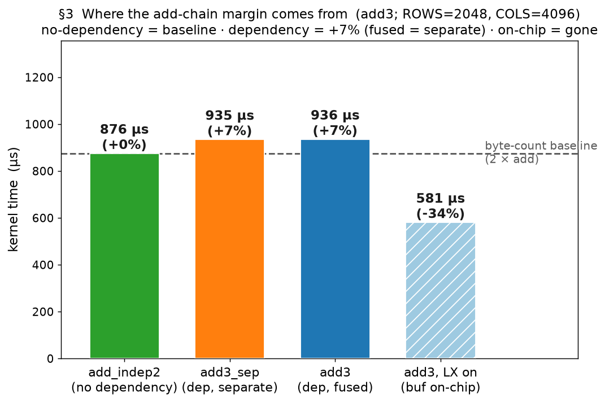

- `add_indep2` (no dependency) sits **on** the baseline (+0 %): same bytes, no margin — so it is not a
  byte effect.
- `add3` and `add3_sep` both sit at **+7 %** and are equal — the margin is there with *or* without
  fusion. It is the **read-after-write dependency**: the read of a just-written HBM buffer cannot stream
  at the independent-read rate, because it must wait for the write to become visible.

**The model captures the on-chip case too.** Turn scratchpad *on* and the intermediate stays on-chip —
the dependency no longer goes through HBM — so `add3` drops to **581 µs (−34 %)** (`add3_sep` cannot
benefit; its intermediate crosses a kernel boundary and must materialize in HBM). Crucially the cost
model, which sees the reduced HBM traffic when the buffer is on-chip, predicts **both** cases within a
few percent — `add3`: −0.7 % (off) / +1.0 % (on); `add4`: −2.3 % / +5.1 %. So "remove the round-trip
and the margin is gone" is not hand-waving: the byte-driven model quantitatively tracks scratchpad on
*and* off.

**Why this matters beyond one op.** The read-after-write dependency is a real, first-class cost
(~+7 % per dependent HBM read) that a per-kernel byte model *cannot* see — it appears only **across op
boundaries**. Any cost model for a **whole program or fused subgraph** (not a single kernel) must carry
a read-after-write term; we flag it here as the term to add when modelling op *sequences*.

**Does the dependency accumulate, and does fusion stay free?** For one dependent read the margin is
+7 % and fusion-free. To see whether it grows with chain length — and whether fusion stays free — we
measure the whole ladder `add3`…`add6` (fused) *and* `add3_sep`…`add6_sep` (separate) over seven
shapes — the three ROWS=2048 shapes replicated 5–7× (the figure plots these), the other four
single-shot — and plot the **excess cost** — extra single-`add`s of time beyond the byte count:

```text
excess(add_n)  =  t(add_n) / t(add)  −  (n−1)
```

The dependency is then the *height* of a curve; any fusion cost is the *gap* between the fused and
separate curves.


**The dependency accumulates; fusion stays free.** Both curves rise together — excess climbs from
≈ 0.13 (one read) to ≈ 0.79 (four reads) — and **fused and separate coincide at 1, 3, and 4 reads**
(within the ±0.02–0.03 replicate noise floor). So the read-after-write dependency accumulates with
chain length, and fusing it is free. (The one wrinkle is at `add4`, where fused sits ≈ +0.31 above
separate — but **not** because the fused kernel misbehaves; the earlier reading of it as a fused
pathology had the direction backwards. *Both* chains bend at the `add4`/`add5` boundary: the
**separate** chain stays flat through three launches (`add3_sep` ≈ `add4_sep`) and only engages its
dependency cost at the fourth launch (`add5_sep`), while the **fused** chain takes a one-time ≈ +0.1
(+3 %) step at `add4` and then accumulates ≈ +0.16 excess/read. So the gap is *mostly* — roughly
two-thirds, though the exact split is fit-dependent — the separate control being flat where the fused
chain has already stepped, not the fused op running slow. (The model happens to predict fused `add4`
within +2 % *at COLS=4096*; its error runs ≈ +0.7 / +2 / −4 / −10 % across `add3`…`add6`, so `add4`
merely sits near the zero-crossing.) The fuser packs `add4` as one ordinary left-associative bundle —
four inputs + one output = 5 tensors, within the 5–6-tensor per-bundle limit; the *first* bundle split
is at `add5`/`add6`, never `add4` — so there is no `add4`-specific fusion structure, which **rules out
the reassociation / extra-barrier guess**. *Why* the separate chain steps only at the fourth launch is
open: the step is flat-then-sharp and scales with operand size, and because `kernel_us` is a min-based
*device* latency (host dispatch jitter is stripped, and for `_sep` it is the sum of the sub-kernels'
device times) a host launch-scheduling explanation is *disfavoured* — it points to a device/memory
regime change (e.g. buffer reuse past a chain length). The sign reproduces across all seven measured
shapes, so it is real, but it is a property of the separate baseline, not the modelled fused op — so we
**do not model it**. The queued `run_add_chain_ir.sh` confirms the *structure* (bundle count,
left-associativity) that rules out the fusion guess; settling the separate-path timing regime would
need a controlled device-vs-host timing split, which the IR dump does not provide.)

**Model status — not a single-op term.** `add_n` is **not a native op** — it is a multi-op dependent
chain — so the read-after-write cost is **not** part of the single-op model, which stays pure
(`T = (R+W)/BW + α·min(R,W)`; a single op has no round-tripped intermediate). An earlier draft carried
a `×(1 + 0.075·(m−1))` arity derate for the chained adds; that has been **removed**. The read-after-write
dependency is instead a **program-level / cross-op** effect, to be modeled by the byte-keyed term
proposed in `new_experiments_plan.md` ("Next model") and unified with the coarse-tiling LX-spill (§15),
which is the same phenomenon (a fused-op intermediate that round-trips HBM). It is not fit yet — the
*separate*-baseline control is irregular (the `add4_sep` wrinkle above), the fused chain's own slope
is only approximate (it over-predicts `add5`/`add6` by −4 %/−10 %), and it needs multi-op-chain data
beyond softmax — so it is scoped there, not patched in here.

### Part I accuracy — every pointwise data point

Predicted vs measured for every **single** pointwise op (`T = (R+W)/BW_peak + α·min(R,W)`).
**RMS 1.9 %, mean +0.1 %, range −2.6…+4.3 %** over 22 points — every point within ~4 %. (The chained
adds `add3`/`add4` are **not** single ops — they are multi-op dependent chains, whose read-after-write
cost is a program-level effect not modeled here; see §3. `copy` is excluded too: `x + 1.0` lowers to an
`add` with a resident broadcast constant, so it is a broadcast op, reported in §4.)

| op | R×C | measured µs | predicted µs | err % |
|---|---|---:|---:|---:|
| `neg` | 512×8192 | 156.6 | 160.0 | +2.2 |
| `neg` | 1024×4096 | 153.4 | 160.0 | +4.3 |
| `neg` | 2048×1024 | 77.6 | 80.0 | +3.1 |
| `neg` | 2048×2048 | 159.1 | 160.0 | +0.6 |
| `neg` | 2048×2048 | 161.3 | 160.0 | −0.8 |
| `neg` | 2048×4096 | 320.8 | 320.0 | −0.3 |
| `neg` | 2048×16384 | 1314.3 | 1280.0 | −2.6 |
| `neg` | 4096×1024 | 160.3 | 160.0 | −0.2 |
| `neg` | 4096×4096 | 646.6 | 640.0 | −1.0 |
| `neg` | 8192×512 | 159.0 | 160.0 | +0.6 |
| `gelu` | 2048×1024 | 77.1 | 80.0 | +3.7 |
| `gelu` | 2048×4096 | 319.1 | 320.0 | +0.3 |
| `gelu` | 2048×16384 | 1314.5 | 1280.0 | −2.6 |
| `exp` | 2048×1024 | 78.3 | 80.0 | +2.2 |
| `exp` | 2048×4096 | 322.4 | 320.0 | −0.8 |
| `exp` | 2048×16384 | 1312.7 | 1280.0 | −2.5 |
| `mul` | 2048×1024 | 108.9 | 108.0 | −0.9 |
| `mul` | 2048×4096 | 433.0 | 431.8 | −0.3 |
| `mul` | 2048×16384 | 1751.6 | 1727.4 | −1.4 |
| `add` | 2048×1024 | 107.0 | 108.0 | +0.9 |
| `add` | 2048×4096 | 431.7 | 431.8 | +0.0 |
| `add` | 2048×16384 | 1757.0 | 1727.4 | −1.7 |

---

## Part II — Other memory-bound ops

### §4. Broadcast operands and the outer-product write

A *broadcast* operand is a small tensor (a row `[1,C]`, a column `[R,1]`, or a scalar)
added/multiplied against a full tensor and reused across the broadcast dimension. This section
builds the model in four steps: how the operand is **counted** (§4.1), why the op runs **faster**
than a plain copy (§4.2), how that rate varies with shape in the **normal** regime (§4.3) and in
the **short-tensor** regime (§4.4), and finally the outer-product **write** (§4.5).

#### §4.1 — I/O counting: the operand is not expanded

In `bcast` (`a[R,C] + b[1,C]`) the
broadcast operand `b[1,C]` is read at its actual `[1,C]` size (one row of `C` elements) — it is
**not** expanded to `b[R,C]` to match the output. So the kernel reads the full input `a[R,C]`
plus a negligible `[1,C]` operand — about a single streaming pass over `a`, not two full `[R,C]`
reads.

#### §4.2 — A broadcast operand raises the effective bandwidth above the plain read-write baseline

The reference is the ~105 GB/s a plain read-then-write pointwise op runs at (the baseline `neg`,
§2). At well-filled sizes (ROWS ≥ 2048) all four broadcast-operand ops run **above** that ~105 in
effective bandwidth (bytes moved ÷ time):

| op | effective BW (GB/s), ROWS=2048, COLS 2048–16384 |
|---|---:|
| `neg` (read-then-write baseline) | ≈ 105 |
| `copy` = `x + 1.0` (add a broadcast scalar) | 118–119 |
| `bcast` (`a + b[1,C]`) | 117–123 |
| `bcastcol` (`a + b[R,1]`) | 118–121 |
| `mulbcast` (`a * b[1,C]`) | 115–123 |

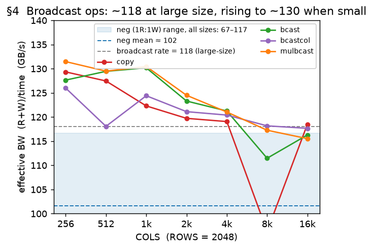

All four ops — three adds and a multiply — show the lift, so it is the presence of a broadcast
operand, not the arithmetic, that raises the rate.

A single flat rate (~118 GB/s) is a fair first cut but leaves errors up to ~50 % once shape varies.
Measured across sizes, all four ops share the *same shape*: a normal regime (§4.3) and a
short-tensor regime (§4.4), split at `ROWS ≈ 1024`. Crucially, that shape is **not** a property of
the `b[1,C]` operand — `copy`, a scalar broadcast with no size-growing operand, collapses at short
lengths exactly like `bcast` does. The only operand-specific difference is a small **rate lift**:
the row-broadcast ops (`bcast`/`mulbcast`) run a few GB/s faster than the scalar/column ops
(`copy`/`bcastcol`), so the two families share one shape with their own constants.

#### §4.3 — The normal regime (ROWS ≥ 1024): a rate that declines with both dimensions

The rate eases down with COLS and, more weakly, with ROWS — a two-term surface, one constant set
per family:

```
BW  =  a − b·log₂(COLS) − c·log₂(ROWS)   GB/s
   row-broadcast (bcast/mulbcast):  a=183.5, b=2.8, c=2.6   (clamped 100–135, 1.3 % RMS)
   scalar/column (copy/bcastcol):   a=162,   b=1.8, c=2.2   (clamped  95–130, 5.1 % RMS)
```

This removes the small-COLS over-prediction the flat rate left — a `2048×1024` multiply goes from
`+12 %` to `+2 %` — and gives `copy`/`bcastcol` their (steeper) large-ROWS decline instead of the
wrong flat `118`. The residual on `copy`/`bcastcol` is a small jump between `ROWS = 1024` and
`2048` that the monotonic surface cannot follow (~−16 % at `1024×2048`).

#### §4.4 — The short-tensor regime (ROWS < 1024): a V-valley at ROWS = COLS/64

Below ~1024 rows the rate stops being monotonic: it forms a **V-shaped valley**, *lowest* at
`ROWS = COLS/64` — exactly the number of 64-wide output stick-planes — and climbing steeply toward
fewer rows, gently toward more.


The two halves of the valley model separately, split at `COLS = 4096`; same forms for both
families (the row-broadcast constants shown, the scalar/column constants in parentheses):

- **`COLS ≤ 4096` — only the rising side shows** (the floor `COLS/64 ≤ 64` is at or below the
  smallest tensor). A downward **quadratic** in `lr = log₂(ROWS)`:

  ```
  BW = a + b·lr + c·lr² + e·log₂(COLS)   GB/s   (clamped 45–140 / 45–120)
     row-broadcast:  a=−350, b=105, c=−5.5, e=−2.0     scalar/column:  a=−270, b=70, c=−3.5, e=+3.0
  ```

- **`COLS ≥ 8192` — the full V**, minimum at `ROWS = COLS/64` (floor walks `128`→`256` rows as
  `COLS` goes `8k`→`16k`):

  ```
  d = log₂(ROWS) − log₂(COLS/64)
  BW = floor + bl·max(0, −d) + br·max(0, +d)   GB/s
     row-broadcast:  floor=92, bl=32, br=10 (cap 128)    scalar/column:  floor=98, bl=15, br=8 (cap 120)
  ```

For the row-broadcast ops this brings the short-tensor error from **~22 %** to **~4.5 %**; for
`copy`/`bcastcol` the same forms reach ~6–10 %. Both regimes meet the §4.3 surface continuously at
`ROWS = 1024`. The floor at `ROWS = COLS/64` — where the tensor is "square" in planes × rows — is a
real, reproducible effect whose physical cause is still open; the one remaining miss is the
smallest short-and-narrow corner, which falls a little faster than the quadratic.

#### §4.5 — The outer-product write

`write` (`b[1,C] + c[R,1]`) broadcasts *both* operands into a full `[R,C]` output — the shape of
an **outer product** (`out[i,j] = b[j] + c[i]`). The operands are tiny (`b` is `C` elements; the
column `c[R,1]` is stick-inflated to `R × 64`), so a naive model treats `write` as an
output-dominated write. Empirically it is far slower and depends on **both** dimensions: the
effective bandwidth is ~135–145 GB/s for a small tensor and collapses toward a ~40 GB/s floor when
*both* ROWS and COLS are large.

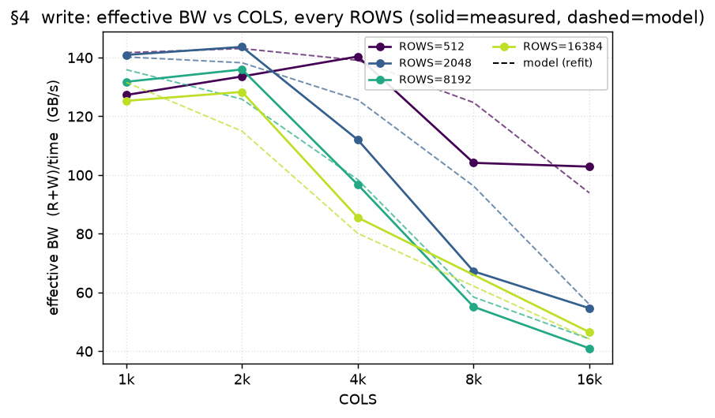

The physical cause is not established — the operands are tiny, yet the write is slow, so the cost
is in *producing* the outer-product output, not in reading inputs. Pending a mechanism, `write` is
modeled by an **empirical** extra-traffic term, **capped** so it cannot run away at the extreme
corner (where the uncapped form over-predicted by +59 %):

```
extra_bytes  =  min( 2.0e-9 · ROWS^1.75 · COLS^2.60 ,  2.4 · output_bytes )
```

This takes `write` from **18.9 %** error to **9.6 %**. It is an honest black-box for a rare op; the
worst residuals are `2048×8192` (−30 %) and narrow-COLS over-predictions (`16384×2048` +12 %).

**§4 accuracy** (per-op error, `(pred − meas)/meas`):

| op | error |
|---|---:|
| `bcast` | **3.4 %** (nothing over ±10 %) |
| `mulbcast` | **3.5 %** (nothing over ±10 %) |
| `copy` | **7.5 %** |
| `bcastcol` | **7.2 %** |
| `write` | **9.6 %** |

Overall **6.3 %**. `bcast`/`mulbcast` have no point over ±10 %; the residuals are the
`copy`/`bcastcol` boundary corners and the `write` black-box.

**Every measured broadcast/write point** (error = `(pred − meas)/meas`):

| op | R×C | meas µs | pred µs | err % |
|---|---|---:|---:|---:|
| `copy` | 64×2048 | 9.4 | 9.2 | -2.4 |
| `copy` | 64×4096 | 17.2 | 17.5 | +1.6 |
| `copy` | 64×8192 | 17.5 | 18.6 | +6.3 |
| `copy` | 64×16384 | 34.4 | 35.0 | +1.6 |
| `copy` | 128×2048 | 14.2 | 12.9 | -9.6 |
| `copy` | 128×4096 | 26.5 | 24.8 | -6.3 |
| `copy` | 128×8192 | 52.5 | 42.8 | -18.4 |
| `copy` | 128×16384 | 78.8 | 74.2 | -5.8 |
| `copy` | 256×2048 | 20.6 | 21.2 | +2.9 |
| `copy` | 256×4096 | 40.7 | 41.1 | +0.9 |
| `copy` | 256×8192 | 79.8 | 79.1 | -0.8 |
| `copy` | 256×16384 | 159.2 | 171.2 | +7.5 |
| `copy` | 512×2048 | 42.5 | 38.3 | -9.9 |
| `copy` | 512×4096 | 83.5 | 74.6 | -10.7 |
| `copy` | 512×8192 | 173.2 | 147.2 | -15.0 |
| `copy` | 512×16384 | 353.8 | 316.6 | -10.5 |
| `copy` | 1024×2048 | 83.0 | 69.8 | -15.9 |
| `copy` | 1024×4096 | 167.3 | 141.7 | -15.3 |
| `copy` | 1024×8192 | 334.8 | 287.8 | -14.0 |
| `copy` | 1024×16384 | 614.3 | 584.6 | -4.8 |
| `copy` | 2048×2048 | 141.8 | 142.2 | +0.3 |
| `copy` | 2048×4096 | 281.9 | 288.8 | +2.4 |
| `copy` | 2048×8192 | 562.2 | 586.6 | +4.3 |
| `copy` | 2048×16384 | 1129.8 | 1192.0 | +5.5 |
| `copy` | 8192×2048 | 609.3 | 590.7 | -3.0 |
| `copy` | 8192×4096 | 1221.6 | 1200.5 | -1.7 |
| `copy` | 8192×8192 | 2454.0 | 2440.3 | -0.6 |
| `copy` | 8192×16384 | 4969.0 | 4961.8 | -0.1 |
| `copy` | 16384×2048 | 1231.7 | 1204.8 | -2.2 |
| `copy` | 16384×4096 | 2476.8 | 2449.2 | -1.1 |
| `copy` | 16384×8192 | 4962.7 | 4980.3 | +0.4 |
| `copy` | 16384×16384 | 10160.4 | 10129.6 | -0.3 |
| `bcast` | 64×2048 | 9.7 | 8.8 | -8.9 |
| `bcast` | 64×4096 | 17.0 | 18.2 | +7.3 |
| `bcast` | 64×8192 | 17.4 | 17.0 | -2.0 |
| `bcast` | 64×16384 | 32.8 | 33.0 | +0.7 |
| `bcast` | 128×2048 | 11.0 | 11.3 | +2.7 |
| `bcast` | 128×4096 | 22.3 | 23.0 | +3.3 |
| `bcast` | 128×8192 | 45.6 | 45.8 | +0.3 |
| `bcast` | 128×16384 | 68.2 | 67.9 | -0.4 |
| `bcast` | 256×2048 | 16.9 | 18.1 | +7.0 |
| `bcast` | 256×4096 | 39.3 | 36.9 | -6.2 |
| `bcast` | 256×8192 | 82.8 | 82.4 | -0.5 |
| `bcast` | 256×16384 | 181.6 | 182.7 | +0.6 |
| `bcast` | 512×2048 | 31.1 | 32.9 | +5.7 |
| `bcast` | 512×4096 | 70.7 | 66.9 | -5.3 |
| `bcast` | 512×8192 | 152.2 | 149.9 | -1.5 |
| `bcast` | 512×16384 | 316.5 | 329.3 | +4.0 |
| `bcast` | 1024×2048 | 66.8 | 66.2 | -0.8 |
| `bcast` | 1024×4096 | 139.3 | 135.5 | -2.8 |
| `bcast` | 1024×8192 | 283.7 | 277.2 | -2.3 |
| `bcast` | 1024×16384 | 583.5 | 567.6 | -2.7 |
| `bcast` | 2048×2048 | 137.1 | 135.2 | -1.4 |
| `bcast` | 2048×4096 | 278.1 | 276.7 | -0.5 |
| `bcast` | 2048×8192 | 568.1 | 566.5 | -0.3 |
| `bcast` | 2048×16384 | 1164.4 | 1160.3 | -0.4 |
| `bcast` | 8192×2048 | 572.3 | 564.4 | -1.4 |
| `bcast` | 8192×4096 | 1160.2 | 1156.1 | -0.4 |
| `bcast` | 8192×8192 | 2384.5 | 2369.4 | -0.6 |
| `bcast` | 8192×16384 | 4876.3 | 4858.9 | -0.4 |
| `bcast` | 16384×2048 | 1165.2 | 1154.1 | -1.0 |
| `bcast` | 16384×4096 | 2375.2 | 2365.1 | -0.4 |
| `bcast` | 16384×8192 | 4821.6 | 4849.9 | +0.6 |
| `bcast` | 16384×16384 | 9688.1 | 9951.6 | +2.7 |
| `bcastcol` | 64×2048 | 9.4 | 9.3 | -0.4 |
| `bcastcol` | 64×4096 | 16.9 | 17.6 | +4.5 |
| `bcastcol` | 64×8192 | 17.6 | 18.6 | +5.8 |
| `bcastcol` | 64×16384 | 34.8 | 35.0 | +0.8 |
| `bcastcol` | 128×2048 | 14.1 | 13.1 | -7.2 |
| `bcastcol` | 128×4096 | 27.4 | 25.0 | -8.9 |
| `bcastcol` | 128×8192 | 52.7 | 43.0 | -18.5 |
| `bcastcol` | 128×16384 | 77.7 | 74.4 | -4.3 |
| `bcastcol` | 256×2048 | 20.3 | 21.5 | +5.9 |
| `bcastcol` | 256×4096 | 39.1 | 41.4 | +5.9 |
| `bcastcol` | 256×8192 | 74.9 | 79.4 | +6.1 |
| `bcastcol` | 256×16384 | 148.9 | 171.5 | +15.2 |
| `bcastcol` | 512×2048 | 36.4 | 38.9 | +6.9 |
| `bcastcol` | 512×4096 | 77.4 | 75.1 | -2.9 |
| `bcastcol` | 512×8192 | 141.0 | 147.7 | +4.8 |
| `bcastcol` | 512×16384 | 282.3 | 317.2 | +12.4 |
| `bcastcol` | 1024×2048 | 73.6 | 70.9 | -3.7 |
| `bcastcol` | 1024×4096 | 162.4 | 142.8 | -12.0 |
| `bcastcol` | 1024×8192 | 324.5 | 288.9 | -11.0 |
| `bcastcol` | 1024×16384 | 647.2 | 585.7 | -9.5 |
| `bcastcol` | 2048×2048 | 140.7 | 144.4 | +2.7 |
| `bcastcol` | 2048×4096 | 280.8 | 291.0 | +3.6 |
| `bcastcol` | 2048×8192 | 572.4 | 588.9 | +2.9 |
| `bcastcol` | 2048×16384 | 1147.0 | 1194.3 | +4.1 |
| `bcastcol` | 8192×2048 | 613.7 | 600.0 | -2.2 |
| `bcastcol` | 8192×4096 | 1222.9 | 1209.9 | -1.1 |
| `bcastcol` | 8192×8192 | 2457.3 | 2449.9 | -0.3 |
| `bcastcol` | 8192×16384 | 4985.9 | 4971.5 | -0.3 |
| `bcastcol` | 16384×2048 | 1251.9 | 1223.7 | -2.3 |
| `bcastcol` | 16384×4096 | 2501.3 | 2468.4 | -1.3 |
| `bcastcol` | 16384×8192 | 5060.0 | 4999.7 | -1.2 |
| `bcastcol` | 16384×16384 | 10318.3 | 10149.4 | -1.6 |
| `mulbcast` | 64×2048 | 9.7 | 8.8 | -8.9 |
| `mulbcast` | 64×4096 | 16.7 | 18.2 | +8.9 |
| `mulbcast` | 64×8192 | 17.3 | 17.0 | -1.2 |
| `mulbcast` | 64×16384 | 33.0 | 33.0 | +0.1 |
| `mulbcast` | 128×2048 | 11.1 | 11.3 | +1.7 |
| `mulbcast` | 128×4096 | 22.4 | 23.0 | +2.7 |
| `mulbcast` | 128×8192 | 45.2 | 45.8 | +1.3 |
| `mulbcast` | 128×16384 | 67.0 | 67.9 | +1.4 |
| `mulbcast` | 256×2048 | 17.1 | 18.1 | +5.8 |
| `mulbcast` | 256×4096 | 39.0 | 36.9 | -5.5 |
| `mulbcast` | 256×8192 | 83.3 | 82.4 | -1.1 |
| `mulbcast` | 256×16384 | 181.3 | 182.7 | +0.8 |
| `mulbcast` | 512×2048 | 31.0 | 32.9 | +6.1 |
| `mulbcast` | 512×4096 | 70.8 | 66.9 | -5.4 |
| `mulbcast` | 512×8192 | 154.1 | 149.9 | -2.7 |
| `mulbcast` | 512×16384 | 321.0 | 329.3 | +2.6 |
| `mulbcast` | 1024×2048 | 65.5 | 66.2 | +1.1 |
| `mulbcast` | 1024×4096 | 138.5 | 135.5 | -2.2 |
| `mulbcast` | 1024×8192 | 284.9 | 277.2 | -2.7 |
| `mulbcast` | 1024×16384 | 586.8 | 567.6 | -3.3 |
| `mulbcast` | 2048×1024 | 64.7 | 66.1 | +2.2 |
| `mulbcast` | 2048×2048 | 133.9 | 135.2 | +1.0 |
| `mulbcast` | 2048×4096 | 278.1 | 276.7 | -0.5 |
| `mulbcast` | 2048×8192 | 576.6 | 566.5 | -1.8 |
| `mulbcast` | 2048×16384 | 1160.4 | 1160.3 | -0.0 |
| `mulbcast` | 8192×2048 | 575.0 | 564.4 | -1.8 |
| `mulbcast` | 8192×4096 | 1173.1 | 1156.1 | -1.4 |
| `mulbcast` | 8192×8192 | 2395.0 | 2369.4 | -1.1 |
| `mulbcast` | 8192×16384 | 4870.0 | 4858.9 | -0.2 |
| `mulbcast` | 16384×2048 | 1164.4 | 1154.1 | -0.9 |
| `mulbcast` | 16384×4096 | 2368.9 | 2365.1 | -0.2 |
| `mulbcast` | 16384×8192 | 4842.3 | 4849.9 | +0.2 |
| `mulbcast` | 16384×16384 | 9735.9 | 9951.6 | +2.2 |
| `write` | 512×1024 | 9.1 | 7.9 | -13.0 |
| `write` | 512×2048 | 16.2 | 15.1 | -6.6 |
| `write` | 512×4096 | 31.0 | 30.7 | -0.9 |
| `write` | 512×8192 | 81.3 | 67.9 | -16.5 |
| `write` | 512×16384 | 165.2 | 179.7 | +8.8 |
| `write` | 2048×1024 | 31.8 | 31.8 | +0.1 |
| `write` | 2048×2048 | 60.9 | 62.6 | +2.7 |
| `write` | 2048×4096 | 153.2 | 135.7 | -11.4 |
| `write` | 2048×8192 | 503.4 | 351.5 | -30.2 |
| `write` | 2048×16384 | 1234.0 | 1204.9 | -2.4 |
| `write` | 8192×1024 | 134.7 | 131.2 | -2.6 |
| `write` | 8192×2048 | 254.1 | 275.0 | +8.2 |
| `write` | 8192×4096 | 709.0 | 692.5 | -2.3 |
| `write` | 8192×8192 | 2454.0 | 2314.6 | -5.7 |
| `write` | 8192×16384 | 6498.5 | 6098.0 | -6.2 |
| `write` | 16384×1024 | 284.6 | 271.0 | -4.8 |
| `write` | 16384×2048 | 539.4 | 602.2 | +11.6 |
| `write` | 16384×4096 | 1594.2 | 1701.3 | +6.7 |
| `write` | 16384×16384 | 11593.6 | 12195.5 | +5.2 |

### §5. Reduction: read-bound, at a rate that falls with ROWS

**Model.** A reduction over the last axis (`sum`/`amax`/`mean`, `x[R,C] → [R]`, plus the
whole-tensor `sumall` and the pure `read`) reads the full input and writes an almost negligible
output, so it is a **read at an effective bandwidth** — no turnaround term. That read bandwidth
is not constant: it starts at the ~150 GB/s read peak for small inputs and **falls as ROWS
grows**, saturating around ~113 GB/s. It is `ROWS`, not total size: at a fixed `ROWS` the rate is
flat across `COLS` (~119–125 GB/s at `ROWS = 8192`, `COLS` 1024–4096). A single curve fits it:

```
reduction read BW = min(150,  114 + 61·exp(−ROWS / 3700))   GB/s
```

**The falloff is op-independent.** All five reductions trace the *same* curve (figure):
149 → 134 → 121 → 115 GB/s at ROWS 2048 → 4096 → 8192 → 16384.

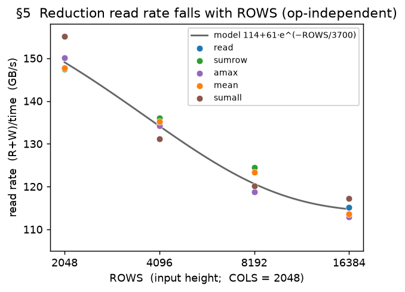

**`sumcol` is the exception.** A reduction over the *outer* axis (`sum(x, dim=0) → [C]`) walks
memory differently and does not show the ROWS falloff; it keeps its own flat access-pattern
rate (~113 GB/s, the `reduce_outer` rate of §6). A cross-core ring combine (when the reduced
axis is split across cores) is provably tiny and carried but inert.

**Below 32 cores, the rate derates further.** The ROWS-falloff above is the rate at the full
32-core budget. A reduction is a streaming full-tensor read over the *shared* HBM bus, so with
fewer active cores fewer parallel request streams are in flight and a smaller fraction of peak
bandwidth is realized. The derate `g(cores) = BW(cores)/BW(32)` is **sub-linear and saturating** —
a single core drives ~11 % of the bus, not `1/32` = 3 % (the naive proportional law is off by
3.6×) — and it is `1.0` at 32 cores, so the gold rate above is untouched:

| cores | 1 | 2 | 4 | 8 | 16 | 32 |
|---|---:|---:|---:|---:|---:|---:|
| `g(cores)` | 0.11 | 0.22 | 0.43 | 0.54 | 0.54 | 1.00 |

Without this, a reduction forced onto few cores is mispredicted by up to **−89 %** (the model
charged the full-bus rate; over the 20 low-core points mean |err| was **289 %**). With it, they
land within a few percent (**mean |err| 5.7 %**) — `sumrow` across cores 1→16, and `read` (the
worst, a transposed shape) within ~16 %:

| op | R×C | cores | measured µs | predicted µs | err % |
|---|---|---:|---:|---:|---:|
| `sumrow` | 2048×8192 | 1 | 2039.0 | 2062.3 | −1 |
| `sumrow` | 2048×8192 | 4 | 549.1 | 527.6 | +4 |
| `sumrow` | 2048×8192 | 16 | 444.4 | 420.1 | +6 |
| `read` | 8192×2048 | 1 | 2390.2 | 2607.0 | −8 |
| `read` | 8192×2048 | 8 | 446.7 | 531.1 | −16 |

This matters because the coarse `softmax_unrolled` op is forced onto **one core** by construction —
though *its* own −90 % miss is a **separate, larger** effect (an on-chip/LX-resident intermediate
that the byte count over-credits, so a bandwidth derate cannot fix it), tracked with the
coarse-tiling work, not here. **Caveat:** the low-core anchors are single-shot (no replicates); the
`c8`/`c16` plateau and the shape-generality of `g(cores)` need a repeated low-core reduction sweep
to confirm (`run_reduction_cores_sweep.sh`, written).

**§5 accuracy.** RMS **2.6 %**, mean +1.3 %, over 58 points at the full 32-core budget — within
~6 % everywhere, across the full ROWS range now that the falloff is modeled (the low-core `g(cores)`
derate above is a separate 20-point set). Representative shapes (repeats omitted):

| op | R×C | measured µs | predicted µs | err % |
|---|---|---:|---:|---:|
| `read` | 2048×1024 | 30.1 | 29.9 | −0.6 |
| `read` | 2048×2048 | 57.6 | 58.0 | +0.8 |
| `read` | 2048×2048 | 59.5 | 58.0 | −2.5 |
| `read` | 2048×4096 | 112.8 | 114.3 | +1.4 |
| `read` | 2048×8192 | 222.9 | 226.8 | +1.8 |
| `read` | 4096×2048 | 128.2 | 129.0 | +0.6 |
| `read` | 8192×1024 | 144.7 | 147.7 | +2.1 |
| `read` | 8192×2048 | 281.8 | 286.8 | +1.8 |
| `read` | 8192×4096 | 545.1 | 564.9 | +3.6 |
| `read` | 16384×2048 | 600.9 | 603.2 | +0.4 |
| `sumrow` | 2048×1024 | 30.6 | 29.9 | −2.4 |
| `sumrow` | 2048×2048 | 58.8 | 58.0 | −1.3 |
| `sumrow` | 2048×4096 | 111.4 | 114.3 | +2.6 |
| `sumrow` | 2048×8192 | 220.5 | 226.8 | +2.9 |
| `sumrow` | 4096×2048 | 127.2 | 129.0 | +1.4 |
| `sumrow` | 8192×1024 | 139.8 | 147.7 | +5.7 |
| `sumrow` | 8192×2048 | 277.0 | 286.8 | +3.5 |
| `sumrow` | 8192×4096 | 534.5 | 564.9 | +5.7 |
| `sumrow` | 16384×2048 | 610.6 | 603.2 | −1.2 |
| `amax` | 2048×2048 | 57.6 | 58.0 | +0.8 |
| `amax` | 2048×8192 | 219.7 | 226.8 | +3.3 |
| `amax` | 4096×2048 | 128.9 | 129.0 | +0.1 |
| `amax` | 8192×1024 | 146.6 | 147.7 | +0.8 |
| `amax` | 8192×2048 | 291.4 | 286.8 | −1.6 |
| `amax` | 8192×4096 | 556.8 | 564.9 | +1.4 |
| `amax` | 16384×2048 | 612.7 | 603.2 | −1.6 |
| `mean` | 2048×2048 | 58.8 | 58.0 | −1.4 |
| `mean` | 2048×8192 | 218.9 | 226.8 | +3.6 |
| `mean` | 4096×2048 | 127.9 | 129.0 | +0.8 |
| `mean` | 8192×1024 | 145.6 | 147.7 | +1.4 |
| `mean` | 8192×2048 | 280.6 | 286.8 | +2.2 |
| `mean` | 8192×4096 | 546.7 | 564.9 | +3.3 |
| `mean` | 16384×2048 | 609.6 | 603.2 | −1.0 |
| `sumall` | 2048×2048 | 54.2 | 56.3 | +3.8 |
| `sumall` | 2048×8192 | 212.2 | 225.1 | +6.1 |
| `sumall` | 4096×2048 | 128.0 | 125.1 | −2.3 |
| `sumall` | 8192×1024 | 139.4 | 139.0 | −0.3 |
| `sumall` | 8192×2048 | 279.3 | 278.1 | −0.4 |
| `sumall` | 8192×4096 | 548.7 | 556.2 | +1.4 |
| `sumall` | 16384×2048 | 572.3 | 584.9 | +2.2 |
| `sumcol` | 2048×2048 | 70.6 | 74.3 | +5.2 |
| `sumcol` | 2048×8192 | 292.9 | 297.1 | +1.4 |
| `sumcol` | 4096×2048 | 145.1 | 148.5 | +2.3 |
| `sumcol` | 8192×2048 | 286.5 | 297.0 | +3.7 |
| `sumcol` | 16384×2048 | 571.9 | 593.9 | +3.9 |

### §6. Transport ops are copies with an access-pattern effective bandwidth

**Observation.** Transport ops — the transpose `transpose`, the 3-D outer-axis swap
`transpose_outer`, and the concatenations `cat0`/`cat1` — rearrange data without arithmetic; in
the IR each lowers to a plain byte-copy (a `clone`). What distinguishes a transport from a plain
copy is *how it walks memory*, which sets its effective bandwidth (the `(R+W)/time` of §4). The
device stores a row of `C` values as `C/64` blocks of 64 (the 128-byte sticks), and the 32 cores
divide those blocks between them.

**What the data shows (figure).** Two of the four hold a **flat effective bandwidth across every
shape** — `transpose` ~116 GB/s (±2 %), `cat1` ~106 — while `cat0` and `transpose_outer` **fall
as the row widens**. The falloff tracks the number of 64-element blocks per row (`C/64`), not the
byte count: at fixed total bytes a wide operand is far slower than a tall one (`cat0` runs at
90 GB/s for a 2048×512 operand but 44 for 2048×32768). Building one output row means collecting
its blocks from scattered input locations, so a wider row is more scattered fetches per row — the
per-block gather, not the bytes, sets the cost (a longer operand lengthens the gather stride and
costs a little more).

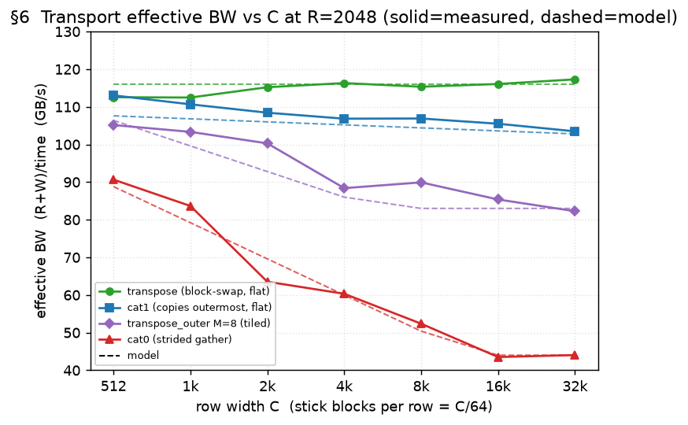

**Model.** The three shape-dependent transports share one form — effective bandwidth declines
with the per-row block count and, weakly, with the operand length — differing only in calibration:

| op | access pattern | effective BW (GB/s) |
|---|---|---|
| `transpose` | block axis swapped inside the stick (a hardware fast path) | **116**, flat |
| `cat1` | copies stored outermost → read and write stay contiguous | ~106, flat |
| `cat0` | copies inside the stick → a strided per-row gather | ~110 → 44 |
| `transpose_outer` (M=8) | a tiled block-transpose (softens the gather) | ~106 → 82 |

**A middle-axis sweet spot (transpose_outer).** `transpose_outer` swaps the two outer axes of a
3-D operand `[R, M, C] → [M, R, C]`. Sweeping the middle axis `M` at fixed shape uncovers a
**peak in effective bandwidth near M ≈ 8**, dropping off on both sides (at 2048×2048: 70 GB/s at
M=2, 100 at M=8, 72 at M=64) — each core reassembles `M` blocks per transpose tile, so too few
wastes the setup and too many overflows the on-chip buffer. The model is calibrated at M=8 (the
common and best case); other `M` is a **flagged residual** — the model applies the M=8 rate, so it
mis-predicts by the amount the effective bandwidth differs from its M=8 peak:

| R×C | M | measured µs | predicted µs | err % |
|---|---:|---:|---:|---:|
| 2048×2048 | 2 | 479.1 | 361.6 | -24.5 |
| 2048×2048 | 4 | 816.7 | 723.2 | -11.5 |
| 2048×2048 | 8 | 1337.0 | 1446.3 | +8.2 |
| 2048×2048 | 16 | 3207.0 | 2892.6 | -9.8 |
| 2048×2048 | 32 | 6587.7 | 5785.2 | -12.2 |
| 2048×2048 | 64 | 14997.0 | 11570.5 | -22.8 |
| 2048×8192 | 2 | 2306.2 | 1617.1 | -29.9 |
| 2048×8192 | 4 | 4229.1 | 3234.2 | -23.5 |
| 2048×8192 | 8 | 5937.1 | 6468.3 | +8.9 |
| 2048×8192 | 16 | 13155.7 | 12936.6 | -1.7 |
| 2048×8192 | 32 | 28474.3 | 25873.3 | -9.1 |

**§6 accuracy.** RMS **5.5 %**, mean +0.7 %, over 100 shapes. `transpose` is exact (±2 %); the
shape-dependent copies mostly land within ~8 %, the residual confined to the extreme corners —
the smallest operands (a 512×512 `cat0` reads +18 % and a 256-row `cat1` −22 %, their bandwidth
already near the flat peak) and the largest `transpose_outer` (where the work is divided
differently, −12 %).
Every measured shape (cores = 32, `transpose_outer` at M=8):

| op | R×C | measured µs | predicted µs | err % |
|---|---|---:|---:|---:|
| `transpose` | 512×2048 | 36.6 | 36.2 | -1.3 |
| `transpose` | 512×4096 | 73.7 | 72.3 | -1.9 |
| `transpose` | 512×8192 | 147.0 | 144.6 | -1.6 |
| `transpose` | 1024×1024 | 38.1 | 36.2 | -5.0 |
| `transpose` | 1024×2048 | 73.4 | 72.3 | -1.4 |
| `transpose` | 1024×4096 | 144.9 | 144.6 | -0.2 |
| `transpose` | 2048×512 | 37.3 | 36.2 | -3.0 |
| `transpose` | 2048×1024 | 74.6 | 72.3 | -3.1 |
| `transpose` | 2048×2048 | 146.9 | 144.6 | -1.5 |
| `transpose` | 2048×4096 | 288.3 | 289.3 | +0.3 |
| `transpose` | 2048×8192 | 581.4 | 578.5 | -0.5 |
| `transpose` | 2048×16384 | 1156.5 | 1157.0 | +0.0 |
| `transpose` | 2048×32768 | 2288.7 | 2314.1 | +1.1 |
| `transpose` | 4096×1024 | 142.7 | 144.6 | +1.4 |
| `transpose` | 4096×2048 | 286.5 | 289.3 | +1.0 |
| `transpose` | 4096×4096 | 577.3 | 578.5 | +0.2 |
| `transpose` | 8192×512 | 145.2 | 144.6 | -0.4 |
| `transpose` | 8192×2048 | 581.6 | 578.5 | -0.5 |
| `transpose` | 8192×4096 | 1147.9 | 1157.0 | +0.8 |
| `transpose` | 8192×8192 | 2310.3 | 2314.1 | +0.2 |
| `transpose` | 16384×2048 | 1167.8 | 1157.0 | -0.9 |
| `transpose_outer` | 256×2048 | 178.9 | 174.0 | -2.7 |
| `transpose_outer` | 256×8192 | 881.7 | 808.5 | -8.3 |
| `transpose_outer` | 512×2048 | 374.3 | 352.5 | -5.8 |
| `transpose_outer` | 512×4096 | 825.6 | 759.2 | -8.0 |
| `transpose_outer` | 512×8192 | 1649.2 | 1617.1 | -1.9 |
| `transpose_outer` | 1024×1024 | 316.0 | 332.9 | +5.4 |
| `transpose_outer` | 1024×2048 | 651.5 | 713.9 | +9.6 |
| `transpose_outer` | 1024×4096 | 1477.1 | 1539.2 | +4.2 |
| `transpose_outer` | 1024×8192 | 2911.5 | 3234.2 | +11.1 |
| `transpose_outer` | 1024×32768 | 13386.3 | 12936.6 | -3.4 |
| `transpose_outer` | 2048×512 | 319.1 | 315.4 | -1.2 |
| `transpose_outer` | 2048×1024 | 649.4 | 673.8 | +3.8 |
| `transpose_outer` | 2048×2048 | 1337.0 | 1446.3 | +8.2 |
| `transpose_outer` | 2048×4096 | 3027.5 | 3121.3 | +3.1 |
| `transpose_outer` | 2048×8192 | 5937.1 | 6468.3 | +8.9 |
| `transpose_outer` | 2048×16384 | 12576.2 | 12936.6 | +2.9 |
| `transpose_outer` | 2048×32768 | 26106.1 | 25873.3 | -0.9 |
| `transpose_outer` | 4096×1024 | 1310.6 | 1364.0 | +4.1 |
| `transpose_outer` | 4096×2048 | 2769.9 | 2930.5 | +5.8 |
| `transpose_outer` | 4096×4096 | 5978.6 | 6331.0 | +5.9 |
| `transpose_outer` | 4096×8192 | 11948.2 | 12936.6 | +8.3 |
| `transpose_outer` | 8192×512 | 1328.8 | 1290.6 | -2.9 |
| `transpose_outer` | 8192×2048 | 5429.1 | 5938.8 | +9.4 |
| `transpose_outer` | 8192×4096 | 12783.8 | 12843.8 | +0.5 |
| `transpose_outer` | 8192×8192 | 25504.4 | 25873.3 | +1.4 |
| `transpose_outer` | 16384×2048 | 13682.9 | 12037.5 | -12.0 |
| `transpose_outer` | 32768×2048 | 23973.7 | 24403.2 | +1.8 |
| `cat0` | 256×2048 | 40.5 | 41.0 | +1.0 |
| `cat0` | 256×8192 | 217.1 | 218.5 | +0.6 |
| `cat0` | 512×512 | 14.2 | 16.8 | +18.2 |
| `cat0` | 512×2048 | 92.1 | 84.6 | -8.2 |
| `cat0` | 512×4096 | 205.3 | 194.2 | -5.4 |
| `cat0` | 512×8192 | 479.4 | 455.9 | -4.9 |
| `cat0` | 1024×1024 | 68.3 | 77.1 | +12.9 |
| `cat0` | 1024×2048 | 186.6 | 174.8 | -6.4 |
| `cat0` | 1024×4096 | 406.2 | 403.3 | -0.7 |
| `cat0` | 1024×8192 | 904.7 | 953.3 | +5.4 |
| `cat0` | 1024×32768 | 4428.5 | 4575.6 | +3.3 |
| `cat0` | 2048×512 | 69.4 | 70.8 | +2.1 |
| `cat0` | 2048×1024 | 150.4 | 158.9 | +5.6 |
| `cat0` | 2048×2048 | 396.3 | 361.6 | -8.8 |
| `cat0` | 2048×4096 | 833.5 | 838.9 | +0.6 |
| `cat0` | 2048×8192 | 1927.5 | 1997.3 | +3.6 |
| `cat0` | 2048×16384 | 4626.1 | 4575.6 | -1.1 |
| `cat0` | 2048×32768 | 9143.0 | 9151.2 | +0.1 |
| `cat0` | 4096×1024 | 308.2 | 327.7 | +6.3 |
| `cat0` | 4096×2048 | 818.8 | 749.0 | -8.5 |
| `cat0` | 4096×4096 | 1705.6 | 1747.6 | +2.5 |
| `cat0` | 4096×8192 | 4018.2 | 4194.3 | +4.4 |
| `cat0` | 8192×512 | 294.9 | 299.6 | +1.6 |
| `cat0` | 8192×2048 | 1696.2 | 1553.4 | -8.4 |
| `cat0` | 8192×4096 | 3667.5 | 3647.2 | -0.6 |
| `cat0` | 8192×8192 | 8238.0 | 8830.1 | +7.2 |
| `cat0` | 16384×2048 | 3505.6 | 3226.4 | -8.0 |
| `cat0` | 16384×8192 | 17466.9 | 18302.4 | +4.8 |
| `cat0` | 32768×2048 | 6734.7 | 6710.9 | -0.4 |
| `cat1` | 256×2048 | 37.9 | 29.7 | -21.8 |
| `cat1` | 512×2048 | 57.8 | 59.4 | +2.7 |
| `cat1` | 512×4096 | 122.0 | 119.6 | -2.0 |
| `cat1` | 512×8192 | 247.4 | 241.1 | -2.6 |
| `cat1` | 1024×1024 | 53.8 | 58.9 | +9.5 |
| `cat1` | 1024×2048 | 111.4 | 118.7 | +6.6 |
| `cat1` | 1024×4096 | 225.5 | 239.2 | +6.1 |
| `cat1` | 2048×512 | 55.7 | 58.5 | +5.0 |
| `cat1` | 2048×1024 | 113.7 | 117.8 | +3.6 |
| `cat1` | 2048×2048 | 233.2 | 237.4 | +1.8 |
| `cat1` | 2048×4096 | 470.3 | 478.4 | +1.7 |
| `cat1` | 2048×8192 | 940.6 | 964.2 | +2.5 |
| `cat1` | 2048×16384 | 1908.3 | 1943.3 | +1.8 |
| `cat1` | 2048×32768 | 3891.2 | 3916.9 | +0.7 |
| `cat1` | 4096×1024 | 226.8 | 235.6 | +3.9 |
| `cat1` | 4096×2048 | 465.7 | 474.8 | +2.0 |
| `cat1` | 4096×4096 | 931.6 | 956.9 | +2.7 |
| `cat1` | 8192×512 | 237.2 | 233.9 | -1.4 |
| `cat1` | 8192×2048 | 953.2 | 949.7 | -0.4 |
| `cat1` | 8192×4096 | 1925.8 | 1913.8 | -0.6 |
| `cat1` | 8192×8192 | 3839.0 | 3856.8 | +0.5 |
| `cat1` | 16384×2048 | 1968.8 | 1899.3 | -3.5 |
| `cat1` | 32768×2048 | 3881.0 | 3798.6 | -2.1 |

---

## Part III — Matmul: memory *and* compute

A matrix multiply `A[M,K] @ B[K,N] → C[M,N]` is the first op here that can be **compute-bound**
rather than purely memory-bound, and the first with non-trivial dataflow across cores: it
performs `M·N·K` multiply-accumulate operations (MACs) on the systolic array. The planner tiles
the output into an `m × n` grid (it can also split the shared `K` into `k`, but strongly avoids
it), using `m·n·k` cores. Two quantities recur below: the **per-core tile** (`M/m` rows × `N/n`
columns each core computes) and the **HBM bytes read/written**, `R` and `W`.

### §7. Setup: matmul time is not explained by memory traffic alone

**Observation.** For every op in Parts I–II, kernel time was fully accounted for by the bytes
moved. Matmul is different: its measured time is far larger than its HBM bytes would predict
under the copy model, and the excess grows with `M·N·K` — the MAC count — not with the byte
count. A `2048³` matmul moves the same order of bytes as a large copy but takes several times
longer. So matmul needs a second term, a **compute** term, on top of memory.

**Assumption.** We model matmul kernel time as a function of exactly two quantities: the compute
work (the MAC count) and the HBM memory traffic (`R`, `W`) — `T = f(compute, memory)`. Sections
§8–§11 pin down the form of `f`.

**Question.** How do the memory term and the compute term **combine** into one kernel time —
do they simply add, or does the accelerator do them at the same time?

**Strategy.** We build the model one term at a time, each in a regime where that term
dominates: first the memory term (on matmuls with almost no compute), then the compute rate (on
matmuls that are almost all compute), then how the two overlap. Only the compute rate (§9) is
truly isolated — it is fixed by a slope that does not depend on the other terms. The memory rate
(§8) and the overlap factor (§10) are correlated and were co-fit.

### §8. The memory term — measured on compute-free matmuls

**Isolation.** To measure the memory term alone, use matmuls where compute is negligible: a
very thin `K` (the output dominates → **write-heavy**) and a very thin `M` (large operands, tiny
output → **read-heavy**).

**Model.** In these compute-free corners the kernel runs at or below the §1 copy peak of
150 GB/s, and the read and write corners do not separate into distinct rates. So the memory term
is the §2 form with a single rate:

```
memory = (R + W) / 150 + α·min(R,W)    (α = 0.00574 ns/B)
```

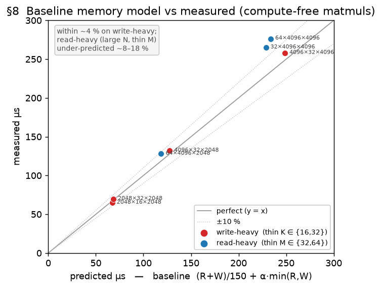

**Accuracy.** On the compute-free sweep (write-heavy `K ∈ {16,32}`, read-heavy `M ∈ {32,64}`,
`N` up to 4096) this baseline predicts the **write-heavy** corner to within ~4 %, but
**under-predicts the read-heavy corner — the large-`N`, thin-`M` shapes — by ~8–18 %** (figure):
there the read runs a little below the copy peak, plus a small fixed floor at tiny `M`. That
residual is minor next to the compute term that dominates real matmuls (§9), so it is carried
in the memory term rather than fit away. (The degenerate `K = 64` write-heavy point is dropped: a
single-stick contraction dim runs off-trend — `2048×64×2048` measures 56.6 µs, *below* both `K = 16`
and `K = 32`. It is a padding-free kernel — `K = 16` and `K = 32` pad the thin operand up to a full
64-element stick, adding preamble traffic — and it runs at ~158 GB/s, *above* the 150 GB/s copy peak
this term is built on, so it is not a clean memory-term point. And at fixed cores the §8 prediction is
independent of the `m·n` split: the byte count (`_fused_hbm_bytes`) carries no split dependence, and
the per-core tile area `M·N/(m·n)` is identical for every 32-core split, so the spill term is identical
too — `4×8`, `8×4`, `16×2` give the *identical* §8 prediction. Work-division dependence appears only
where the split changes the per-core geometry, in the compute and spill terms, §9 and §11, where the
split sweeps live.)

### §9. The compute term — its form and rate

**Observation.** With the memory term (§8) subtracted, the leftover time is compute. We model it
as **perfect parallelism**: each core does an equal `1/cores` share of the `MACs` at the same
rate, so compute time is expected to be **linear in `1/cores`** (double the cores → half the
time) and linear in the MAC count (double `K` → double the time):

```
compute = MACs / cores / peak       (MACs = M·N·K,  cores = m·n·k)
```

Here `peak` is a modeled **hardware compute ceiling** — the sustained number of
multiply-accumulates one core's systolic array retires per nanosecond (MAC/ns) — a single
constant we fit below. (Reaching `peak` needs enough per-core rows to fill the array; a
fill efficiency `pt_eff = min(1, (rows/64)^0.35) ≤ 1` captures the shortfall, and it is ≈ 1 for
every large matmul here — which is why this section can quote `compute = MACs/cores/peak`
unqualified.)

**Time tracks cores, not the split — when neither factor is too thin.** The `cores` in the
denominator is the *product* `m·n` (the planner keeps `K` whole), not the particular factoring —
*provided* neither factor of the split is too thin. The figure confirms this: at 32 cores the
most-balanced splits `4×8` and `8×4` land on the same time (~386 µs at `K=2048`, ~670 µs at
`K=4096`). A thin factor then costs a few percent, growing as the split gets thinner and with a mild
orientation dependence: `2×16` runs ~5 % slower (404 / 704 µs), `16×2` less so (+2.4 % at `K=2048`,
near-collapse at `K=4096`), and a fully lopsided split runs ~2× slower (`1×32`, `32×1`, present in
this sweep only at `K=4096`). So the collapse holds only when neither factor is too thin; that
residual is exactly the work-division effect quantified in §11–§12.

**Fitting `peak`, cleanly.** `peak` is the **slope** of kernel time against `1/cores` at a fixed
matmul — and a slope is immune to any constant offset, including the overlap term of §10. So
unlike the memory rate, `peak` is pinned without circularity. Two problem sizes (`K = 2048` and
`4096` at `M=N=2048`) swept over cores 4→32, fit on the balanced splits, give straight lines whose
**slope** pins `peak`; the `K=4096` slope is twice the `K=2048` slope, matching the 2× MAC count.
The fits carry a **~100 µs positive intercept** (the memory + non-hidden-overlap floor of a 32-core
matmul, not a per-kernel constant) — which is exactly why `peak` is read off the *slope*, not the
intercept. (The fit is balanced-only because the lopsided `1×32`/`32×1` points — present at 32 cores
only for `K=4096` — inflate that intercept to ~350 µs *and* drop the slope ~4 %.) One subtlety: the
bare slope implies `peak ≈ 1070`; the `~1140` below is what the **full** additive+overlap model gives
once that ~100 µs floor is reassigned to the memory and overlap terms. The fitted
`peak ≈ 1140–1160 MAC/ns/core` predicts these to **2–3 %**; its absolute level is *mildly*
correlated with the overlap factor (`peak = 1200` with the same overlap fits nearly as well), so
we quote a small range, not a spuriously exact number.


### §10. Compute and memory overlap — they do not simply add

**Observation.** Adding the two terms (`T = compute + memory`) **over-predicts** balanced
matmuls: the real kernel is faster than the sum. The array computes while the next operands
stream in, so the two phases run partly concurrently — at most the *shorter* one can hide inside
the longer, capping the saving at `min(compute, memory)`.

**Model.** Overlap a fixed fraction `γ` of that cap:

```
T = compute + memory − γ·min(compute, memory)
```

`γ=0` is serial; `γ=1` is a fully pipelined array (`T = max(compute, memory)`). The fit lands
`γ ≈ 0.46` — about half the shorter phase hidden. Why only half? Pipeline **fill and drain** can't
overlap (the first load has nothing to compute against, the last compute nothing to stream), and
that overhead grows as each core's pipeline shortens: for `2048×2048×2048` the hidden fraction
falls `0.64 → 0.49 → 0.35` as cores go `4 → 8 → 32`. A single `γ` is a compromise across core
counts; an `L`-dependent γ is the natural refinement (a queued core-count sweep, see the appendix).

![§10 prediction error vs memory fraction for every 32-core matmul run (k=1, power-of-2 shapes), colored by regime. Two markers per run: the additive model (γ=0, open) over-predicts more as the memory fraction grows; the overlap term (γ=0.46, filled) lowers every prediction, closing that over-prediction for the realistic bulk. Outliers are labeled with tensor size M×K×N and split m×n×k. The outlier causes — work-division extreme (lopsided split), tensor-size extreme (thin reduction), and tiny (small output) — are colored separately.](figures/fig10_matmul_overlap.png)

**Does γ generalize?** The figure plots **every 32-core matmul run** against its memory fraction, each
with two markers — additive (`γ=0`, open) and overlap (`γ=0.46`, filled). Read vertically: the drop
from open to filled *is* the overlap term — it always **lowers** the prediction (filled sits below
open), by construction. The additive model over-predicts more and more as the memory fraction grows —
up to **+40…+50 %** for the memory-heaviest runs — and overlap closes exactly that gap: the
**realistic** points land inside ±10 % across the whole fraction range. That the *same* `γ = 0.46`
does this for every realistic shape and memory fraction is the evidence it generalizes.

Because overlap only lowers the prediction, it is *not* a universal pull toward 0: a run whose
additive prediction is already near or below the measured time is pushed **more** negative. That
happens for a handful of **work-division extreme** runs (lopsided `1×32` / `16×2` / `32×1`), where the
additive model already under-predicts — overlap is the wrong lever for those, and the §12 split term
(applied separately, after the overlap) is what they need.

What still sits outside ±10 % after overlap is **not** an overlap miss — it is spill / split and
small-kernel effects taken up next, split into three distinct causes (each outlier labeled with its
size *and* split):

- **work-division extreme** (lopsided split, fanout > 8: `32×1`, `1×32`, `16×2`) — a normal-shape tensor
  whose per-core tile is fanned lopsidedly; this is §12's split term.
- **tensor-size extreme** (thin reduction, `K ≤ 128`) — a memory-heavy, compute-starved operand; it
  stresses the memory/tile term (§8 / §11), and sits at the high-memory-fraction right edge.
- **tiny** (small output, `min(M,N) ≤ 512`) — a small kernel riding the fixed per-kernel overhead floor.

The **realistic** group (balanced split, normal shape) is the tightest — the regime the model is built
for. (This figure keeps only the all-32-core, `k = 1`, power-of-2 cases; lower core counts are a separate
`γ(cores)` refinement — a single `γ` is a compromise across core counts, the queued core-count sweep in
the appendix.)

### §11. A residual: when the operand tile overflows on-chip memory

**Observation.** With the memory (§8), compute (§9), and overlap (§10) terms in place — the full
base model, minus this section's term — balanced high-core matmuls still leave a residual that
**grows once the per-core output tile overflows on-chip capacity**. That tile is the accumulator
of area `(M/m)·(N/n)`; the figure grows it with two `4×8`-split sweeps — the balanced splits a real
planner emits — (one raises `M/m` at `N/n = 256`, the other raises `N/n` at `M/m = 512`) and plots
both against the tile **size in bytes**. (This section, and its term, are fit on these `4×8` splits;
how *lopsidedly* the tile is split is a separate effect, taken up in §12.) The residual (measured − base model) sits near zero while the tile fits and climbs
steeply once the size passes ~128 KB/core (64K fp16 elements), reaching +277 µs (+17 %) at the
largest tile. That is the signature of running out of on-chip room.

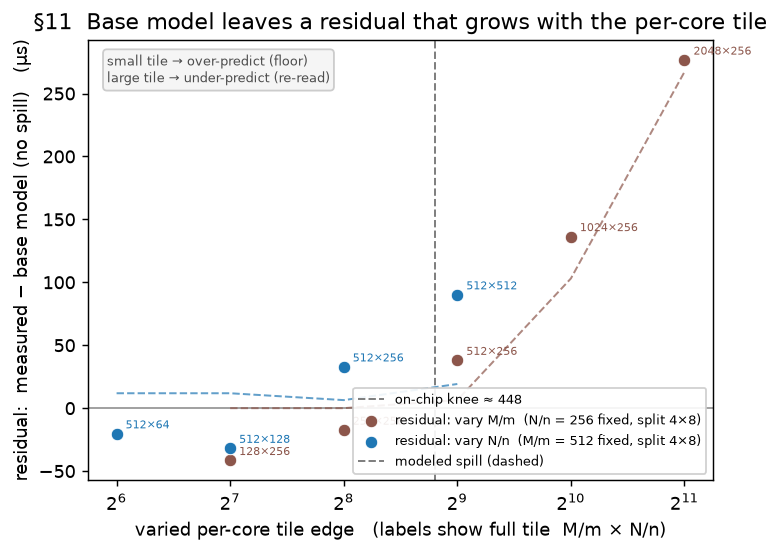

**Model.** Once the per-core output tile overflows on-chip capacity, both operands must be
re-streamed from HBM for reuse — extra traffic we call **spill**. The re-read *magnitude* is the
operand bytes; the *fraction* re-read grows with how far the tile overflows the capacity knee
(`area` in elements; `65536` elems = 128 KB at fp16):

```
spill = (|A| + |B|)·f(area),   area = (M/m)·(N/n),
f(area) = min(1.50, max(0, 0.45·log₂(area / 65536)))
```

where `|A|` and `|B|` are the two operand byte sizes the extractor records — `|A|` the `[M,K]`
activation, `|B|` the `[K,N]` weight — so `(|A|+|B|)` is the traffic for one full re-stream of both,

charged at the read rate. The knee at ~128 KB/core is the PE-array **accumulator** capacity, *not*
the LX scratchpad — the IR dumps show matmuls use **zero LX** (`lx = 0 B` on all 316 runs), so the
resource that overflows is on the compute side and the extra operand traffic is the re-stream it
forces. It is one threshold on the tile *as a whole*, not a separate limit per edge. (Because the
trigger is compute-side, charging the re-stream to HBM vs compute is partly interchangeable through
the §10 overlap; the current data do not separate them, and the HBM form fits the balanced envelope.)

**Residuals.** A few remain: at equal area an elongated tile costs a little more than a square one
(a shape dependence the area-only form omits); very *small* tiles are slightly *over*-predicted by
the opposite-sign small-tile floor; and because `f` saturates at 1.5, the very largest balanced
tiles (e.g. `8×4` past ~256 KB) are *under*-predicted by ~15 %. None matters much for what this term
is *for*: steering the compiler away from over-large per-core tiles.

### §12. Split shape: a large per-core tile fanned across many cores

**Observation.** With the memory (§8), compute (§9), overlap (§10) and spill (§11) terms in place,
forced **lopsided** splits still under-predict badly: at a fixed problem on 32 cores, `8×4` is basically accurate, but `16×2` misses
by ~40 %, `32×1` by ~61 %. The per-core output-tile *area* `(M/m)·(N/n)` is identical for every split
at fixed cores, so §11's area spill is the same for all of them and cannot see this — the miss
depends on **how** the output is split, not just the tile size.

**The data.** The figure plots the base-model residual (measured − model *without* this term) against
per-core tile size. **Balanced splits stay flat near zero at any tile size**; splitting either
dimension past its knee climbs once the tile passes the ~256 KB gate, and the two-sided term (dashed)
tracks each climb — the long-dim splits (steeper) and the short-dim splits (lighter, higher knee).


**Hypothesis.** Splitting an output dimension across many cores makes them re-read the operand they
share: the `m` cores that split `M` all need the same weight columns; the `n` cores that split `N`
all need the same activation rows. Past a cohort of ~8 cores the shared operand is re-fetched from
HBM rather than broadcast once. This bites only when the tile is **large** (past §11's capacity) *and*
a dimension is split many ways — and it is **asymmetric**: splitting the **longer** output dimension
into many thin slices is penalized sooner and harder than splitting the **shorter** one. Concretely
at `M ≫ N`, a `32×1` split (all 32 cores on the long `M`) costs about **twice** a `1×32` (all 32 on
the short `N`) at the same tile area — a difference a single symmetric term cannot represent.

**Model.** Two additive terms — one for how far the *longer* output dimension is split, one for the
*shorter* — charged **after** the compute/memory overlap (they are not hidden under compute; they are
why the lopsided kernel runs long):

```text
split = c_L · max(0, area − a₀) · max(0, log₂(fan_long / 8))
      + c_S · max(0, area − a₀) · max(0, log₂(fan_short / 16))
area = (M/m)·(N/n);   fan_long, fan_short = the split counts of the longer, shorter output dim
a₀ = 131072 elems (≈ 256 KB);   c_L = 2.6e−3,   c_S = 2.9e−3 µs/elem
```

`fan_long` is how many cores the longer output dimension is split into, `fan_short` the shorter.
The long-dim knee `/8` is the compiler's own cohort limit (`_COHORT_LIMIT` in its work-division cost
model); the short-dim knee `/16` is empirical — the shorter dimension tolerates a wider split before
it costs. `a₀` (twice §11's knee) gates out small tiles. Both terms are **exactly 0 for balanced
splits and for small tiles**, so §8–§11 is unchanged.

**After the term.** On the lopsided rows the error drops from **RMS 36 % → 15 %** (mean −29 → −2 %),
and both extremes are pulled in — the tall `16×2` a real compiler emits (long-dim term), and the
forced `32×1` / `1×32` ends (long- and short-dim terms) — with balanced and small kernels untouched:

| M×K×N | split | base err | with §12 term |
|---|---|---:|---:|
| 2048×2048×2048 | `16×2` (small tile) | −1 % | −1 % |
| 4096×2048×2048 | `16×2` | −37 % | −8 % |
| 8192×2048×2048 | `16×2` | −39 % | **−1 %** |
| 8192×2048×2048 | `32×1` (split the long `M` ×32) | −61 % | −11 % |
| 8192×2048×2048 | `1×32` (split the short `N` ×32) | −44 % | −4 % |
| 2048×2048×8192 | `1×32` (split the long `N` ×32) | −67 % | −24 % |

What remains is the most extreme wide-problem case (splitting a very long dimension ×32, last row):
better than before but still under — the deep tail the two knees do not fully reach.

**Part III accuracy — matmul, by regime** (power-of-2 shapes only). The **realistic** bulk is within a
few percent; the **work-division extreme** (lopsided-split) rows are now modeled by §12; the
**tensor-size extreme** (thin-K) and **tiny** (small-output) matmuls remain bounded, flagged residuals
off the real-workload path.

| regime | n | RMS % | mean % | err range | status |
|---|---:|---:|---:|---|---|
| realistic (balanced split, normal shape) | 34 | **5.8** | +3.4 | -6…+19 | modeled |
| work-division extreme (fanout > 8) | 10 | **10.2** | -3.2 | -16…+22 | §12 two-sided split term; only the most extreme ×32 splits still trail |
| tensor-size extreme (thin reduction, K ≤ 128) | 6 | 15.9 | +10.7 | +1…+32 | flagged: thin-operand memory/tile residual |
| tiny (small output, min(M,N) ≤ 512) | 7 | 27.7 | +8.6 | -28…+48 | flagged: fixed per-kernel overhead floor |

Representative realistic points (the regime the model is built for):

| M×K×N | split (m×n×k) | measured µs | predicted µs | err % |
|---|---|---:|---:|---:|
| 2048×2048×2048 | 2×2×1 (cores 4) | 2013.5 | 2091.0 | +3.8 |
| 2048×2048×2048 | 2×4×1 (cores 8) | 1095.9 | 1140.0 | +4.0 |
| 2048×2048×2048 | 4×8×1 (cores 32) | 384.4 | 393.4 | +2.3 |
| 4096×2048×2048 | 4×8×1 (cores 32) | 806.1 | 781.2 | −3.1 |
| 8192×2048×2048 | 4×8×1 (cores 32) | 1594.2 | 1582.0 | −0.8 |
| 2048×4096×2048 | 4×8×1 (cores 32) | 667.1 | 702.3 | +5.3 |
| 2048×2048×4096 | 4×8×1 (cores 32) | 764.0 | 781.2 | +2.2 |

**Every matmul data point** (57 runs, power-of-2 shapes only; `regime` = which row of the summary table above):

| regime | M×K×N | split (m×n×k) | meas µs | pred µs | err % |
|---|---|---|---:|---:|---:|
| `realistic` | 2048×2048×1024 | 4×8×1 | 167.6 | 199.5 | +19.0 |
| `realistic` | 1024×2048×2048 | 4×8×1 | 182.0 | 199.5 | +9.6 |
| `realistic` | 2048×2048×2048 | 8×4×1 | 383.4 | 393.4 | +2.6 |
| `realistic` | 2048×2048×2048 | 4×8×1 | 384.4 | 393.4 | +2.3 |
| `realistic` | 2048×2048×2048 | 4×8×1 | 384.9 | 393.4 | +2.2 |
| `realistic` | 2048×2048×2048 | 4×8×1 | 390.1 | 393.4 | +0.8 |
| `realistic` | 1024×2048×1024 | 2×2×1 | 506.5 | 542.4 | +7.1 |
| `realistic` | 2048×4096×2048 | 4×8×1 | 667.1 | 702.3 | +5.3 |
| `realistic` | 2048×4096×2048 | 4×8×1 | 668.0 | 702.3 | +5.1 |
| `realistic` | 2048×2048×4096 | 4×8×1 | 764.0 | 781.2 | +2.2 |
| `realistic` | 2048×2048×4096 | 4×8×1 | 770.3 | 781.2 | +1.4 |
| `realistic` | 4096×2048×2048 | 4×8×1 | 806.1 | 781.2 | -3.1 |
| `realistic` | 4096×2048×2048 | 4×8×1 | 810.3 | 781.2 | -3.6 |
| `realistic` | 4096×2048×2048 | 8×4×1 | 831.5 | 781.2 | -6.0 |
| `realistic` | 1024×4096×1024 | 2×2×1 | 1006.3 | 1070.7 | +6.4 |
| `realistic` | 2048×4096×2048 | 4×4×1 | 1093.4 | 1227.6 | +12.3 |
| `realistic` | 2048×2048×2048 | 2×4×1 | 1093.8 | 1140.0 | +4.2 |
| `realistic` | 2048×4096×2048 | 4×4×1 | 1094.5 | 1227.6 | +12.2 |
| `realistic` | 2048×2048×2048 | 2×4×1 | 1095.9 | 1140.0 | +4.0 |
| `realistic` | 8192×2048×2048 | 4×8×1 | 1594.2 | 1582.0 | -0.8 |
| `realistic` | 8192×2048×2048 | 4×8×1 | 1594.3 | 1582.0 | -0.8 |
| `realistic` | 8192×2048×2048 | 8×4×1 | 1614.7 | 1582.0 | -2.0 |
| `realistic` | 2048×2048×2048 | 2×2×1 | 2013.5 | 2091.0 | +3.8 |
| `realistic` | 2048×2048×2048 | 2×2×1 | 2014.9 | 2091.0 | +3.8 |
| `realistic` | 2048×4096×2048 | 2×4×1 | 2123.7 | 2223.8 | +4.7 |
| `realistic` | 2048×4096×2048 | 2×4×1 | 2125.0 | 2223.8 | +4.7 |
| `realistic` | 2048×4096×2048 | 2×4×1 | 2125.7 | 2223.8 | +4.6 |
| `realistic` | 2048×4096×2048 | 2×2×1 | 4021.0 | 4125.7 | +2.6 |
| `realistic` | 2048×4096×2048 | 2×2×1 | 4021.2 | 4125.7 | +2.6 |
| `realistic` | 2048×4096×2048 | 2×2×1 | 4022.1 | 4125.7 | +2.6 |
| `realistic` | 2048×4096×2048 | 2×2×1 | 4024.2 | 4125.7 | +2.5 |
| `realistic` | 2048×2048×4096 | 2×2×1 | 4026.8 | 4106.4 | +2.0 |
| `realistic` | 4096×2048×2048 | 2×2×1 | 4027.0 | 4106.4 | +2.0 |
| `realistic` | 4096×2048×4096 | 2×2×1 | 8045.1 | 8061.8 | +0.2 |
| `work-div` | 64×4096×2048 | 1×32×1 | 127.9 | 126.5 | -1.0 |
| `work-div` | 32×4096×4096 | 1×32×1 | 264.9 | 238.8 | -9.9 |
| `work-div` | 64×4096×4096 | 1×32×1 | 276.4 | 249.6 | -9.7 |
| `work-div` | 2048×2048×2048 | 2×16×1 | 399.4 | 393.4 | -1.5 |
| `work-div` | 4096×2048×2048 | 2×16×1 | 811.1 | 781.2 | -3.7 |
| `work-div` | 4096×2048×2048 | 32×1×1 | 1202.7 | 1468.0 | +22.1 |
| `work-div` | 4096×2048×2048 | 16×2×1 | 1222.8 | 1124.6 | -8.0 |
| `work-div` | 4096×2048×2048 | 1×32×1 | 1381.8 | 1158.7 | -16.1 |
| `work-div` | 8192×2048×2048 | 2×16×1 | 1632.6 | 1582.0 | -3.1 |
| `work-div` | 8192×2048×2048 | 16×2×1 | 2632.8 | 2612.2 | -0.8 |
| `tensor` | 1024×128×2048 | 4×8×1 | 31.5 | 41.7 | +32.5 |
| `tensor` | 2048×64×2048 | 4×8×1 | 56.6 | 68.0 | +20.2 |
| `tensor` | 2048×16×2048 | 4×8×1 | 64.7 | 68.6 | +6.0 |
| `tensor` | 2048×32×2048 | 4×8×1 | 69.6 | 71.2 | +2.4 |
| `tensor` | 4096×32×2048 | 4×8×1 | 131.8 | 134.0 | +1.7 |
| `tensor` | 4096×32×4096 | 4×8×1 | 257.9 | 261.5 | +1.4 |
| `tiny` | 512×64×512 | 4×8×1 | 5.3 | 5.4 | +2.2 |
| `tiny` | 512×64×512 | 4×4×1 | 7.5 | 5.6 | -24.7 |
| `tiny` | 512×64×512 | 2×4×1 | 8.4 | 6.1 | -27.6 |
| `tiny` | 512×512×1024 | 4×8×1 | 20.3 | 27.5 | +35.0 |
| `tiny` | 256×2048×512 | 4×8×1 | 26.0 | 28.2 | +8.4 |
| `tiny` | 512×2048×2048 | 4×8×1 | 86.2 | 127.7 | +48.2 |
| `tiny` | 2048×2048×512 | 4×8×1 | 107.4 | 127.7 | +19.0 |

---

### §13. Batched matmul: serial batches run below the single-matmul rate

**Observation.** In batched matmul the compiler **never splits the batch across cores** — it keeps every batch on the same
cores and iterates — so the **base** model (no bmm term) charges `B ×` a single matmul's compute and HBM. Measured, it runs
much slower. (The figures and the 2–4.6× factor in this observation are all vs that *base* model; the
slow-compute-rate term derived below closes the default-layout case to ~6 %.) At a balanced split the kernel is a **shape-dependent 2–4.6× the prediction**, and the
factor is **flat in `B`** once `B ≥ 4`: a genuine per-batch floor, not a one-off start-up cost.
(`B = 1` is excluded from the fit — with a single batch the compiler collapses the batch dimension
into a different plan: its `op_it_space_splits` has three dims where `B ≥ 2` has four.)

**The data.** The figure plots measured / predicted against `B` for three shapes. The **full bmm**
(solid) — a true `[B,M,K] @ [B,K,N]` with a distinct weight per batch — plateaus at a shape-dependent
**2–4.6×** for `B ≥ 4`. The **shared-weight** variant (dashed) is the `3d2d` case `[B,M,K] @ [K,N]`,
a projection: one 2-D weight applied to every batch, read **once** instead of once per batch. It
plateaus far lower (~1.3–2×). Both are flat in `B` — the cost is `B ×` a fixed per-batch penalty.
As an anchor, a **plain 2-D matmul** of one batch's shape (the star at `B = 1`) sits at ~1×: the model
is right for a single matmul, so the entire penalty comes from batching, not from the shape.

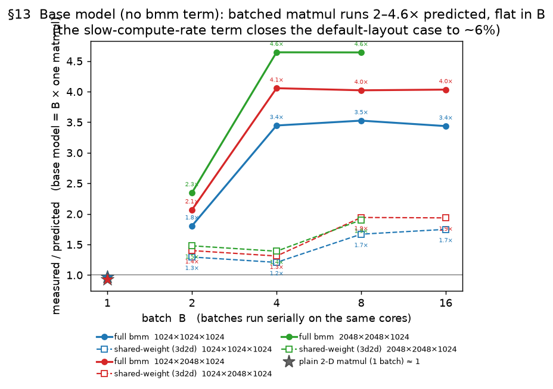

**The residual is over and above the `B ×` accounting — on both sides.** The extractor already counts
`B ×` the HBM bytes (the full bmm's weight `B ×`, the projection's once) **and** charges `B ×` the
compute; the prediction scales linearly with `B` (verified: it doubles per `B`-doubling). So the miss
is **not a byte or a MAC under-count; it is a rate**. It also **grows with the per-batch size**: at
fixed `B = 8` it runs 2.7× at `K = 256` up to 4.4× at `K = 4096` (and similarly with `M`, `N`) — the
more traffic per batch, the more of it runs at the low rate.

**The shared-weight control pins the rate to the weight re-read, not compute.** At *equal MACs*, the
full bmm and the projection differ only in weight traffic — the full re-reads it every batch, the
projection once. Their per-batch excess differs ~10× (~350 µs vs ~29 µs at a mid shape); a pure
compute-rate cause would give the *same* excess and does not.

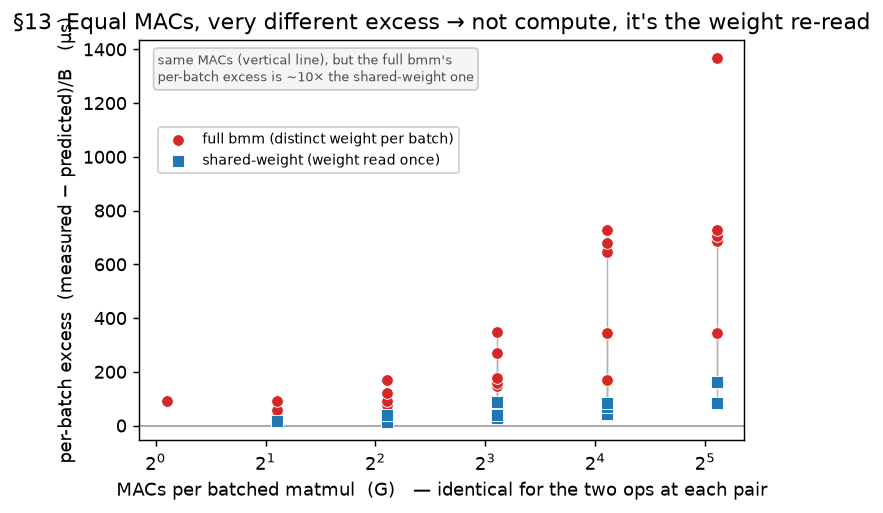

**A two-rate model.** Charge the (correctly counted) per-batch traffic at **two** effective rates: the
streamed part — inputs, output, spill, and the weight's *first* read — at `BW_stream ≈ 64 GB/s`, and
the **repeated weight re-read** of `(B−1)·K·N·2` bytes — present for the full bmm, zero for the
projection — at a much lower `BW_reread ≈ 16 GB/s`:

```text
mem = (streamed − reread)/BW_stream + reread/BW_reread     reread = (B−1)·K·N·2  (full bmm; 0 for 3d2d)
```

Serial batches drain the pipeline with no cross-batch locality, so even the streamed rate sits below
the ~150 GB/s single-matmul peak; the same weight re-read `B−1` times has the worst locality of all and
runs slower still. Applied to the memory half of the prediction (these shapes are ~half bandwidth,
~half compute), it cuts the mean error on the batched rows from **~68 % to ~36 %** (projection ~27 %,
full ~39 %). A single bandwidth cannot fit both — the full bmm needs a much lower rate than the
projection — which is the two-rate model's point. The remaining ~36 % is honest residual: `BW_stream`
and `BW_reread` are constants, yet the implied rates still drift ~2× with shape. **This two-rate
(weight-reread-bytes) model is now SUPERSEDED** — the layout experiment below shows the bytes are
layout-identical, so the penalty is not a re-read of extra bytes but a slow *compute rate*; the shipped
term is the `mac_peak` override described two paragraphs down. The two-rate write-up is kept as the
record of how the effect was first (approximately) captured before it was disentangled.

**The mechanism, disentangled: it is the device tile-order, not extra bytes.** A controlled layout
experiment settles what the two-rate model above could only infer through a bytes proxy. For a fixed
`[B,M,K] @ [B,K,N]` bmm we place each operand with a device `dim_order` of either the default
`[0,1,2]` (batch outermost) or `[1,0,2]` (batch second) and measure all four combinations **at
identical bytes** — the loop-level IR confirms **no inserted copy / restickify** and the counted
`io_hbm` is byte-identical (41.9 MB) across all four. At `B = 4`, `1024×2048×1024` (the `[0,1,2]²`
default and `[1,0,2]²` best are repeat-backed, reps = 7, cv 0.2–0.6 %; the two mixes from the matched
IR run):

| operand A order | operand B order | kernel µs | eff BW (GB/s) | vs best |
|---|---|---:|---:|---:|
| `[0,1,2]` | `[0,1,2]`  (compiler default) | 1847 | 22.7 | **3.32×** |
| `[0,1,2]` | `[1,0,2]` | 1293 | 32.4 | 2.33× |
| `[1,0,2]` | `[0,1,2]` | 1062 | 39.5 | 1.91× |
| `[1,0,2]` | `[1,0,2]`  (best) | 556 | 75.4 | 1.00× |

![§13c bmm layout: the same [4,1024,2048]@[4,2048,1024] bmm under all four operand dim_order combos at identical bytes (41.9 MB, IR-confirmed no inserted copy); the compiler default [0,1,2]² runs 3.3× slower (23 GB/s) than [1,0,2]² (75 GB/s), with the two single-operand swaps in between](figures/fig13c_matmul_bmm_layout.png)

The *same bytes* run **3.3× slower** on the default `[0,1,2]²` order (22.7 GB/s) than on `[1,0,2]²`
(75.4 GB/s) — a pure **dataflow / locality** effect, not a byte or MAC difference. So the §13 penalty
is the **device tile-order**: the default `[0,1,2]` walks the batch outermost with no cross-batch
operand locality — which is exactly what the two-rate model's "weight re-read" was a bytes-proxy for —
and the compiler emits this slow default for *every* real bmm, which is why real bmm rides the low
rate. Recovering the full 3.3× needs *both* operands on `[1,0,2]`; swapping only one recovers
~1.9× (A) or ~2.3× (B). The slow-default rate is **~215 µs/GMAC** (1847 µs / 8.59 GMAC), now
repeat-backed (the reps = 7 sweep gives 1840 / 546 µs for default / best, matching the IR run). The
full split-keyed rate across `B` and shape awaits the complete layout sweep — this run stalled before
the other quads finished — but this matched quad plus the IR confirm the mechanism and the default
rate. **It is a slow COMPUTE rate, not a bandwidth derate — and it is now shipped.** The tell is that
`µs/GMAC` is **flat at ~215** across the default-layout bmm cohort (16 distinct shapes, reps = 7,
cores = 32, B ≥ 4) — constant over a 16× MAC range and across varying `rpc`/`cpc`/`K` — a
**compute-bound** signature. A bandwidth effect would make `µs/GMAC` vary with the shape's byte/MAC
ratio; it does not (the per-shape `eff BW` above only *looks* variable because `io_hbm/MACs` varies).
So the strided per-batch stick re-gather of the default `[0,1,2]` order throttles the systolic array
to a **slow sustained rate ~160 MAC/ns/core** (vs 1140 for a plain 2-D matmul). The model now charges
this via a per-op `mac_peak` override (`_matmul_mac_peak`): a matmul whose **both** rank-3 operands sit
on the default `[0,1,2]` device order (batch at device pos −2), with **B ≥ 4** and **cores ≥ 8**, uses
`bmm_default_mac_peak_per_core_ns = 160`; every other matmul keeps 1140. On the clean repeat-backed
cohort this cuts the default-bmm error from **~420 % to a mean |err| of ~6 %**, and it is **provably
gold-safe** — 0 change on all 1514 non-bmm records (max |Δ| = 0.000000 µs), plain 2-D matmul
byte-identical. It fires only on genuine both-batched bmm, so the `3d2d` projection (one rank-3
operand) and the fast `[1,0,2]` layout are untouched. **Gates, honestly:** the slow rate is a
*many-core* effect (implied per-core peak 407/241/168 at cores 1/2/4 → ~160 only at cores ≥ 8) so
low-core bmm keeps 1140 and stays a large unmodeled residual; and at **B = 2** (batch ≪ the 32-way
`m·n` split) the penalty roughly halves (~108 µs/GMAC), a distinct small-batch corner left on the
plain rate. The remaining >10 % residuals are these gated corners plus thin single-stick tiles
(`M`/`N` ≤ 512) and old **single-shot** bmm points that disagree with the reps = 7 cohort (distrusted
per the noise protocol). A planner that placed bmm operands `[1,0,2]` would remove ~⅔ of the penalty
outright.

Two interactions are recorded so they are not later double-counted. A **lopsided** bmm split still
pays §12 on top of the floor, so a short-dim-fanned bmm is worse again (up to ~15×). And **forcing the
batch across cores** — which the planner never does — is catastrophic (~11× for the full bmm), because
every core then reloads a full weight per batch; it is a guard case, not something to model.

**Accuracy with the shipped bmm term.** On the clean repeat-backed default-layout cohort
(`bmm_wd` + both-default `bmm_layout`, B ≥ 4, cores = 32, reps = 7, non-single-stick;
`err = (pred − meas)/meas`, generated from the live model):

| M×K×N | B | meas µs | pred µs | err % |
|---|---:|---:|---:|---:|
| 512×2048×512 | 4 | 348 | 494 | +42 |
| 1024×1024×1024 | 4 | 962 | 955 | -1 |
| 1024×2048×1024 | 4 | 1838 | 1855 | +1 |
| 1024×2048×2048 | 4 | 3682 | 3649 | -1 |
| 2048×2048×1024 | 4 | 3688 | 3649 | -1 |
| 2048×2048×2048 | 4 | 7368 | 7204 | -2 |
| 1024×256×1024 | 8 | 656 | 536 | -18 |
| 1024×512×1024 | 8 | 1107 | 1012 | -9 |
| 512×2048×512 | 8 | 937 | 988 | +5 |
| 1024×1024×1024 | 8 | 1956 | 1911 | -2 |
| 1024×2048×1024 | 8 | 3654 | 3709 | +2 |
| 1024×2048×2048 | 8 | 7261 | 7298 | +1 |
| 1024×4096×1024 | 8 | 7091 | 7306 | +3 |
| 2048×2048×1024 | 8 | 7383 | 7298 | -1 |
| 512×2048×512 | 16 | 1879 | 1976 | +5 |
| 1024×2048×1024 | 16 | 7309 | 7419 | +2 |

**Mean |err| ~6 %** over these 16 distinct clean shapes, most within ±5 %. The two outliers are the
thin corners — `512×2048×512` (`M=N=512`, +42 %) and `1024×256×1024` (thin `K`, −18 %) — where a small
per-core tile underfills *on top of* the slow rate (a follow-up bmm `pt_eff`). The `3d2d` shared-weight
projection (one rank-3 operand) and the fast `[1,0,2]` layout do NOT take the term and keep their prior
errors; low-core and B = 2 bmm are gated out and remain unmodeled. So the term closes the *normal* bmm
case (the old −68 % category) to ~6 % while leaving the flagged corners honest. (The earlier two-rate
weight-reread model is superseded — the bytes are layout-identical; the penalty is a compute rate.)

---

## Part IV — Coarse tiling: fitting intermediates in on-chip memory

A *coarse-tiled* program fuses a chain of ops into **one** kernel and tiles a dimension so that,
within each tile, the intermediate tensors are small enough to live in on-chip scratchpad (LX)
instead of off-chip memory (HBM). Two examples: `softmax(x)` (the chain `max → sub → exp → sum →
div`) and a tiled `a @ b`. This part shows the cost of such a kernel needs **no new form** — it
is the Parts I–III model applied to a byte count that depends on where each tensor lives.

### §14. The whole model is one question: which tensors are in HBM, which in LX?

The accelerator has two memories: **HBM** (off-chip — the bandwidth every Part so far has
modeled) and **LX** (a small on-chip scratchpad). In the traffic model, an LX-resident tensor is
**free** — it never crosses the HBM bus — while an HBM tensor is charged at the Part I–III rates.
So a fused kernel's cost is set entirely by **which tensors sit in HBM**:

```
HBM bytes = every external input (counted once) + every output + every intermediate that spilled to HBM
LX intermediates = free
```

The model reads this straight from the IR: each tensor carries its residency (HBM or LX). It
sums the HBM ones — deduplicating a shared external input, which a fused kernel loads once and
re-serves on-chip — and ignores the LX ones. That is the entire coarse-tiling model.

**Why tiling helps.** Untiled, softmax's two full-size intermediates live in HBM (~7 passes over
the data); tiling the rows finely enough moves them into LX, leaving only the input and output in
HBM (2 passes). The byte-counting model follows the drop:

| tiles | intermediates in | HBM passes | measured µs | predicted µs | err % |
|---:|---|---:|---:|---:|---:|
| 1 (untiled) | HBM | 7.0 | 9927 | 9861 | −1 |
| 2 | HBM (spilled) | 4.5 | 9735 | 8006 | −18 |
| 4 | LX | 2.0 | 3143 | 3318 | +6 |
| 8 | LX | 2.0 | 2867 | 2990 | +4 |
| 16 | LX | 2.0 | 2649 | 2695 | +2 |
| 32 | LX | 2.0 | 2683 | 2695 | +0 |

(The `tiles=2` row still carries the deepest residual, and the `§15` bandwidth derate is what
lifts its prediction from the old −40 % toward −18 %.)

### §15. The LX-spill boundary: spilled traffic runs slower than peak

**Observation.** The byte count is accurate at both ends — fully untiled (all intermediates in
HBM, ~7 passes) and finely tiled (all in LX, 2 passes) — but **under-predicts by up to 40 % in
the transition between them**. The error is not random: it grows with the per-core **working
set** — the live intermediate bytes each core holds, `≈ 2 × (rows/core) × COLS × 2 B`.

| per-core working set | effective BW | err % | verdict |
|---:|---:|---:|---|
| ~4.2 MB | ~62 GB/s | **−40** | spills; runs at ~⅔ peak |
| ~2.1 MB | ~84 GB/s | −13…−18 | partial spill |
| ~1.0 MB | ~90 GB/s | −5…−13 | over capacity — mild |
| ≤ 0.5 MB | ~100 GB/s | −7…+4 | fits — model correct |

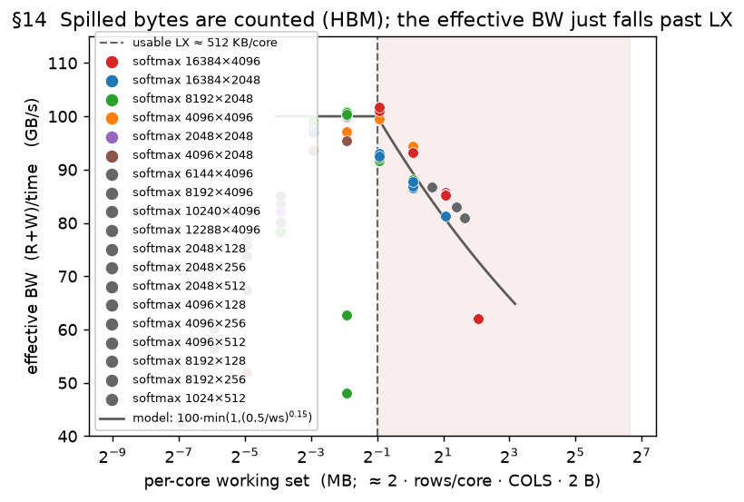

**It is a rate effect, not a byte miss.** The tempting story is that the spilled intermediates go
uncounted. They do not: at the spilling end the extractor already tags them **HBM** and counts
them (the ~4 MB/core case reads + writes ~600 MB). Yet the model still over-predicts the
*bandwidth* — it assumes the ~100 GB/s balanced-softmax rate, but the **effective bandwidth falls
as the working set overflows**, down to ~62 GB/s. So the spilled bytes are right; they just run
slower. (The untiled `tiles=1` case, with the largest working set of all, fits to −1 % — because
it is HBM *by design* and streams at the normal rate; only the *tiled-but-overflowing* regime is
slow.)

**Experiment / evidence.** The tile sweep, repeated at three shapes, collapses onto the working
set: effective BW is ~100 GB/s while it fits and falls smoothly once past **~512 KB/core** — the
*same* threshold for every shape. That threshold matches the **practically available** LX
independently (the raw scratchpad may be larger, but only ~512 KB/core is usable before spill
overhead).

**Model.** Derate the bandwidth for a coarse-tiled kernel whose per-core working set overflows LX
(`cap ≈ 512 KB`); the bytes stay counted, only the rate drops:

```
ws/core = 2 · (rows/core) · COLS · 2 B ;
BW  ×=  min(1, (cap / ws)^0.15)          for ws > cap   (else 1)
```

This cuts the coarse-tiling (softmax) error from **RMS 11.0 % to 5.7 %** and the worst spill point
from −40 % to −18 %. It is calibrated on softmax and gated to non-matmul coarse tiling; the
residual −18 % at the deepest overflow (8× capacity) is the one point the single exponent
under-derates.

### §16. Underfill: a short per-core tile runs the pipeline below peak — the `eff` term

**Observation.** Once the intermediates fit in LX (§15), a coarse-tiled kernel's speed still
depends on the **per-core tile height** — the rows each core streams per tile,
`h = ROWS / (cores · tiles)`: with too few rows the **effective bandwidth drops**. Sweeping the
tile count on softmax (isolating the LX-fitting points), the effective bandwidth climbs from
~48 GB/s at a 2-row tile (`h = 2`) to a ~150 GB/s plateau by `h ≈ 16`, then mildly declines
(figure).

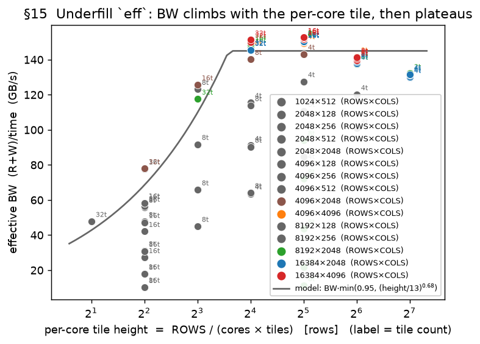

**Model (calibrated).** A pipeline-fill efficiency `eff ≤ 1` multiplies the memory term, keyed on
the per-core tile height `h = ROWS / (cores · tiles)`:

```
eff = min(0.95,  (h / 13)^0.68)          memory term = (R + W) / BW_eff / eff
```

It plateaus at 0.95 by `h ≈ 16` and derates below (≈0.45 at `h = 4`, ≈0.28 at `h = 2`). A
cross-`COLS` control (same `h`, double the tile bytes → same per-byte cost) confirmed it keys
on **rows (`h`), not tile bytes**. **On the softmax regime where the intermediates fit LX, this
gives RMS 5.9 %** (mean −1.2 %, over 45 points) — the coarse-tiling model is accurate once §15's
spill is set aside.

**Two residuals, both left unmodeled.** (1) Above `h ≈ 32` the efficiency mildly declines
(150 → 131 GB/s) while the model holds the 0.95 cap — a small, rows-driven droop. (2) A **tiled
matmul** (`matmul_row_tiling`) appears to underfill on *compute* the way softmax underfills on
memory — beyond a few tiles its time climbs as each tile gets fewer rows — but the available data
is thin, non-current, and partly non-monotonic, so it is **flagged, not modeled** (tiled matmuls
take `pt_eff = 1`; a clean tile-count sweep is queued). It is the −15 % `matmul_row` row in the
table below.


### Part IV data — every coarse-tiling run

All coarse ops we have measured, scored on the current model (rows averaged over repeat `runs`; `err = (pred − meas)/meas`). The K-tiling and looped-softmax paths are modeled to a few percent; the remaining large residuals are **flagged, not yet modeled** — some are known code defects (noted in the status column), which we take up next.

| op | n | RMS % | mean % | status |
|---|---:|---:|---:|---|
| `matmul_row_tiling` | 25 | 27 | -18 | per-tile compute underfill not modeled (`pt_eff=1`); grows with tile count |
| `matmul_k_tiling` | 15 | 7 | -4 | **modeled** (K-tiling, control) |
| `mm_nested_m_k` | 12 | 44 | -38 | nested compute under-counted (missing `×loop_trip`) — code fix queued |
| `bmm_k_tiling` | 17 | 63 | -60 | bmm batch floor (§13) + K-tiling; not modeled |
| `bmm_3d2d_k_tiling` | 6 | 14 | -13 | shared-weight K-tiling; close |
| `bmm_nested_b_k` | 4 | 65 | +15 | fractional batch-split trpc corrupts mem term — code fix queued |
| `softmax_row_tiling` | 34 | 20 | -4 | **modeled** (§14–§16); small `COLS≤128` rows underfill (cores=1) |
| `softmax_noexp_row_tiling` | 3 | 5 | +5 | **modeled** (§14–§16, control) |
| `softmax_unrolled` | 8 | 91 | -91 | extractor under-counts unrolled loop (cores=1, no `CoarseTileInfo`) |
| `ctsum`/`ctamax`/`ctamin` | 18 | 4 | +2 | **modeled** (coarse dim0 reduction, tiled over ROWS — control) |

Per-row detail:

| op | shape | tiles | runs | meas µs | pred µs | err % |
|---|---|---:|---:|---:|---:|---:|
| `matmul_row_tiling` | 2048×2048×2048 | 1 | 1 | 383 | 393 | +3 |
| `matmul_row_tiling` | 2048×2048×2048 | 2 | 2 | 341 | 358 | +5 |
| `matmul_row_tiling` | 2048×2048×2048 | 4 | 2 | 438 | 358 | -18 |
| `matmul_row_tiling` | 2048×2048×2048 | 8 | 2 | 655 | 358 | -45 |
| `matmul_row_tiling` | 2048×2048×2048 | 16 | 1 | 1004 | 358 | -64 |
| `matmul_row_tiling` | 2048×2048×4096 | 1 | 1 | 770 | 781 | +1 |
| `matmul_row_tiling` | 2048×2048×4096 | 2 | 2 | 754 | 720 | -4 |
| `matmul_row_tiling` | 2048×2048×4096 | 4 | 2 | 727 | 685 | -6 |
| `matmul_row_tiling` | 2048×2048×4096 | 8 | 2 | 1128 | 685 | -39 |
| `matmul_row_tiling` | 2048×2048×4096 | 16 | 1 | 1944 | 685 | -65 |
| `matmul_row_tiling` | 4096×2048×2048 | 1 | 1 | 835 | 781 | -6 |
| `matmul_row_tiling` | 4096×2048×2048 | 2 | 2 | 781 | 713 | -9 |
| `matmul_row_tiling` | 4096×2048×2048 | 4 | 2 | 678 | 685 | +1 |
| `matmul_row_tiling` | 4096×2048×2048 | 8 | 2 | 872 | 685 | -22 |
| `matmul_row_tiling` | 4096×2048×2048 | 16 | 1 | 1304 | 685 | -47 |
| `matmul_row_tiling` | 4096×2048×4096 | 1 | 1 | 1576 | 1451 | -8 |
| `matmul_row_tiling` | 4096×2048×4096 | 2 | 1 | 1538 | 1391 | -10 |
| `matmul_row_tiling` | 4096×2048×4096 | 4 | 1 | 1514 | 1341 | -11 |
| `matmul_row_tiling` | 4096×2048×4096 | 8 | 1 | 1455 | 1306 | -10 |
| `matmul_row_tiling` | 4096×2048×4096 | 16 | 1 | 2248 | 1306 | -42 |
| `matmul_row_tiling` | 8192×2048×2048 | 1 | 1 | 1636 | 1582 | -3 |
| `matmul_row_tiling` | 8192×2048×2048 | 2 | 1 | 1681 | 1423 | -15 |
| `matmul_row_tiling` | 8192×2048×2048 | 4 | 1 | 1588 | 1366 | -14 |
| `matmul_row_tiling` | 8192×2048×2048 | 8 | 1 | 1360 | 1337 | -2 |
| `matmul_row_tiling` | 8192×2048×2048 | 16 | 1 | 1744 | 1337 | -23 |
| `matmul_k_tiling` | 1024×4096×1024 | 1 | 1 | 198 | 201 | +2 |
| `matmul_k_tiling` | 1024×4096×1024 | 2 | 1 | 357 | 330 | -8 |
| `matmul_k_tiling` | 1024×4096×1024 | 4 | 1 | 521 | 474 | -9 |
| `matmul_k_tiling` | 1024×4096×1024 | 8 | 1 | 758 | 786 | +4 |
| `matmul_k_tiling` | 1024×4096×1024 | 16 | 1 | 1387 | 1422 | +3 |
| `matmul_k_tiling` | 2048×2048×2048 | 1 | 2 | 387 | 393 | +2 |
| `matmul_k_tiling` | 2048×2048×2048 | 2 | 2 | 1021 | 950 | -7 |
| `matmul_k_tiling` | 2048×2048×2048 | 4 | 2 | 1706 | 1546 | -9 |
| `matmul_k_tiling` | 2048×2048×2048 | 8 | 2 | 2884 | 2804 | -3 |
| `matmul_k_tiling` | 2048×2048×2048 | 16 | 2 | 5230 | 5352 | +2 |
| `matmul_k_tiling` | 4096×2048×2048 | 1 | 1 | 840 | 781 | -7 |
| `matmul_k_tiling` | 4096×2048×2048 | 2 | 1 | 2148 | 1875 | -13 |
| `matmul_k_tiling` | 4096×2048×2048 | 4 | 1 | 3506 | 3054 | -13 |
| `matmul_k_tiling` | 4096×2048×2048 | 8 | 1 | 5960 | 5563 | -7 |
| `matmul_k_tiling` | 4096×2048×2048 | 16 | 1 | 10622 | 10658 | +0 |
| `mm_nested_m_k` | 2048×2048×2048 | 1 | 2 | 386 | 393 | +2 |
| `mm_nested_m_k` | 2048×2048×2048 | 2 | 2 | 1103 | 669 | -39 |
| `mm_nested_m_k` | 2048×2048×2048 | 4 | 2 | 1721 | 1036 | -40 |
| `mm_nested_m_k` | 2048×2048×2048 | 8 | 2 | 2827 | 1642 | -42 |
| `mm_nested_m_k` | 2048×2048×4096 | 1 | 1 | 778 | 781 | +0 |
| `mm_nested_m_k` | 2048×2048×4096 | 2 | 1 | 2355 | 1310 | -44 |
| `mm_nested_m_k` | 2048×2048×4096 | 4 | 1 | 3649 | 1993 | -45 |
| `mm_nested_m_k` | 2048×2048×4096 | 8 | 1 | 5907 | 3130 | -47 |
| `mm_nested_m_k` | 4096×2048×2048 | 1 | 1 | 846 | 781 | -8 |
| `mm_nested_m_k` | 4096×2048×2048 | 2 | 1 | 2378 | 997 | -58 |
| `mm_nested_m_k` | 4096×2048×2048 | 4 | 1 | 3752 | 1248 | -67 |
| `mm_nested_m_k` | 4096×2048×2048 | 8 | 1 | 6060 | 1950 | -68 |
| `bmm_k_tiling` | 1·1024×2048×1024 | 1 | 1 | 148 | 114 | -23 |
| `bmm_k_tiling` | 2·1024×2048×1024 | 1 | 1 | 960 | 485 | -50 |
| `bmm_k_tiling` | 4·256×2048×1024 | 1 | 1 | 453 | 250 | -45 |
| `bmm_k_tiling` | 4·512×2048×1024 | 1 | 1 | 893 | 429 | -52 |
| `bmm_k_tiling` | 4·1024×512×1024 | 1 | 1 | 886 | 244 | -72 |
| `bmm_k_tiling` | 4·1024×1024×1024 | 1 | 1 | 1864 | 427 | -77 |
| `bmm_k_tiling` | 4·1024×2048×1024 | 1 | 5 | 3795 | 730 | -81 |
| `bmm_k_tiling` | 4·1024×2048×1024 | 2 | 2 | 4399 | 1084 | -75 |
| `bmm_k_tiling` | 4·1024×2048×1024 | 4 | 2 | 4953 | 1666 | -66 |
| `bmm_k_tiling` | 4·1024×2048×1024 | 8 | 2 | 6099 | 2917 | -52 |
| `bmm_k_tiling` | 4·1024×2048×1024 | 16 | 2 | 8352 | 5463 | -35 |
| `bmm_k_tiling` | 4·2048×2048×1024 | 1 | 1 | 5880 | 1536 | -74 |
| `bmm_k_tiling` | 8·1024×64×1024 | 1 | 1 | 300 | 154 | -48 |
| `bmm_k_tiling` | 8·1024×2048×1024 | 1 | 3 | 7414 | 1189 | -84 |
| `bmm_k_tiling` | 8·1024×2048×1024 | 2 | 1 | 8698 | 2063 | -76 |
| `bmm_k_tiling` | 8·1024×2048×1024 | 4 | 1 | 9703 | 3279 | -66 |
| `bmm_k_tiling` | 8·1024×2048×1024 | 8 | 1 | 11877 | 5808 | -51 |
| `bmm_3d2d_k_tiling` | 4·1024×2048×1024 | 1 | 2 | 598 | 562 | -6 |
| `bmm_3d2d_k_tiling` | 4·1024×2048×1024 | 2 | 2 | 1171 | 1000 | -15 |
| `bmm_3d2d_k_tiling` | 4·1024×2048×1024 | 4 | 2 | 1871 | 1582 | -15 |
| `bmm_3d2d_k_tiling` | 4·1024×2048×1024 | 8 | 2 | 3285 | 2833 | -14 |
| `bmm_3d2d_k_tiling` | 4·1024×2048×1024 | 16 | 2 | 6117 | 5379 | -12 |
| `bmm_3d2d_k_tiling` | 8·1024×2048×1024 | 1 | 1 | 1498 | 1223 | -18 |
| `bmm_nested_b_k` | 4·1024×2048×1024 | 1 | 2 | 3797 | 627 | -83 |
| `bmm_nested_b_k` | 4·1024×2048×1024 | 2 | 2 | 4897 | 5240 | +7 |
| `bmm_nested_b_k` | 4·1024×2048×1024 | 4 | 2 | 5635 | 8360 | +48 |
| `bmm_nested_b_k` | 4·1024×2048×1024 | 8 | 2 | 7151 | 13376 | +87 |
| `softmax_row_tiling` | 1024×512 | 8 | 6 | 127 | 26 | -79 |
| `softmax_row_tiling` | 2048×512 | 16 | 6 | 252 | 52 | -79 |
| `softmax_row_tiling` | 2048×2048 | 4 | 1 | 172 | 168 | -2 |
| `softmax_row_tiling` | 2048×2048 | 8 | 1 | 204 | 223 | +9 |
| `softmax_row_tiling` | 2048×2048 | 16 | 1 | 323 | 357 | +10 |
| `softmax_row_tiling` | 2048×2048 | 32 | 1 | 526 | 571 | +9 |
| `softmax_row_tiling` | 4096×2048 | 4 | 1 | 352 | 337 | -4 |
| `softmax_row_tiling` | 4096×2048 | 8 | 1 | 359 | 337 | -6 |
| `softmax_row_tiling` | 4096×2048 | 16 | 1 | 400 | 445 | +11 |
| `softmax_row_tiling` | 4096×2048 | 32 | 1 | 646 | 713 | +10 |
| `softmax_row_tiling` | 4096×4096 | 2 | 1 | 711 | 747 | +5 |
| `softmax_row_tiling` | 4096×4096 | 4 | 1 | 675 | 674 | -0 |
| `softmax_row_tiling` | 4096×4096 | 8 | 1 | 691 | 674 | -2 |
| `softmax_row_tiling` | 6144×4096 | 2 | 1 | 1160 | 1192 | +3 |
| `softmax_row_tiling` | 8192×2048 | 2 | 1 | 762 | 747 | -2 |
| `softmax_row_tiling` | 8192×2048 | 4 | 2 | 730 | 674 | -8 |
| `softmax_row_tiling` | 8192×2048 | 8 | 8 | 667 | 674 | +1 |
| `softmax_row_tiling` | 8192×2048 | 16 | 2 | 679 | 674 | -1 |
| `softmax_row_tiling` | 8192×2048 | 32 | 1 | 856 | 890 | +4 |
| `softmax_row_tiling` | 8192×4096 | 2 | 1 | 1574 | 1659 | +5 |
| `softmax_row_tiling` | 10240×4096 | 2 | 1 | 2020 | 2144 | +6 |
| `softmax_row_tiling` | 12288×4096 | 2 | 1 | 2487 | 2644 | +6 |
| `softmax_row_tiling` | 16384×2048 | 1 | 1 | 4956 | 4930 | -1 |
| `softmax_row_tiling` | 16384×2048 | 2 | 1 | 1653 | 1659 | +0 |
| `softmax_row_tiling` | 16384×2048 | 4 | 3 | 1541 | 1495 | -3 |
| `softmax_row_tiling` | 16384×2048 | 8 | 3 | 1444 | 1347 | -7 |
| `softmax_row_tiling` | 16384×2048 | 16 | 4 | 1340 | 1347 | +1 |
| `softmax_row_tiling` | 16384×2048 | 32 | 2 | 1384 | 1347 | -3 |
| `softmax_row_tiling` | 16384×4096 | 1 | 1 | 9927 | 9861 | -1 |
| `softmax_row_tiling` | 16384×4096 | 2 | 2 | 9735 | 8006 | -18 |
| `softmax_row_tiling` | 16384×4096 | 4 | 2 | 3143 | 3318 | +6 |
| `softmax_row_tiling` | 16384×4096 | 8 | 2 | 2867 | 2990 | +4 |
| `softmax_row_tiling` | 16384×4096 | 16 | 3 | 2649 | 2695 | +2 |
| `softmax_row_tiling` | 16384×4096 | 32 | 1 | 2683 | 2695 | +0 |
| `softmax_noexp_row_tiling` | 8192×2048 | 8 | 1 | 641 | 674 | +5 |
| `softmax_noexp_row_tiling` | 16384×2048 | 16 | 1 | 1284 | 1347 | +5 |
| `softmax_noexp_row_tiling` | 16384×4096 | 16 | 1 | 2545 | 2695 | +6 |
| `softmax_unrolled` | 1024×512 | 1 | 1 | 288 | 23 | -92 |
| `softmax_unrolled` | 1024×512 | 4 | 1 | 294 | 21 | -93 |
| `softmax_unrolled` | 1024×512 | 8 | 1 | 301 | 21 | -93 |
| `softmax_unrolled` | 1024×512 | 16 | 1 | 339 | 21 | -94 |
| `softmax_unrolled` | 2048×512 | 1 | 1 | 676 | 154 | -77 |
| `softmax_unrolled` | 2048×512 | 8 | 1 | 584 | 42 | -93 |
| `softmax_unrolled` | 2048×512 | 16 | 1 | 596 | 42 | -93 |
| `softmax_unrolled` | 2048×512 | 32 | 1 | 675 | 42 | -94 |
| `ctsum` | 2048×512 | 1 | 2 | 18 | 19 | +2 |
| `ctsum` | 4096×2048 | 1 | 2 | 142 | 149 | +5 |
| `ctsum` | 4096×2048 | 2 | 2 | 144 | 149 | +3 |
| `ctsum` | 4096×2048 | 4 | 2 | 146 | 149 | +2 |
| `ctsum` | 4096×2048 | 8 | 2 | 151 | 149 | -1 |
| `ctamax` | 4096×2048 | 1 | 1 | 142 | 149 | +5 |
| `ctamax` | 4096×2048 | 2 | 1 | 144 | 149 | +3 |
| `ctamax` | 4096×2048 | 4 | 1 | 147 | 149 | +1 |
| `ctamax` | 4096×2048 | 8 | 1 | 150 | 149 | -1 |
| `ctamin` | 4096×2048 | 1 | 1 | 141 | 149 | +5 |
| `ctamin` | 4096×2048 | 2 | 1 | 152 | 149 | -2 |
| `ctamin` | 4096×2048 | 4 | 1 | 148 | 149 | +1 |
| `ctamin` | 4096×2048 | 8 | 1 | 153 | 150 | -2 |
---

### Appendix — reproducibility

- **Offline scoring:** `notes/eval_model.py` recomputes accuracy for any model version from
  the stored `(features, measured_time)` dataset — no hardware. `--params k=v` re-scores a
  proposed parameter instantly.
- **Figures:** `notes/plot_report.py` regenerates every figure from `sweep_records.json`.
- **Sweeps:** each section's data comes from the profiling sweeps under
  `docs/source/user_guide/examples/` (a master runner chains them and folds the results into
  `sweep_records.json`).
