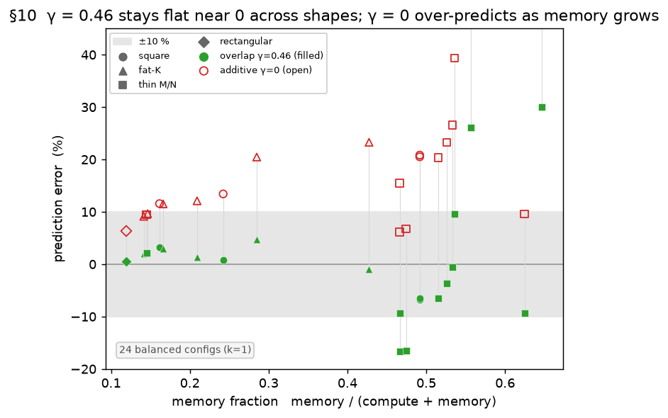

# Deriving a Cost Model for the IBM Spyre Accelerator

*Working draft. This is the long-form DERIVATION: how each term of the model was arrived
at, starting from an observation in the sweep data, then a question, a hypothesis, an
isolation experiment, and the resulting model form — validated offline with
`notes/eval_model.py` against the stored measured times (no re-run needed to re-score).
Every section follows that same arc. The concise summary lives in
[cost_model_presentation.md](cost_model_presentation.md).*

*Section skeleton — filled in iteratively, one section at a time; figures are generated
by `notes/plot_report.py` from `sweep_records.json`.*

---

## Part I — Pointwise: the gold baseline

### §1. Pointwise kernels are memory-I/O bound

Pointwise ops are the simplest kernels on the device: read one or more tensors, apply an
elementwise function, write one tensor. We use them to establish the reference every later
op is measured against.

**Observation 1 — time is linear in bytes, with no fixed cost.** Sweeping the balanced
1-read/1-write op `neg` (and `gelu`, `exp`) across sizes, the kernel time is a straight
line in the HBM bytes moved (device / stick-padded), passing through the origin:

| op | R×C | HBM traffic | kernel |
|---|---|---|---|
| `neg` | 2048×1024 | 8.4 MB | 77.6 µs |
| `neg` | 2048×4096 | 33.6 MB | 320.8 µs |
| `neg` | 4096×4096 | 67.1 MB | 646.6 µs |
| `neg` | 2048×16384 | 134.2 MB | 1314.3 µs |

A linear fit `T = a·bytes + b` over the 1R:1W set (16 points, 8.4–134 MB) gives
**R² = 0.99996**, slope → **~102 GB/s**, and intercept **b = −7 µs ≈ 0** (−9 % of the
smallest kernel — no *positive* per-kernel floor).


**Observation 2 — the arithmetic is free.** `gelu` and `exp` (a transcendental) land within
~1 % of `neg` at every size (e.g. at 8.4 MB: 78.3 / 77.1 / 77.6 µs; at 134 MB:
1312.7 / 1314.5 / 1314.3 µs). Doing real math costs the same as negating → **there is no
compute term**; the kernel time is set entirely by moving bytes.

**Model (baseline).** `T = bytes / BW` — no compute term, no fixed per-kernel cost. This
is the gold reference. One thread is deliberately left for the next section: the fitted rate here is
~102–108 GB/s, *below* the read-only peak (~150) — i.e. the effective BW is **not** a
single constant; it depends on the read/write mix (§2).

### §2. The read/write ratio changes the effective bandwidth

**Observation — the effective BW is not a single constant.** §1's fit gave ~102–108 GB/s
for `neg`, but a read-dominated op runs far *faster* per byte. Grouping ops by their
read/write mix (effective BW = `(R+W)/time`, and `w = W/(R+W)` the write fraction):

| class | example op | `w` | effBW |
|---|---|---|---|
| read-dominated | `sumrow`/`read`/`amax` (reduce → tiny write) | ~0 | ~150 GB/s |
| 2 reads : 1 write | `add`/`mul` | 0.33 | ~116 GB/s |
| 1 read : 1 write | `neg`/`gelu`/`exp` | 0.50 | ~108 GB/s |
| write-dominated | `write` = `b[1,C] + c[R,1]`: both inputs broadcast → tiny reads, full write | ~1 | ~144 GB/s |

So `bytes/BW` with one BW is wrong — the effBW falls as the traffic becomes balanced, then
climbs back toward write-only.

**Question.** What makes balanced traffic slower per byte than one-directional traffic?

**Hypothesis.** HBM is a shared bus that pays a **turnaround** cost when it switches
between reading and writing. The penalty falls on the overlap `min(R,W)`, which is 0 for
pure read or pure write and maximal at a balanced 1:1:

```
T = (R+W)/BW_peak + α·min(R,W)      ⇒   effBW = 1 / (1/BW_peak + α·f),  f = min(R,W)/(R+W)
```

This predicts a **symmetric valley** in effBW vs `w`: the peak rate at `w=0` and `w=1`,
the minimum at `w=0.5`.


Each class is one op swept at several sizes, so each shows several points; the small
vertical spread within a class is a mild size drift (~2–3 %). Two things to read off the
plot: (a) the two ends of the valley reach the **same height** — read-dominated (~150) ≈
write-dominated (~144) — so reads and writes share **one** rate, and a single `BW_peak` is
right (not separate read/write rates); (b) the `n-ary` crosses (`add3`/`add4`) sit at the
same `w=0.33` as `add` but **below** the curve — they do not fit this two-parameter model,
which is the subject of §3.

**The `BW_peak` value is op-class-soft.** Fitting *only* the pure-streaming pointwise ratios
(`neg` 1:1 + `add` 2:1) prefers **BW_peak ≈ 137, α ≈ 0.0039** — the 150 comes from reductions,
which run faster. A single `BW_peak` cannot serve both; scoring candidate values against all
the measured points shows lowering it helps pointwise but hurts reductions —

| params | pointwise RMS | reduction RMS |
|---|---|---|
| `BW_peak=150, α=0.00574` (current) | 5.1 % | **3.3 %** |
| `BW_peak=140, α=0.0047` | 4.9 % | 8.8 % (+8 bias) |
| `BW_peak=136, α=0.0038` | 4.4 % | 11.5 % (+11 bias) |

We **keep `BW_peak=150, α=0.00574`** — the better aggregate (reductions land at ~150 and
must not be sacrificed for a ~0.7 pt pointwise gain). The residual is that pure-streaming
pointwise runs ~10 % below the reduction rate — a real op-class difference, flagged not
modeled. *(Reductions are also not a perfectly clean read-only anchor: their effBW drifts
147→121 from ROWS 2048→8192, a stick-padded-output access effect examined in §5.)*

**Model.** `T = (R+W)/BW_peak + α·min(R,W)`, with `BW_peak = 150`, `α = 0.00574 ns/B`.

### §3. Chained pointwise ops pay a per-op derate

**Observation.** In §2's figure, `add3`/`add4` sat *below* the turnaround valley — they run
slower per byte than a single `add`, and it worsens with each extra operand.

**Why: the hardware add is binary.** The loop-level IR only fuses a **2-input → 1-output**
add, so an n-input sum compiles as a **chain of binary adds**, each writing an intermediate
that the next reads back:

```
add3:  op0 = arg0 + arg1            add4:  op0 = arg0 + arg1
       op1 = buf0 + arg2  (= out)          op1 = buf0 + arg2
                                           op2 = buf1 + arg3  (= out)
```

With scratchpad planning off every buffer lives in HBM, so each intermediate (`buf0`,
`buf1`) is **written and read back** — and that traffic is already in the byte count:

| op | reads | writes | R | W | `w = W/(R+W)` |
|---|---|---|---|---|---|
| `add` | arg0, arg1 | out | 2 | 1 | 0.33 |
| `add3` | arg0, arg1, **buf0**, arg2 | **buf0**, out | 4 | 2 | 0.33 |
| `add4` | arg0, arg1, **buf0**, arg2, **buf1**, arg3 | **buf0**, **buf1**, out | 6 | 3 | 0.33 |

**The round-trip bytes do not fully explain it.** Every arity has the *same* `w = 1/3`, so
the §2 turnaround model predicts the *same* effective BW (~117 GB/s) for all of them — a flat
line. But the measured effBW **declines**: 116 → 108 → 99 as `add → add3 → add4`. So there is
an extra cost *beyond* the counted round-trip bytes.


**Model.** A per-op **arity derate** captures the decline: `T × (1 + 0.075·(n_ops − 1))`. It
lands `add3` exactly (base+turn 216 µs × 1.075 = 232 µs = measured) and `add4` within ~2 %.

### Part I accuracy — every pointwise data point

Predicted vs measured for all pointwise ops (`T = (R+W)/BW_peak + α·min(R,W)`, with the
arity derate for the chained adds). **RMS 1.9 %, mean −0.2 %, range −3.0…+4.3 %** over
28 points — every point within ~4 %. (`copy` is *not* a pointwise op and is excluded here:
`x + 1.0` lowers to an `add` with a resident broadcast constant, so it is a broadcast op —
its accuracy is reported with the broadcast ops in §4.)

| op | R×C | measured µs | predicted µs | err % |
|---|---|---:|---:|---:|
| `neg` | 512×8192 | 156.6 | 160.0 | +2.2 |
| `neg` | 1024×4096 | 153.4 | 160.0 | +4.3 |
| `neg` | 2048×1024 | 77.6 | 80.0 | +3.1 |
| `neg` | 2048×2048 | 159.1 | 160.0 | +0.6 |
| `neg` | 2048×2048 | 161.3 | 160.0 | −0.8 |
| `neg` | 2048×4096 | 320.8 | 320.0 | −0.3 |
| `neg` | 2048×16384 | 1314.3 | 1280.0 | −2.6 |
| `neg` | 4096×1024 | 160.3 | 160.0 | −0.2 |
| `neg` | 4096×4096 | 646.6 | 640.0 | −1.0 |
| `neg` | 8192×512 | 159.0 | 160.0 | +0.6 |
| `gelu` | 2048×1024 | 77.1 | 80.0 | +3.7 |
| `gelu` | 2048×4096 | 319.1 | 320.0 | +0.3 |
| `gelu` | 2048×16384 | 1314.5 | 1280.0 | −2.6 |
| `exp` | 2048×1024 | 78.3 | 80.0 | +2.2 |
| `exp` | 2048×4096 | 322.4 | 320.0 | −0.8 |
| `exp` | 2048×16384 | 1312.7 | 1280.0 | −2.5 |
| `mul` | 2048×1024 | 108.9 | 108.0 | −0.9 |
| `mul` | 2048×4096 | 433.0 | 431.8 | −0.3 |
| `mul` | 2048×16384 | 1751.6 | 1727.4 | −1.4 |
| `add` | 2048×1024 | 107.0 | 108.0 | +0.9 |
| `add` | 2048×4096 | 431.7 | 431.8 | +0.0 |
| `add` | 2048×16384 | 1757.0 | 1727.4 | −1.7 |
| `add3` | 2048×1024 | 232.2 | 232.1 | −0.0 |
| `add3` | 2048×4096 | 934.4 | 928.5 | −0.6 |
| `add3` | 2048×16384 | 3740.3 | 3713.9 | −0.7 |
| `add4` | 2048×1024 | 375.6 | 372.5 | −0.8 |
| `add4` | 2048×4096 | 1523.1 | 1489.9 | −2.2 |
| `add4` | 2048×16384 | 6146.0 | 5959.5 | −3.0 |

---

## Part II — Other memory-bound ops

### §4. Broadcast: a broadcast operand is loaded once — and raises the effective BW

A *broadcast* operand is a small tensor (a row `[1,C]`, a column `[R,1]`, or a scalar)
added/multiplied against a full tensor and reused across the broadcast dimension. It has
two effects, both distinct from a plain 1R:1W op.

**(a) I/O counting — loaded once.** `bcast` (`a[R,C] + b[1,C]`) costs about the same as a
single streaming pass over `a`, not two full reads: the operand `b` is counted at its own
(one-row) device size, loaded once, not scaled up to the output.

**(b) A broadcast operand raises the effective bandwidth.** We report each op's *effective
bandwidth* — `(R + W) / time`, the total HBM bytes moved divided by the kernel time. At
well-filled sizes (ROWS ≥ 2048) the four broadcast-operand ops run above `neg`'s steady ~105:

| op | effective BW `(R+W)/time` (GB/s), ROWS=2048, COLS 2048–16384 |
|---|---:|
| `neg` (1R:1W baseline) | ≈ 105 |
| `copy` = `x + 1.0` (add a broadcast scalar) | 118–119 |
| `bcast` (`a + b[1,C]`) | 117–123 |
| `bcastcol` (`a + b[R,1]`) | 118–121 |
| `mulbcast` (`a * b[1,C]`) | 115–123 |


A dedicated COLS sweep confirms it: all four hold **~117–118 GB/s across COLS 2048–16384**
(the COLS=1024 points sit a little higher — small-tensor noise). The same lift shows up for
three different adds and a multiply, so it comes from *having a broadcast operand*, not from
a particular instruction. Each of these ops also streams a full input `a[R,C]`, whose cost
dominates and does not depend on the operand's residency, so the effective bandwidth stays
flat with size — these ops do **not** degrade at large C (contrast `write` below).

**Model.** An op that streams a full input together with a broadcast operand is given the
effective bandwidth `bw_broadcast = 118 GB/s`, using the same per-op-bandwidth mechanism as
the transport ops (§6). `copy`, `bcast`, `bcastcol`, and `mulbcast` fall in this class. The
physical reason a broadcast operand runs faster than a plain 1R:1W op is not established; the
value is calibrated to the measurements above.

**`write` — an outer-product write, modeled empirically.** `write` (`b[1,C] + c[R,1]`)
broadcasts *both* operands. On the device the row operand `b[1,C]` is only `C` elements
(~32 KB even at C=16384) and the column operand `c[R,1]` is stick-inflated to `R × 64` (each
of the R values occupies its own 64-element stick); both are small next to the `[R,C]`
output, so a naive model treats `write` as an output-dominated write. Empirically it is much
slower — its effective bandwidth falls from ~140 GB/s at small sizes to ~56 at large — and
the cost per output byte rises with COLS, and more weakly with ROWS:


At matched output size a wide (large-C) tensor is slower than a tall one (17 MB: 9.7 vs 8.2
µs/MB; 67 MB: 17.7 vs 10.4). The operands are far too small to spill, so the slowdown is in
the outer-product write itself (the output device layout is `[C/64, R, 64]`, so a larger C
means more column-stick planes and the write becomes less efficient). A clean mechanism has
not been isolated — a saturating spill term under-predicts the large cases, while the growth
is close to a power law — so we charge an **empirical extra HBM cost**, fit on the write
sweep:

```
extra_bytes  =  2.148e-7 · ROWS^1.60 · COLS^2.20   (charged at BW_peak)
```

This brings the `write` errors to ~10 % RMS (worst ~−24 % at two mid sizes) and the whole
broadcast category from 19 % to **7.7 %**. It is an admitted black-box for a rare
outer-product op, to be replaced once the mechanism is understood; a denser ROWS×COLS grid
would sharpen it.

**§4 accuracy — every broadcast data point.** RMS **7.7 %**, mean +0.1 %, over 51 points.
The error budget is concentrated in `write` (the outer-product black-box, worst −24 %) and a
few small-`ROWS` broadcast points where a fixed per-op rate slightly mis-serves the tiny cases.

| op | R×C | measured µs | predicted µs | err % |
|---|---|---:|---:|---:|
| `copy` | 2048×1024 | 67.5 | 71.1 | +5.4 |
| `copy` | 2048×1024 | 70.4 | 71.1 | +1.0 |
| `copy` | 2048×2048 | 141.2 | 142.2 | +0.7 |
| `copy` | 2048×4096 | 283.7 | 284.4 | +0.2 |
| `copy` | 2048×4096 | 286.2 | 284.4 | −0.7 |
| `copy` | 2048×8192 | 558.0 | 568.7 | +1.9 |
| `copy` | 2048×16384 | 1131.8 | 1137.4 | +0.5 |
| `copy` | 2048×16384 | 1136.4 | 1137.4 | +0.1 |
| `copy` | 8192×2048 | 604.3 | 568.7 | −5.9 |
| `copy` | 16384×2048 | 1230.8 | 1137.4 | −7.6 |
| `copy` | 16384×4096 | 2473.0 | 2274.9 | −8.0 |
| `bcast` | 64×16384 | 34.5 | 35.8 | +3.9 |
| `bcast` | 256×16384 | 180.6 | 142.5 | −21.1 |
| `bcast` | 2048×1024 | 64.8 | 71.1 | +9.8 |
| `bcast` | 2048×2048 | 136.3 | 142.2 | +4.3 |
| `bcast` | 2048×4096 | 278.5 | 284.4 | +2.1 |
| `bcast` | 2048×8192 | 570.8 | 568.9 | −0.3 |
| `bcast` | 2048×16384 | 1147.7 | 1137.7 | −0.9 |
| `bcast` | 2048×16384 | 1151.3 | 1137.7 | −1.2 |
| `bcastcol` | 64×16384 | 33.6 | 35.6 | +5.9 |
| `bcastcol` | 256×16384 | 146.6 | 142.5 | −2.8 |
| `bcastcol` | 2048×1024 | 69.6 | 73.3 | +5.4 |
| `bcastcol` | 2048×2048 | 141.1 | 144.4 | +2.3 |
| `bcastcol` | 2048×4096 | 280.9 | 286.6 | +2.0 |
| `bcastcol` | 2048×8192 | 567.8 | 570.9 | +0.5 |
| `bcastcol` | 2048×16384 | 1138.6 | 1139.7 | +0.1 |
| `bcastcol` | 2048×16384 | 1143.2 | 1139.7 | −0.3 |
| `mulbcast` | 64×16384 | 31.6 | 35.8 | +13.5 |
| `mulbcast` | 256×16384 | 177.8 | 142.5 | −19.9 |
| `mulbcast` | 2048×1024 | 63.4 | 71.1 | +12.2 |
| `mulbcast` | 2048×2048 | 136.9 | 142.2 | +3.9 |
| `mulbcast` | 2048×4096 | 277.7 | 284.4 | +2.4 |
| `mulbcast` | 2048×8192 | 568.3 | 568.9 | +0.1 |
| `mulbcast` | 2048×16384 | 1159.2 | 1137.7 | −1.9 |
| `mulbcast` | 2048×16384 | 1166.7 | 1137.7 | −2.5 |
| `write` | 64×16384 | 15.4 | 16.6 | +7.8 |
| `write` | 256×16384 | 70.7 | 75.8 | +7.3 |
| `write` | 512×1024 | 8.5 | 8.0 | −6.4 |
| `write` | 512×4096 | 29.9 | 31.6 | +5.8 |
| `write` | 512×16384 | 163.0 | 170.9 | +4.9 |
| `write` | 2048×1024 | 31.1 | 32.4 | +4.4 |
| `write` | 2048×1024 | 32.0 | 32.4 | +1.3 |
| `write` | 2048×2048 | 59.6 | 64.7 | +8.6 |
| `write` | 2048×4096 | 150.7 | 140.4 | −6.9 |
| `write` | 2048×16384 | 1190.1 | 982.9 | −17.4 |
| `write` | 2048×16384 | 1299.6 | 982.9 | −24.4 |
| `write` | 8192×1024 | 133.4 | 135.8 | +1.8 |
| `write` | 8192×1024 | 137.9 | 135.8 | −1.5 |
| `write` | 8192×2048 | 255.0 | 287.1 | +12.6 |
| `write` | 8192×4096 | 700.4 | 692.0 | −1.2 |
| `write` | 8192×16384 | 6653.1 | 6690.5 | +0.6 |

### §5. Reduction: read-bound, at a rate that falls with ROWS

**Model.** A reduction over the last axis (`sum`/`amax`/`mean`, `x[R,C] → [R]`, plus the
whole-tensor `sumall` and the pure `read`) reads the full input and writes an almost negligible
output, so it is a **read at an effective bandwidth** — no turnaround term. That read bandwidth
is not constant: it starts at the ~150 GB/s read peak for small inputs and **falls as ROWS
grows** (the read pipeline degrades as each core streams more rows), saturating around
~113 GB/s. A single curve fits it:

```
reduction read BW = min(150,  114 + 61·exp(−ROWS / 3700))   GB/s
```

**The falloff is op-independent and keyed on ROWS, not COLS.** All five reductions trace the
*same* curve (figure): 149 → 134 → 121 → 115 GB/s at ROWS 2048 → 4096 → 8192 → 16384. Holding
ROWS fixed and varying COLS leaves the rate flat (~119–125 GB/s across COLS 1024–4096 at
ROWS 8192), confirming ROWS — not total bytes or COLS — is the driver.


**`sumcol` is the exception.** A reduction over the *outer* axis (`sum(x, dim=0) → [C]`) walks
memory differently and does not show the ROWS falloff; it keeps its own flat access-pattern
rate (~113 GB/s, the `reduce_outer` rate of §6). A cross-core ring combine (when the reduced
axis is split across cores) is provably tiny and carried but inert.

**§5 accuracy.** RMS **2.6 %**, mean +1.3 %, over 58 points — within ~6 % everywhere, across the
full ROWS range now that the falloff is modeled. Representative shapes (repeats omitted):

| op | R×C | measured µs | predicted µs | err % |
|---|---|---:|---:|---:|
| `read` | 2048×1024 | 30.1 | 29.9 | −0.6 |
| `read` | 2048×2048 | 57.6 | 58.0 | +0.8 |
| `read` | 2048×2048 | 59.5 | 58.0 | −2.5 |
| `read` | 2048×4096 | 112.8 | 114.3 | +1.4 |
| `read` | 2048×8192 | 222.9 | 226.8 | +1.8 |
| `read` | 4096×2048 | 128.2 | 129.0 | +0.6 |
| `read` | 8192×1024 | 144.7 | 147.7 | +2.1 |
| `read` | 8192×2048 | 281.8 | 286.8 | +1.8 |
| `read` | 8192×4096 | 545.1 | 564.9 | +3.6 |
| `read` | 16384×2048 | 600.9 | 603.2 | +0.4 |
| `sumrow` | 2048×1024 | 30.6 | 29.9 | −2.4 |
| `sumrow` | 2048×2048 | 58.8 | 58.0 | −1.3 |
| `sumrow` | 2048×4096 | 111.4 | 114.3 | +2.6 |
| `sumrow` | 2048×8192 | 220.5 | 226.8 | +2.9 |
| `sumrow` | 4096×2048 | 127.2 | 129.0 | +1.4 |
| `sumrow` | 8192×1024 | 139.8 | 147.7 | +5.7 |
| `sumrow` | 8192×2048 | 277.0 | 286.8 | +3.5 |
| `sumrow` | 8192×4096 | 534.5 | 564.9 | +5.7 |
| `sumrow` | 16384×2048 | 610.6 | 603.2 | −1.2 |
| `amax` | 2048×2048 | 57.6 | 58.0 | +0.8 |
| `amax` | 2048×8192 | 219.7 | 226.8 | +3.3 |
| `amax` | 4096×2048 | 128.9 | 129.0 | +0.1 |
| `amax` | 8192×1024 | 146.6 | 147.7 | +0.8 |
| `amax` | 8192×2048 | 291.4 | 286.8 | −1.6 |
| `amax` | 8192×4096 | 556.8 | 564.9 | +1.4 |
| `amax` | 16384×2048 | 612.7 | 603.2 | −1.6 |
| `mean` | 2048×2048 | 58.8 | 58.0 | −1.4 |
| `mean` | 2048×8192 | 218.9 | 226.8 | +3.6 |
| `mean` | 4096×2048 | 127.9 | 129.0 | +0.8 |
| `mean` | 8192×1024 | 145.6 | 147.7 | +1.4 |
| `mean` | 8192×2048 | 280.6 | 286.8 | +2.2 |
| `mean` | 8192×4096 | 546.7 | 564.9 | +3.3 |
| `mean` | 16384×2048 | 609.6 | 603.2 | −1.0 |
| `sumall` | 2048×2048 | 54.2 | 56.3 | +3.8 |
| `sumall` | 2048×8192 | 212.2 | 225.1 | +6.1 |
| `sumall` | 4096×2048 | 128.0 | 125.1 | −2.3 |
| `sumall` | 8192×1024 | 139.4 | 139.0 | −0.3 |
| `sumall` | 8192×2048 | 279.3 | 278.1 | −0.4 |
| `sumall` | 8192×4096 | 548.7 | 556.2 | +1.4 |
| `sumall` | 16384×2048 | 572.3 | 584.9 | +2.2 |
| `sumcol` | 2048×2048 | 70.6 | 74.3 | +5.2 |
| `sumcol` | 2048×8192 | 292.9 | 297.1 | +1.4 |
| `sumcol` | 4096×2048 | 145.1 | 148.5 | +2.3 |
| `sumcol` | 8192×2048 | 286.5 | 297.0 | +3.7 |
| `sumcol` | 16384×2048 | 571.9 | 593.9 | +3.9 |

### §6. Transport ops are copies with an access-pattern effective bandwidth

**Observation.** Transport ops — `transpose` and concatenation `cat0`/`cat1` — rearrange data
without arithmetic. In the IR each lowers to a plain byte-copy (a `clone`, the same primitive a
trivial copy emits; we confirmed the recorded op name is `clone`, versus `neg` for a real
pointwise op). So the only thing that distinguishes a transport from a copy is *how it walks
memory*, and that sets its effective bandwidth (the `(R+W)/time` of §4).

**What the data shows (figure).** `transpose` and `cat1` each run at a **stable effective
bandwidth across every shape** — `transpose` ~116 GB/s (±1.5 %), `cat1` ~108. `cat0` and
`transpose_outer` instead **fall with the row width `C`**: a shape sweep at *fixed total bytes*
shows the effective BW drops sharply as `C` grows (e.g. `cat0` runs at 85 GB/s for an
8192×512 operand but 53 for 512×8192 — same bytes, wide vs tall). More columns means more
64-element blocks per row to scatter, and that dominates the cost.


**Model.** Each op gets the rate its access pattern implies, read from the IR:

| op | access pattern | effective BW (GB/s) | model |
|---|---|---|---|
| `transpose` | swaps the 64-block axis with a row axis | **116**, flat | fixed 116 |
| `cat1` | concatenate on the outer axis | ~108, flat | default copy model (§2), ~7 % optimistic |
| `cat0` | concatenate on the 64-block axis | ~110 → ~49, falls with `C` | `252 − 4·log₂R − 12.3·log₂C` (clamped 45–150) |
| `transpose_outer` | 3-D swap of two outer axes | ~106 → ~85, falls with `C` | default copy model; flagged |

`cat0`'s sub-block interleave slows as the row gets wider; a fit on the shape sweep
(effective BW linear in `log₂C`, weakly in `log₂R`, R² 0.93 over 10 shapes) captures it and
brings `cat0` from tens of percent off to within ~10 %. `transpose_outer` shows the *same*
`C`-driven falloff, but — unlike `cat0` and `transpose` — it carries no access-pattern tag in
the IR for the extractor to key a rate on, so it stays on the default copy model and is
**flagged**: that model misses the falloff and under-predicts wide-`C` shapes by up to ~22 %.
Tagging it (a compiler-side change) would let it reuse the same shape model.

**§6 accuracy.** RMS **8.5 %**, mean −3.3 %, over 42 points. `transpose` is exact (±2 %); the
residual is the shape-dependent copies — `cat0` (modeled, within ~11 % bar one +22 % point at
8192²) and `transpose_outer` (unmodeled, up to −22 %). Representative shapes (repeats omitted):

| op | R×C | measured µs | predicted µs | err % |
|---|---|---:|---:|---:|
| `transpose` | 512×8192 | 146.0 | 144.6 | −0.9 |
| `transpose` | 2048×2048 | 145.5 | 144.6 | −0.6 |
| `transpose` | 4096×1024 | 142.7 | 144.6 | +1.4 |
| `transpose` | 4096×4096 | 575.6 | 578.5 | +0.5 |
| `transpose` | 8192×512 | 143.7 | 144.6 | +0.7 |
| `cat1` | 512×8192 | 243.2 | 215.9 | −11.2 |
| `cat1` | 2048×2048 | 231.0 | 215.9 | −6.5 |
| `cat1` | 4096×4096 | 935.0 | 863.7 | −7.6 |
| `cat1` | 8192×512 | 237.1 | 215.9 | −8.9 |
| `cat0` | 512×512 | 14.2 | 15.0 | +5.3 |
| `cat0` | 1024×1024 | 66.9 | 71.1 | +6.3 |
| `cat0` | 8192×512 | 294.8 | 284.2 | −3.6 |
| `cat0` | 4096×1024 | 308.2 | 314.3 | +2.0 |
| `cat0` | 2048×2048 | 396.6 | 351.6 | −11.3 |
| `cat0` | 1024×4096 | 406.2 | 399.1 | −1.8 |
| `cat0` | 512×8192 | 474.0 | 461.2 | −2.7 |
| `cat0` | 4096×4096 | 1709.4 | 1861.2 | +8.9 |
| `cat0` | 8192×8192 | 8219.3 | 10011.6 | +21.8 |
| `transpose_outer` | 1024×1024 | 316.1 | 320.0 | +1.2 |
| `transpose_outer` | 8192×512 | 1325.9 | 1280.0 | −3.5 |
| `transpose_outer` | 2048×2048 | 1340.0 | 1280.0 | −4.5 |
| `transpose_outer` | 4096×1024 | 1310.6 | 1280.0 | −2.3 |
| `transpose_outer` | 1024×4096 | 1477.1 | 1280.0 | −13.3 |
| `transpose_outer` | 512×8192 | 1635.7 | 1280.0 | −21.7 |
| `transpose_outer` | 4096×4096 | 6010.8 | 5120.0 | −14.8 |
| `transpose_outer` | 8192×8192 | 25324.2 | 20479.8 | −19.1 |

---

## Part III — Matmul: memory *and* compute

A matrix multiply `A[M,K] @ B[K,N] → C[M,N]` is the first op here that can be **compute-bound**
rather than purely memory-bound, and the first with non-trivial dataflow across cores: it
performs `M·N·K` multiply-accumulate operations (MACs) on the systolic array. The planner tiles
the output into an `m × n` grid (it can also split the shared `K` into `k`, but strongly avoids
it), using `m·n·k` cores. Two quantities recur below: the **per-core tile** (`M/m` rows × `N/n`
columns each core computes) and the **HBM bytes read/written**, `R` and `W`.

### §7. Setup: matmul time is not explained by memory traffic alone

**Observation.** For every op in Parts I–II, kernel time was fully accounted for by the bytes
moved. Matmul is different: its measured time is far larger than its HBM bytes would predict
under the copy model, and the excess grows with `M·N·K` — the MAC count — not with the byte
count. A `2048³` matmul moves the same order of bytes as a large copy but takes several times
longer. So matmul needs a second term, a **compute** term, on top of memory.

**Assumption.** We model matmul kernel time as a function of exactly two quantities: the compute
work (the MAC count) and the HBM memory traffic (`R`, `W`) — `T = f(compute, memory)`. Sections
§8–§11 pin down the form of `f`.

**Question.** How do the memory term and the compute term **combine** into one kernel time —
do they simply add, or does the accelerator do them at the same time?

**Strategy.** We build the model one term at a time, each in a regime where that term
dominates: first the memory term (on matmuls with almost no compute), then the compute rate (on
matmuls that are almost all compute), then how the two overlap. Only the compute rate (§9) is
truly isolated — it is fixed by a slope that does not depend on the other terms. The memory rate
(§8) and the overlap factor (§10) are correlated and were co-fit.

### §8. The memory term — measured on compute-free matmuls

**Isolation.** To measure the memory term alone, use matmuls where compute is negligible: a
very thin `K` (the output dominates → **write-heavy**) and a very thin `M` (large operands, tiny
output → **read-heavy**).

**Model.** In these compute-free corners the kernel runs at or below the §1 copy peak of
150 GB/s, and the read and write corners do not separate into distinct rates. So the memory term
is the §2 form with a single rate:

```
memory = (R + W) / 150 + α·min(R,W)    (α = 0.00574 ns/B)
```


**Accuracy.** On the compute-free sweep (write-heavy `K ∈ {16,32,64}`, read-heavy `M ∈ {32,64}`,
`N` up to 4096) this baseline predicts the **write-heavy** corner to within ~4 %, but
**under-predicts the read-heavy corner — the large-`N`, thin-`M` shapes — by ~7–15 %** (figure):
there the read runs a little below the copy peak, plus a small fixed floor at tiny `M`. That
residual is minor next to the compute term that dominates real matmuls (§9), so it is carried
in the memory term rather than fit away.

### §9. The compute term — its form and rate

**Observation.** With the memory term (§8) subtracted, the leftover time is the compute, and it
scales as **`MACs / cores`** — the work each core does. Doubling the cores on a fixed matmul
halves it; doubling `K` (hence the MACs) doubles it. That fixes the *form*:

```
compute = MACs / cores / peak       (MACs = M·N·K,  cores = m·n·k)
```

where `peak` is the sustained MAC rate per core.

**Time tracks cores, not the split.** The `cores` in the denominator is the *product* `m·n`
(the planner keeps `K` whole), not the particular factoring. The figure confirms this directly:
at 32 cores the balanced splits `4×8`, `8×4`, `2×16` land on the same ~385 µs.

**Fitting `peak`, cleanly.** `peak` is the **slope** of kernel time against `1/cores` at a fixed
matmul — and a slope is immune to any constant offset, including the overlap term of §10. So
unlike the memory rate, `peak` is pinned without circularity. Two problem sizes (`K = 2048` and
`4096` at `M=N=2048`) swept over cores 4→32 give straight lines through near-zero intercepts —
and the `K=4096` slope is twice the `K=2048` slope, matching the 2× MAC count. The fitted
`peak ≈ 1140–1160 MAC/ns/core` predicts these to **2–3 %**; its absolute level is *mildly*
correlated with the overlap factor (`peak = 1200` with the same overlap fits nearly as well), so
we quote a small range, not a spuriously exact number.


### §10. Compute and memory overlap — they do not simply add

**Observation.** Adding the two terms (`T = compute + memory`) **over-predicts** balanced
high-core matmuls: the real kernel is faster than the sum of its parts. Turning the overlap off
(overlap factor = 0) inflates the error on the compute-dominant set from ~3 % to ~15 % — so the
effect is real, not fitting noise.

**Model.** `T = compute + memory − γ·min(compute, memory)` — the *smaller* of the two terms is
partly hidden behind the larger, because the systolic array computes while operands stream. The
fitted overlap fraction is `γ ≈ 0.45–0.46`.

**Does one γ hold across shapes?** Yes, within the balanced regime. The figure plots the
prediction error of every balanced (`k=1`) matmul — 24 configs, at cores 4→32 — against the
**memory fraction** (`memory / (compute + memory)`). Each config's shape class is a marker:
**square** (`M=N=K`), **fat-K** (`K ≥ 2·max(M,N)`, so compute-heavy), **thin M/N** (one of `M`,
`N` at most half the other — a skinny matmul), and **rectangular** (everything else). Overlap
only bites when memory is a meaningful fraction, and that is exactly what the data shows: the
additive model (`γ=0`, open) is fine when compute dominates (left) but **over-predicts more and
more as the memory fraction grows**, reaching +40 %. A single `γ ≈ 0.46` (filled) flattens that
back to ≈ 0 across the whole range and all shape classes — so the overlap fraction is *not* a
per-shape fudge.



**What it does not fix (flagged for §12).** At the highest memory fractions (> ~0.5 — the most
memory-dominated, thinnest shapes) the `γ=0.46` points scatter to ±15–30 %: overlap alone does
not fully describe those, and they overlap with the read-heavy corner of §8 and the thin-shape
residuals of §12. Within the compute-leaning bulk (memory fraction ≲ 0.45) a single γ holds to
±10 %.

### §11. A residual: the per-core operand tile, re-read from memory

**Observation.** With the memory (§8), compute (§9), and overlap (§10) terms in place — the full
base model, minus this section's term — balanced high-core matmuls still leave a residual that
**grows with the per-core tile edge**. The figure isolates it with two `4×8`-split sweeps: one
varies `M/m` (the tile's row count, holding `N/n = 256`), the other varies `N/n` (holding
`M/m = 512`). In both, the residual (measured − base model) is slightly *negative* at a small
tile and climbs steeply *positive* as the tile grows past ~448 — reaching +277 µs (+17 %) at
`M/m = 2048`. That is the signature of running out of on-chip room.


**Model.** A per-core operand tile that no longer fits on-chip must be re-streamed from HBM for
reuse — extra traffic we call **spill** — saturating once the whole tile is re-read. We model it
as a re-read of the operands past an on-chip capacity knee:

```
spill = |A|·f(M/m) + |B|·f(N/n),   f(t) = min(1.70, 1.10·log₂(t / 448))
```

charged at the read rate — a saturating (logarithmic, capped) growth with a knee near a per-core
tile of ~448 rows/columns.

**Two flags kept in the open:**

- **The separable form is an approximation.** On-chip capacity bounds the per-core tile *as a
  whole* — its area `M/m × N/n` (the output accumulator) — not each edge against an independent
  448 knee. The separable `|A|·f(M/m) + |B|·f(N/n)` is therefore a convenience, not the physics.
  Our data cannot yet settle the true 2-D form: the two decouple sweeps are 1-D slices (each fixes
  one edge), and they show the residual is *not* a function of area alone — at equal area
  `M/m·N/n = 262144`, an elongated `1024×256` tile costs +136 µs but a square `512×512` only +90 µs,
  so the tile *shape* matters. A dedicated `M/m × N/n` grid (`run_matmul_tile_grid_sweep.sh`, see
  the appendix) is queued to fit the real 2-D form.
- **A co-resident, opposite-sign residual.** Large per-core tiles are slightly *under*-predicted
  (what `spill` corrects), but *small* per-core tiles (e.g. `N/n = 128`) are **over**-predicted by
  tens of percent — a small-tile floor from fixed per-kernel overhead and **under-fill** (too few
  rows to keep every compute lane busy). The two residuals pull opposite ways, so `spill` is a
  real large-tile trend, carried but not claimed to be the whole story.

### §12. Where the base model breaks: out-of-regime residuals

The base model (§8–§11) predicts **planner-realistic** matmuls — those a real compiler would
emit — to **RMS ~6.9 %** (mean ≈ 0). "Planner-realistic" means the `K` dimension kept whole (the
planner never splits `K`), balanced output tiling (each fanout ≤ 8), and non-tiny operands. Two
departures from that envelope leave larger errors; both sit outside what a planner emits, and we
name the mechanism for each.

- **§12a. Extreme splits (one fanout ≫ 8).** A very lopsided split makes the model
  **under-predict by 40–47 %** (`16×2`, `32×1`, `1×32`). We tried to model it; here is what it is
  and why the current term cannot capture it. The cost is an **operand re-read**: when a dimension
  is split few ways, that operand's per-core tile is huge and is re-streamed from HBM by many
  cores. Crucially it is **asymmetric** — a huge `N/n` (the inner/stick tile: `16×2`→`N/n = 1024`,
  `32×1`→`2048`) breaks it, while a huge `M/m` (the row tile: `2×16`→`M/m = 4096`) is *fine*
  (+1…−3 %), because extra rows just stream whereas a wide `N` tile must be re-read. The §11
  log-spill term is symmetric and **saturating**, so it structurally cannot express this: raising
  its cap only moves the mean error from −24 % to −16 % and then plateaus — the *form* is wrong
  here, not just mis-tuned. A correct term needs the operand re-read as a function of *both* the
  tile and the fanout; the queued 2-D grid plus a split sweep (`run_matmul_tile_grid_sweep.sh`,
  extended) will supply the data to fit it. Flagged, not hacked — and it costs little in practice
  because a planner keeps both fanouts moderate (a `2×16`-style split is already fine).

- **§12b. Tiny matmuls (a fixed-overhead floor).** Very small operands (e.g. `512×64×512`,
  ≈ 5–8 µs) sit on a fixed per-kernel overhead the model sets to zero (§1); at low core counts the
  model predicts below that floor and **under-predicts by up to −34 %**. This one *is* easy to
  model — a small floor, `T = max(T_floor, model)` — but we left it out deliberately: the floor
  only bites sub-10-µs kernels (negligible next to real matmuls), and a global floor would
  slightly perturb the well-fit larger shapes. It is a known, bounded, one-line term, not a
  mystery. (The same category also catches a few thin, memory-heavy shapes — small `M/m`, large
  memory fraction, e.g. `512×2048×2048` at +48 % — which *over*-predict; those are the small-tile
  and high-memory-fraction residuals already noted in §10 and §11, not a distinct effect.)

**Part III accuracy — matmul, by regime.** On the planner-realistic envelope the model is
within a few percent on the bulk (residual tails at small per-core tiles and the 8×4 edge); the
out-of-regime rows carry the large, mechanism-named errors above.

| regime | n | RMS % | mean % | err range | status |
|---|---:|---:|---:|---|---|
| planner-realistic (K whole, fanout ≤ 8, non-tiny) | 34 | **6.9** | −0.2 | −17…+26 | modeled; tails at small `N/n` and 8×4 splits |
| extreme split (one fanout ≫ 8 → huge tile) | 7 | 32.2 | −23.9 | −48…+4 | §12a: asymmetric operand re-read; log-spill can't fit |
| tiny operands (few µs) | 20 | 21.1 | +2.6 | −34…+48 | §12b: fixed-overhead floor (easily added) |

Representative planner-realistic points (the regime the model is built for):

| M×K×N | split (m×n×k) | measured µs | predicted µs | err % |
|---|---|---:|---:|---:|
| 2048×2048×2048 | 2×2×1 (cores 4) | 2013.5 | 2079.6 | +3.3 |
| 2048×2048×2048 | 2×4×1 (cores 8) | 1095.9 | 1104.5 | +0.8 |
| 2048×2048×2048 | 4×8×1 (cores 32) | 384.4 | 358.5 | −6.8 |
| 4096×2048×2048 | 4×8×1 (cores 32) | 806.1 | 777.0 | −3.6 |
| 8192×2048×2048 | 4×8×1 (cores 32) | 1594.2 | 1584.8 | −0.6 |
| 2048×4096×2048 | 4×8×1 (cores 32) | 667.1 | 660.7 | −1.0 |
| 2048×2048×4096 | 4×8×1 (cores 32) | 764.0 | 693.1 | −9.3 |

**Every matmul data point** (62 runs; `regime` = which row of the summary table above):

| regime | M×K×N | split (m×n×k) | meas µs | pred µs | err % |
|---|---|---|---:|---:|---:|
| `realistic` | 1024×2048×1024 | 2×2×1 | 506.5 | 521.6 | +3.0 |
| `realistic` | 1024×4096×1024 | 2×2×1 | 1006.3 | 1029.1 | +2.3 |
| `realistic` | 2048×2048×1024 | 4×8×1 | 167.6 | 211.4 | +26.1 |
| `realistic` | 1024×2048×2048 | 4×8×1 | 182.0 | 199.5 | +9.6 |
| `realistic` | 2048×2048×2048 | 2×2×1 | 2013.5 | 2079.6 | +3.3 |
| `realistic` | 2048×2048×2048 | 2×2×1 | 2014.9 | 2079.6 | +3.2 |
| `realistic` | 2048×2048×2048 | 2×4×1 | 1095.9 | 1104.5 | +0.8 |
| `realistic` | 2048×2048×2048 | 2×4×1 | 1093.8 | 1104.5 | +1.0 |
| `realistic` | 2048×2048×2048 | 4×8×1 | 384.4 | 358.5 | −6.8 |
| `realistic` | 2048×2048×2048 | 4×8×1 | 384.9 | 358.5 | −6.9 |
| `realistic` | 2048×2048×2048 | 4×8×1 | 390.1 | 358.5 | −8.1 |
| `realistic` | 2048×2048×2048 | 8×4×1 | 383.4 | 358.5 | −6.5 |
| `realistic` | 2048×4096×2048 | 2×2×1 | 4021.0 | 4103.0 | +2.0 |
| `realistic` | 2048×4096×2048 | 2×2×1 | 4021.2 | 4103.0 | +2.0 |
| `realistic` | 2048×4096×2048 | 2×2×1 | 4022.1 | 4103.0 | +2.0 |
| `realistic` | 2048×4096×2048 | 2×2×1 | 4024.2 | 4103.0 | +2.0 |
| `realistic` | 2048×4096×2048 | 2×4×1 | 2123.7 | 2152.8 | +1.4 |
| `realistic` | 2048×4096×2048 | 2×4×1 | 2125.0 | 2152.8 | +1.3 |
| `realistic` | 2048×4096×2048 | 2×4×1 | 2125.7 | 2152.8 | +1.3 |
| `realistic` | 2048×4096×2048 | 4×4×1 | 1093.4 | 1144.5 | +4.7 |
| `realistic` | 2048×4096×2048 | 4×4×1 | 1094.5 | 1144.5 | +4.6 |
| `realistic` | 2048×4096×2048 | 4×8×1 | 667.1 | 660.7 | −1.0 |
| `realistic` | 2048×4096×2048 | 4×8×1 | 668.0 | 660.7 | −1.1 |
| `realistic` | 4096×2048×2048 | 2×2×1 | 4027.0 | 4112.8 | +2.1 |
| `realistic` | 2048×2048×4096 | 2×2×1 | 4026.8 | 4112.8 | +2.1 |
| `realistic` | 4096×2048×2048 | 4×8×1 | 806.1 | 777.0 | −3.6 |
| `realistic` | 4096×2048×2048 | 4×8×1 | 810.3 | 777.0 | −4.1 |
| `realistic` | 4096×2048×2048 | 8×4×1 | 831.5 | 693.1 | −16.6 |
| `realistic` | 2048×2048×4096 | 4×8×1 | 764.0 | 693.1 | −9.3 |
| `realistic` | 2048×2048×4096 | 4×8×1 | 770.3 | 693.1 | −10.0 |
| `realistic` | 2048×2048×4608 | 4×8×1 | 944.1 | 787.9 | −16.5 |
| `realistic` | 8192×2048×2048 | 4×8×1 | 1594.2 | 1584.8 | −0.6 |
| `realistic` | 8192×2048×2048 | 4×8×1 | 1594.3 | 1584.8 | −0.6 |
| `realistic` | 8192×2048×2048 | 8×4×1 | 1614.7 | 1509.9 | −6.5 |
| `realistic` | 4096×2048×4096 | 2×2×1 | 8045.1 | 8086.0 | +0.5 |
| `extreme` | 2048×2048×2048 | 2×16×1 | 399.4 | 416.4 | +4.3 |
| `extreme` | 4096×2048×2048 | 2×16×1 | 811.1 | 820.4 | +1.1 |
| `extreme` | 8192×2048×2048 | 2×16×1 | 1632.6 | 1584.8 | −2.9 |
| `extreme` | 4096×2048×2048 | 32×1×1 | 1202.7 | 725.3 | −39.7 |
| `extreme` | 4096×2048×2048 | 1×32×1 | 1381.8 | 820.4 | −40.6 |
| `extreme` | 4096×2048×2048 | 16×2×1 | 1222.8 | 713.6 | −41.6 |
| `extreme` | 8192×2048×2048 | 16×2×1 | 2632.8 | 1382.9 | −47.5 |
| `tiny` | 512×64×512 | 4×8×1 | 5.3 | 5.4 | +2.2 |
| `tiny` | 512×64×512 | 4×4×1 | 7.5 | 5.6 | −24.7 |
| `tiny` | 512×64×512 | 2×4×1 | 8.4 | 6.1 | −27.6 |
| `tiny` | 768×64×768 | 2×4×1 | 14.1 | 12.5 | −11.0 |
| `tiny` | 768×64×768 | 4×4×1 | 17.3 | 11.4 | −34.0 |
| `tiny` | 512×512×1024 | 4×8×1 | 20.3 | 27.5 | +35.0 |
| `tiny` | 256×2048×512 | 4×8×1 | 26.0 | 28.2 | +8.4 |
| `tiny` | 1024×128×2048 | 4×8×1 | 31.5 | 41.7 | +32.5 |
| `tiny` | 2048×16×2048 | 4×8×1 | 64.7 | 68.3 | +5.5 |
| `tiny` | 2048×64×2048 | 4×8×1 | 56.6 | 66.8 | +18.1 |
| `tiny` | 2048×32×2048 | 4×8×1 | 69.6 | 70.6 | +1.5 |
| `tiny` | 512×2048×2048 | 4×8×1 | 86.2 | 127.7 | +48.2 |
| `tiny` | 1792×2048×512 | 4×8×1 | 125.2 | 113.5 | −9.3 |
| `tiny` | 2048×2048×512 | 4×8×1 | 107.4 | 139.6 | +30.0 |
| `tiny` | 1792×64×3584 | 4×8×1 | 104.5 | 100.3 | −4.1 |
| `tiny` | 4096×32×2048 | 4×8×1 | 131.8 | 133.9 | +1.6 |
| `tiny` | 4096×32×4096 | 4×8×1 | 257.9 | 259.4 | +0.6 |
| `tiny` | 64×4096×2048 | 1×32×1 | 127.9 | 126.5 | −1.0 |
| `tiny` | 32×4096×4096 | 1×32×1 | 264.9 | 238.8 | −9.9 |
| `tiny` | 64×4096×4096 | 1×32×1 | 276.4 | 249.6 | −9.7 |

---

## Part IV — Coarse tiling: fitting intermediates in on-chip memory

A *coarse-tiled* program fuses a chain of ops into **one** kernel and tiles a dimension so that,
within each tile, the intermediate tensors are small enough to live in on-chip scratchpad (LX)
instead of off-chip memory (HBM). Two examples: `softmax(x)` (the chain `max → sub → exp → sum →
div`) and a tiled `a @ b`. This part shows the cost of such a kernel needs **no new form** — it
is the Parts I–III model applied to a byte count that depends on where each tensor lives.

### §13. The whole model is one question: which tensors are in HBM, which in LX?

The accelerator has two memories: **HBM** (off-chip — the bandwidth every Part so far has
modeled) and **LX** (a small on-chip scratchpad). In the traffic model, an LX-resident tensor is
**free** — it never crosses the HBM bus — while an HBM tensor is charged at the Part I–III rates.
So a fused kernel's cost is set entirely by **which tensors sit in HBM**:

```
HBM bytes = every external input (counted once) + every output + every intermediate that spilled to HBM
LX intermediates = free
```

The model reads this straight from the IR: each tensor carries its residency (HBM or LX). It
sums the HBM ones — deduplicating a shared external input, which a fused kernel loads once and
re-serves on-chip — and ignores the LX ones. That is the entire coarse-tiling model.

**Why tiling helps — softmax, one shape, tile count swept.** Untiled, softmax's two big
intermediates (the `sub` and `exp` results, each the size of the whole tensor) live in HBM, so
the kernel makes ~7 passes over the data. Tile the rows finely enough and those intermediates
fit in LX — only the input (once) and the output touch HBM, i.e. **2 passes** — and the model,
counting bytes, follows the drop:

| tiles | intermediates in | HBM passes | measured µs | predicted µs | err % |
|---:|---|---:|---:|---:|---:|
| 1 (untiled) | HBM | 7.0 | 9927 | 9861 | −1 |
| 2 | HBM (partial) | 4.5 | 9735 | 5860 | **−40** |
| 4 | LX | 2.0 | 3143 | 2695 | −14 |
| 8 | LX | 2.0 | 2867 | 2695 | −5 |
| 16 | LX | 2.0 | 2649 | 2695 | +2 |
| 32 | LX | 2.0 | 2683 | 2695 | +0 |

Once the intermediates are in LX (tiles ≥ ~8) the model is within a few percent. No new cost
*form* is needed: a fused kernel with no matmul (softmax: `max→sub→exp→sum→div`) is priced as a
memory-bound Part I–II kernel — no compute term — while a fused matmul carries the Part III
compute terms on top of the same byte count. Two residuals remain, both about *when* the byte
count and the underfill are right: the **LX-spill boundary** (§14, the −40 % row above) and the
**per-tile underfill** (§15).

### §14. The LX-spill boundary: an intermediate is free only if it fits on-chip

**Observation.** The byte count is accurate at both ends — fully untiled (all intermediates in
HBM, ~7 passes) and finely tiled (all in LX, 2 passes) — but **under-predicts by up to 40 % in
the transition between them**. The error is not random: it grows with the per-core **working
set** — the live intermediate bytes each core must hold — independent of the tile count or shape.
Across three shapes (per-core working set = `2 intermediates × rows-per-core × COLS × 2 B`):

| per-core working set | HBM passes (model) | err % | verdict |
|---:|---:|---:|---|
| ~4.2 MB | 4.5 | **−40** | spills; model counts it LX |
| ~2.1 MB | 2.0 | −13…−18 | partial spill |
| ~1.0 MB | 2.0 | −5…−13 | mostly fits |
| ≤ 0.5 MB | 2.0 | −7…+4 | fits — model correct |


**Hypothesis.** The IR flips an intermediate's tag to LX as soon as tiling shrinks it, but the
hardware only keeps it on-chip if the **per-core working set fits the scratchpad (~1 MB/core)**.
Past that it silently spills to HBM and is re-read — traffic the LX tag hides — so the byte count
is too low. The model should not trust the tag: it should count an LX intermediate as HBM
whenever the per-core working set exceeds LX capacity.

**Experiment / evidence.** The tile sweep above, repeated at three shapes, collapses onto the
working set, not the tile count: −40 % at ~4 MB/core, fading through ~2 MB, within a few percent
once ≲ 1 MB/core — the *same* threshold for every shape. That pins **LX capacity ≈ 1 MB/core**
and turns the fix into a concrete term (spill an intermediate when `working_set/core > ~1 MB`),
the same "does the tile fit on-chip" test as the matmul spill of §11. Verified offline: forcing
the over-capacity intermediates back into the HBM count moves the −40 % `tiles=2` point to
**−6 %**, without touching the well-tiled floor — most of the residual is this one mis-count.

### §15. Underfill: a short per-core tile runs the pipeline below peak — the `eff` term

**Observation.** Once the intermediates fit in LX (§14), a coarse-tiled kernel's speed still
depends on the per-core tile height: with too few rows per core the streaming pipeline never
fills. Sweeping the tile count on softmax (isolating the LX-fitting points), the effective
bandwidth climbs from ~48 GB/s at `rpc = 2` rows-per-core to a ~150 GB/s plateau by `rpc ≈ 16`,
then mildly declines (figure).


**Model (calibrated).** A pipeline-fill efficiency `eff ≤ 1` multiplies the memory term, keyed on
per-core rows per tile `rpc = ROWS / (cores · tiles)`:

```
eff = min(0.95,  (rpc / 13)^0.68)        memory term = (R + W) / BW_eff / eff
```

It plateaus at 0.95 by `rpc ≈ 16` and derates below (≈0.45 at `rpc = 4`, ≈0.28 at `rpc = 2`). A
cross-`COLS` control (same `rpc`, double the tile bytes → same per-byte cost) confirmed it keys
on **rows (`rpc`), not tile bytes**. **On the softmax regime where the intermediates fit LX, this
gives RMS 5.9 %** (mean −1.2 %, over 45 points) — the coarse-tiling model is accurate once §14's
spill is set aside.

**Two residuals.**

- **Above `rpc ≈ 32` the efficiency mildly declines** (150 → 131 GB/s) while the model holds the
  0.95 cap — a small, rows-driven droop left unmodeled (the shaded region in the figure).
- **`matmul_row_tiling` needs its own underfill.** `eff` derates the *memory* term, right for the
  memory-bound softmax; a tiled matmul underfills on *compute*. At a fixed shape its measured time
  **grows with tile count** (`2048²` tiled 2 → 4 → 8: 341 → 440 → 652 µs) as each per-tile matmul
  gets fewer rows — an implied efficiency ≈ **0.9 / 0.5 at 64 / 32 rows-per-core**, far steeper
  than the standalone-matmul underfill (still ~1.0 at 64, since one big matmul accumulates across
  all its rows and pays no per-tile fill). A steeper compute-underfill curve for tiled matmuls —
  `eff = min(1, (rpc/72)^0.85)`, applied only to `tiles_output_dim` matmuls — is now in the model
  and brings `matmul_row_tiling` from **~20 % to 14 %**; the residual is thin data (one shape,
  three tile counts), so a tile-count sweep is queued to firm up the curve.

---

### Appendix — reproducibility

- **Offline scoring:** `notes/eval_model.py` recomputes accuracy for any model version from
  the stored `(features, measured_time)` dataset — no hardware. `--params k=v` re-scores a
  proposed parameter instantly.
- **Figures:** `notes/plot_report.py` regenerates every figure from `sweep_records.json`.
- **Sweeps:** each section's data comes from the profiling sweeps under
  `docs/source/user_guide/examples/` (a master runner chains them and folds the results into
  `sweep_records.json`).
- **Queued sweeps (awaiting hardware), to close the residuals flagged above:**
  - `run_reduction_rows_sweep.sh` — the reductions over ROWS = 2048/4096/8192/16384 at a couple
    of COLS, to characterize the large-ROWS read slowdown of §5 (currently backed by only two
    ops at one large ROWS).
  - `run_transport_shape_sweep.sh` — `cat0` and `transpose_outer` over size × aspect ratio, to
    replace the provisional fixed/default rates of §6 with size-dependent ones.
  - `run_matmul_tile_grid_sweep.sh` — a full `M/m × N/n` grid (fixed `4×8` split) to settle the
    2-D form of the spill term (§11), plus a split sweep (balanced → extreme at a fixed shape) to
    fit the asymmetric operand-re-read that breaks extreme splits (§12a).
