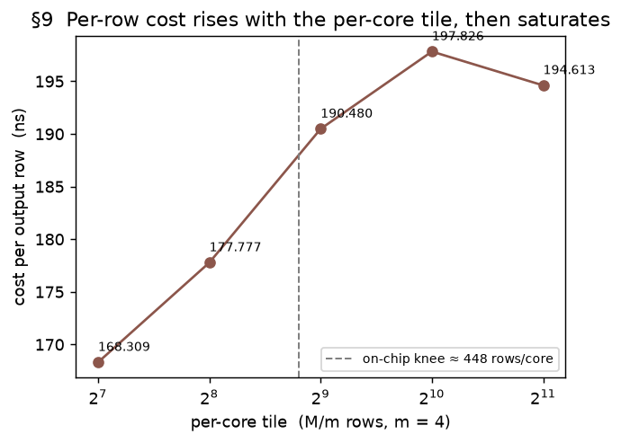
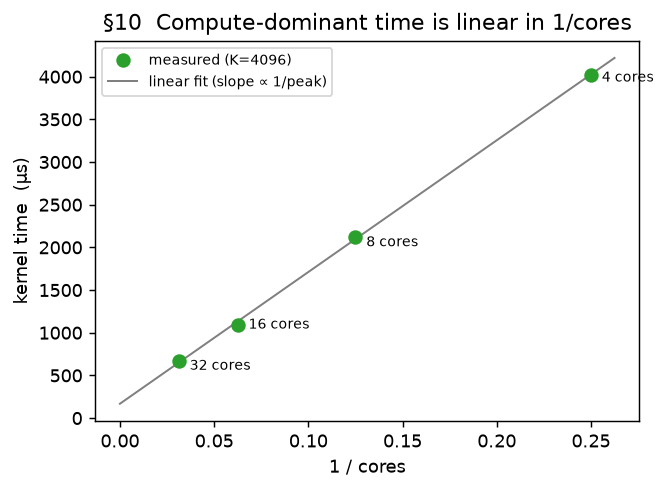
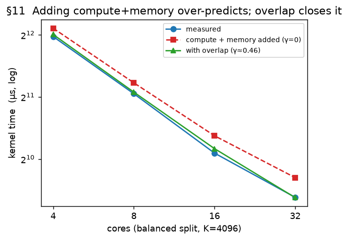

# Deriving a Cost Model for the IBM Spyre Accelerator

*Working draft. This is the long-form DERIVATION: how each term of the model was arrived
at, starting from an observation in the sweep data, then a question, a hypothesis, an
isolation experiment, and the resulting model form — validated offline with
`notes/eval_model.py` against the stored measured times (no re-run needed to re-score).
Every section follows that same arc. The concise summary lives in
[cost_model_presentation.md](cost_model_presentation.md).*

*Section skeleton — filled in iteratively, one section at a time; figures are generated
by `notes/plot_report.py` from `sweep_records.json`.*

---

## Part I — Pointwise: the gold baseline

### §1. Pointwise kernels are memory-I/O bound

Pointwise ops are the simplest kernels on the device: read one or more tensors, apply an
elementwise function, write one tensor. We use them to establish the reference every later
op is measured against.

**Observation 1 — time is linear in bytes, with no fixed cost.** Sweeping the balanced
1-read/1-write op `neg` (and `gelu`, `exp`) across sizes, the kernel time is a straight
line in the HBM bytes moved (device / stick-padded), passing through the origin:

| op | R×C | HBM traffic | kernel |
|---|---|---|---|
| `neg` | 2048×1024 | 8.4 MB | 77.6 µs |
| `neg` | 2048×4096 | 33.6 MB | 320.8 µs |
| `neg` | 4096×4096 | 67.1 MB | 646.6 µs |
| `neg` | 2048×16384 | 134.2 MB | 1314.3 µs |

A linear fit `T = a·bytes + b` over the 1R:1W set (16 points, 8.4–134 MB) gives
**R² = 0.99996**, slope → **~102 GB/s**, and intercept **b = −7 µs ≈ 0** (−9 % of the
smallest kernel — no *positive* per-kernel floor).


**Observation 2 — the arithmetic is free.** `gelu` and `exp` (a transcendental) land within
~1 % of `neg` at every size (e.g. at 8.4 MB: 78.3 / 77.1 / 77.6 µs; at 134 MB:
1312.7 / 1314.5 / 1314.3 µs). Doing real math costs the same as negating → **there is no
compute term**; the kernel time is set entirely by moving bytes.

**Model (baseline).** `T = bytes / BW` — no compute term, no fixed per-kernel cost. This
is the gold reference. One thread is deliberately left for the next section: the fitted rate here is
~102–108 GB/s, *below* the read-only peak (~150) — i.e. the effective BW is **not** a
single constant; it depends on the read/write mix (§2).

### §2. The read/write ratio changes the effective bandwidth

**Observation — the effective BW is not a single constant.** §1's fit gave ~102–108 GB/s
for `neg`, but a read-dominated op runs far *faster* per byte. Grouping ops by their
read/write mix (effective BW = `(R+W)/time`, and `w = W/(R+W)` the write fraction):

| class | example op | `w` | effBW |
|---|---|---|---|
| read-dominated | `sumrow`/`read`/`amax` (reduce → tiny write) | ~0 | ~150 GB/s |
| 2 reads : 1 write | `add`/`mul` | 0.33 | ~116 GB/s |
| 1 read : 1 write | `neg`/`gelu`/`exp` | 0.50 | ~108 GB/s |
| write-dominated | `write` = `b[1,C] + c[R,1]`: both inputs broadcast → tiny reads, full write | ~1 | ~144 GB/s |

So `bytes/BW` with one BW is wrong — the effBW falls as the traffic becomes balanced, then
climbs back toward write-only.

**Question.** What makes balanced traffic slower per byte than one-directional traffic?

**Hypothesis.** HBM is a shared bus that pays a **turnaround** cost when it switches
between reading and writing. The penalty falls on the overlap `min(R,W)`, which is 0 for
pure read or pure write and maximal at a balanced 1:1:

```
T = (R+W)/BW_peak + α·min(R,W)      ⇒   effBW = 1 / (1/BW_peak + α·f),  f = min(R,W)/(R+W)
```

This predicts a **symmetric valley** in effBW vs `w`: the peak rate at `w=0` and `w=1`,
the minimum at `w=0.5`.


Each class is one op swept at several sizes, so each shows several points; the small
vertical spread within a class is a mild size drift (~2–3 %). Two things to read off the
plot: (a) the two ends of the valley reach the **same height** — read-dominated (~150) ≈
write-dominated (~144) — so reads and writes share **one** rate, and a single `BW_peak` is
right (not separate read/write rates); (b) the `n-ary` crosses (`add3`/`add4`) sit at the
same `w=0.33` as `add` but **below** the curve — they do not fit this two-parameter model,
which is the subject of §3.

**The `BW_peak` value is op-class-soft.** Fitting *only* the pure-streaming pointwise ratios
(`neg` 1:1 + `add` 2:1) prefers **BW_peak ≈ 137, α ≈ 0.0039** — the 150 comes from reductions,
which run faster. A single `BW_peak` cannot serve both; scoring candidate values against all
the measured points shows lowering it helps pointwise but hurts reductions —

| params | pointwise RMS | reduction RMS |
|---|---|---|
| `BW_peak=150, α=0.00574` (current) | 5.1 % | **3.3 %** |
| `BW_peak=140, α=0.0047` | 4.9 % | 8.8 % (+8 bias) |
| `BW_peak=136, α=0.0038` | 4.4 % | 11.5 % (+11 bias) |

We **keep `BW_peak=150, α=0.00574`** — the better aggregate (reductions land at ~150 and
must not be sacrificed for a ~0.7 pt pointwise gain). The residual is that pure-streaming
pointwise runs ~10 % below the reduction rate — a real op-class difference, flagged not
modeled. *(Reductions are also not a perfectly clean read-only anchor: their effBW drifts
147→121 from ROWS 2048→8192, a stick-padded-output access effect examined in §5.)*

**Model.** `T = (R+W)/BW_peak + α·min(R,W)`, with `BW_peak = 150`, `α = 0.00574 ns/B`.

### §3. Chained pointwise ops pay a per-op derate

**Observation.** In §2's figure, `add3`/`add4` sat *below* the turnaround valley — they run
slower per byte than a single `add`, and it worsens with each extra operand.

**Why: the hardware add is binary.** The loop-level IR only fuses a **2-input → 1-output**
add, so an n-input sum compiles as a **chain of binary adds**, each writing an intermediate
that the next reads back:

```
add3:  op0 = arg0 + arg1            add4:  op0 = arg0 + arg1
       op1 = buf0 + arg2  (= out)          op1 = buf0 + arg2
                                           op2 = buf1 + arg3  (= out)
```

With scratchpad planning off every buffer lives in HBM, so each intermediate (`buf0`,
`buf1`) is **written and read back** — and that traffic is already in the byte count:

| op | reads | writes | R | W | `w = W/(R+W)` |
|---|---|---|---|---|---|
| `add` | arg0, arg1 | out | 2 | 1 | 0.33 |
| `add3` | arg0, arg1, **buf0**, arg2 | **buf0**, out | 4 | 2 | 0.33 |
| `add4` | arg0, arg1, **buf0**, arg2, **buf1**, arg3 | **buf0**, **buf1**, out | 6 | 3 | 0.33 |

**The round-trip bytes do not fully explain it.** Every arity has the *same* `w = 1/3`, so
the §2 turnaround model predicts the *same* effective BW (~117 GB/s) for all of them — a flat
line. But the measured effBW **declines**: 116 → 108 → 99 as `add → add3 → add4`. So there is
an extra cost *beyond* the counted round-trip bytes.


**Model.** A per-op **arity derate** captures the decline: `T × (1 + 0.075·(n_ops − 1))`. It
lands `add3` exactly (base+turn 216 µs × 1.075 = 232 µs = measured) and `add4` within ~2 %.

### Part I accuracy — every pointwise data point

Predicted vs measured for all pointwise ops (`T = (R+W)/BW_peak + α·min(R,W)`, with the
arity derate for the chained adds). **RMS 1.9 %, mean −0.2 %, range −3.0…+4.3 %** over
28 points — every point within ~4 %. (`copy` is *not* a pointwise op and is excluded here:
`x + 1.0` lowers to an `add` with a resident broadcast constant, so it is a broadcast op —
its accuracy is reported with the broadcast ops in §4.)

| op | R×C | measured µs | predicted µs | err % |
|---|---|---:|---:|---:|
| `neg` | 512×8192 | 156.6 | 160.0 | +2.2 |
| `neg` | 1024×4096 | 153.4 | 160.0 | +4.3 |
| `neg` | 2048×1024 | 77.6 | 80.0 | +3.1 |
| `neg` | 2048×2048 | 159.1 | 160.0 | +0.6 |
| `neg` | 2048×2048 | 161.3 | 160.0 | −0.8 |
| `neg` | 2048×4096 | 320.8 | 320.0 | −0.3 |
| `neg` | 2048×16384 | 1314.3 | 1280.0 | −2.6 |
| `neg` | 4096×1024 | 160.3 | 160.0 | −0.2 |
| `neg` | 4096×4096 | 646.6 | 640.0 | −1.0 |
| `neg` | 8192×512 | 159.0 | 160.0 | +0.6 |
| `gelu` | 2048×1024 | 77.1 | 80.0 | +3.7 |
| `gelu` | 2048×4096 | 319.1 | 320.0 | +0.3 |
| `gelu` | 2048×16384 | 1314.5 | 1280.0 | −2.6 |
| `exp` | 2048×1024 | 78.3 | 80.0 | +2.2 |
| `exp` | 2048×4096 | 322.4 | 320.0 | −0.8 |
| `exp` | 2048×16384 | 1312.7 | 1280.0 | −2.5 |
| `mul` | 2048×1024 | 108.9 | 108.0 | −0.9 |
| `mul` | 2048×4096 | 433.0 | 431.8 | −0.3 |
| `mul` | 2048×16384 | 1751.6 | 1727.4 | −1.4 |
| `add` | 2048×1024 | 107.0 | 108.0 | +0.9 |
| `add` | 2048×4096 | 431.7 | 431.8 | +0.0 |
| `add` | 2048×16384 | 1757.0 | 1727.4 | −1.7 |
| `add3` | 2048×1024 | 232.2 | 232.1 | −0.0 |
| `add3` | 2048×4096 | 934.4 | 928.5 | −0.6 |
| `add3` | 2048×16384 | 3740.3 | 3713.9 | −0.7 |
| `add4` | 2048×1024 | 375.6 | 372.5 | −0.8 |
| `add4` | 2048×4096 | 1523.1 | 1489.9 | −2.2 |
| `add4` | 2048×16384 | 6146.0 | 5959.5 | −3.0 |

---

## Part II — Other memory-bound ops

### §4. Broadcast: a broadcast operand is loaded once — and raises the effective BW

A *broadcast* operand is a small tensor (a row `[1,C]`, a column `[R,1]`, or a scalar)
added/multiplied against a full tensor and reused across the broadcast dimension. It has
two effects, both distinct from a plain 1R:1W op.

**(a) I/O counting — loaded once.** `bcast` (`a[R,C] + b[1,C]`) costs about the same as a
single streaming pass over `a`, not two full reads: the operand `b` is counted at its own
(one-row) device size, loaded once, not scaled up to the output.

**(b) A broadcast operand raises the effective bandwidth.** We report each op's *effective
bandwidth* — `(R + W) / time`, the total HBM bytes moved divided by the kernel time. At
well-filled sizes (ROWS ≥ 2048) the four broadcast-operand ops run above `neg`'s steady ~105:

| op | effective BW `(R+W)/time` (GB/s), ROWS=2048, COLS 2048–16384 |
|---|---:|
| `neg` (1R:1W baseline) | ≈ 105 |
| `copy` = `x + 1.0` (add a broadcast scalar) | 118–119 |
| `bcast` (`a + b[1,C]`) | 117–123 |
| `bcastcol` (`a + b[R,1]`) | 118–121 |
| `mulbcast` (`a * b[1,C]`) | 115–123 |


A dedicated COLS sweep confirms it: all four hold **~117–118 GB/s across COLS 2048–16384**
(the COLS=1024 points sit a little higher — small-tensor noise). The same lift shows up for
three different adds and a multiply, so it comes from *having a broadcast operand*, not from
a particular instruction. Each of these ops also streams a full input `a[R,C]`, whose cost
dominates and does not depend on the operand's residency, so the effective bandwidth stays
flat with size — these ops do **not** degrade at large C (contrast `write` below).

**Model.** An op that streams a full input together with a broadcast operand is given the
effective bandwidth `bw_broadcast = 118 GB/s`, using the same per-op-bandwidth mechanism as
the transport ops (§6). `copy`, `bcast`, `bcastcol`, and `mulbcast` fall in this class. The
physical reason a broadcast operand runs faster than a plain 1R:1W op is not established; the
value is calibrated to the measurements above.

**`write` — an outer-product write, modeled empirically.** `write` (`b[1,C] + c[R,1]`)
broadcasts *both* operands. On the device the row operand `b[1,C]` is only `C` elements
(~32 KB even at C=16384) and the column operand `c[R,1]` is stick-inflated to `R × 64` (each
of the R values occupies its own 64-element stick); both are small next to the `[R,C]`
output, so a naive model treats `write` as an output-dominated write. Empirically it is much
slower — its effective bandwidth falls from ~140 GB/s at small sizes to ~56 at large — and
the cost per output byte rises with COLS, and more weakly with ROWS:


At matched output size a wide (large-C) tensor is slower than a tall one (17 MB: 9.7 vs 8.2
µs/MB; 67 MB: 17.7 vs 10.4). The operands are far too small to spill, so the slowdown is in
the outer-product write itself (the output device layout is `[C/64, R, 64]`, so a larger C
means more column-stick planes and the write becomes less efficient). A clean mechanism has
not been isolated — a saturating spill term under-predicts the large cases, while the growth
is close to a power law — so we charge an **empirical extra HBM cost**, fit on the write
sweep:

```
extra_bytes  =  2.148e-7 · ROWS^1.60 · COLS^2.20   (charged at BW_peak)
```

This brings the `write` errors to ~10 % RMS (worst ~−24 % at two mid sizes) and the whole
broadcast category from 19 % to **7.7 %**. It is an admitted black-box for a rare
outer-product op, to be replaced once the mechanism is understood; a denser ROWS×COLS grid
would sharpen it.

**§4 accuracy — every broadcast data point.** RMS **7.7 %**, mean +0.1 %, over 51 points.
The error budget is concentrated in `write` (the outer-product black-box, worst −24 %) and a
few small-`ROWS` broadcast points where a fixed per-op rate slightly mis-serves the tiny cases.

| op | R×C | measured µs | predicted µs | err % |
|---|---|---:|---:|---:|
| `copy` | 2048×1024 | 67.5 | 71.1 | +5.4 |
| `copy` | 2048×1024 | 70.4 | 71.1 | +1.0 |
| `copy` | 2048×2048 | 141.2 | 142.2 | +0.7 |
| `copy` | 2048×4096 | 283.7 | 284.4 | +0.2 |
| `copy` | 2048×4096 | 286.2 | 284.4 | −0.7 |
| `copy` | 2048×8192 | 558.0 | 568.7 | +1.9 |
| `copy` | 2048×16384 | 1131.8 | 1137.4 | +0.5 |
| `copy` | 2048×16384 | 1136.4 | 1137.4 | +0.1 |
| `copy` | 8192×2048 | 604.3 | 568.7 | −5.9 |
| `copy` | 16384×2048 | 1230.8 | 1137.4 | −7.6 |
| `copy` | 16384×4096 | 2473.0 | 2274.9 | −8.0 |
| `bcast` | 64×16384 | 34.5 | 35.8 | +3.9 |
| `bcast` | 256×16384 | 180.6 | 142.5 | −21.1 |
| `bcast` | 2048×1024 | 64.8 | 71.1 | +9.8 |
| `bcast` | 2048×2048 | 136.3 | 142.2 | +4.3 |
| `bcast` | 2048×4096 | 278.5 | 284.4 | +2.1 |
| `bcast` | 2048×8192 | 570.8 | 568.9 | −0.3 |
| `bcast` | 2048×16384 | 1147.7 | 1137.7 | −0.9 |
| `bcast` | 2048×16384 | 1151.3 | 1137.7 | −1.2 |
| `bcastcol` | 64×16384 | 33.6 | 35.6 | +5.9 |
| `bcastcol` | 256×16384 | 146.6 | 142.5 | −2.8 |
| `bcastcol` | 2048×1024 | 69.6 | 73.3 | +5.4 |
| `bcastcol` | 2048×2048 | 141.1 | 144.4 | +2.3 |
| `bcastcol` | 2048×4096 | 280.9 | 286.6 | +2.0 |
| `bcastcol` | 2048×8192 | 567.8 | 570.9 | +0.5 |
| `bcastcol` | 2048×16384 | 1138.6 | 1139.7 | +0.1 |
| `bcastcol` | 2048×16384 | 1143.2 | 1139.7 | −0.3 |
| `mulbcast` | 64×16384 | 31.6 | 35.8 | +13.5 |
| `mulbcast` | 256×16384 | 177.8 | 142.5 | −19.9 |
| `mulbcast` | 2048×1024 | 63.4 | 71.1 | +12.2 |
| `mulbcast` | 2048×2048 | 136.9 | 142.2 | +3.9 |
| `mulbcast` | 2048×4096 | 277.7 | 284.4 | +2.4 |
| `mulbcast` | 2048×8192 | 568.3 | 568.9 | +0.1 |
| `mulbcast` | 2048×16384 | 1159.2 | 1137.7 | −1.9 |
| `mulbcast` | 2048×16384 | 1166.7 | 1137.7 | −2.5 |
| `write` | 64×16384 | 15.4 | 16.6 | +7.8 |
| `write` | 256×16384 | 70.7 | 75.8 | +7.3 |
| `write` | 512×1024 | 8.5 | 8.0 | −6.4 |
| `write` | 512×4096 | 29.9 | 31.6 | +5.8 |
| `write` | 512×16384 | 163.0 | 170.9 | +4.9 |
| `write` | 2048×1024 | 31.1 | 32.4 | +4.4 |
| `write` | 2048×1024 | 32.0 | 32.4 | +1.3 |
| `write` | 2048×2048 | 59.6 | 64.7 | +8.6 |
| `write` | 2048×4096 | 150.7 | 140.4 | −6.9 |
| `write` | 2048×16384 | 1190.1 | 982.9 | −17.4 |
| `write` | 2048×16384 | 1299.6 | 982.9 | −24.4 |
| `write` | 8192×1024 | 133.4 | 135.8 | +1.8 |
| `write` | 8192×1024 | 137.9 | 135.8 | −1.5 |
| `write` | 8192×2048 | 255.0 | 287.1 | +12.6 |
| `write` | 8192×4096 | 700.4 | 692.0 | −1.2 |
| `write` | 8192×16384 | 6653.1 | 6690.5 | +0.6 |

### §5. Reduction: read-dominated (with a large-ROWS residual)

**Model.** A reduction over the last axis (`sum`/`amax`/`mean`, `x[R,C] → [R]`) reads the
full input and writes only the small `[R]` result. Because almost nothing is written, the
read↔write turnaround penalty of §2 — which is charged on the *smaller* of the read and
write bytes — is essentially zero, so the kernel just runs at the peak read bandwidth,
`T ≈ R / BW_peak`. This is the same reason read-only ops sit at the top of the §2 V-curve; a
reduction needs no term of its own. At ROWS=2048 the four reductions land right on that rate
(~150 GB/s, ±5 %).

**A residual at large ROWS.** At ROWS=8192 the effective BW drops to **~123 GB/s** (a ~15–18 %
fall), consistently across COLS:

| op | ROWS=2048 (64 rows/core) | ROWS=8192 (256 rows/core) |
|---|---:|---:|
| `read` | 148–152 | 123–125 |
| `sumrow` | 145–153 | 122–128 |
| `amax` / `mean` | 150–155 | — |


**It is not the output.** The result `[R]` is stored **stick-inflated to `R × 64`** (each
reduced value occupies its own 64-element stick), but that inflated device size is *already
counted* in `W` — so the shortfall is not a missed output cost. And it is not the output for
a second reason: the shortfall **grows with COLS** (at ROWS=8192 the gap is ~20 / 45 / 85 µs
for COLS 1024 / 2048 / 4096) while the output stays a constant ~1 MB. It therefore tracks the
**input read**, not the output write: the reduction's *read* effectively runs slower at
256 rows/core (ROWS=8192) than at 64 (ROWS=2048). The mechanism is not identified, and the
data is thin (only two ROWS values), so this is flagged, not modeled. The read-rate model is
accurate for ROWS ≤ 2048 (±5 %); a dedicated ROWS sweep is needed to characterize the
large-ROWS falloff.

**Cross-core combine.** When the reduced axis is split across cores there is a ring combine;
it is provably tiny (bounded by ~`cores × per-elem`, sub-noise), so it is carried but inert.

**§5 accuracy — every reduction data point.** RMS **7.9 %**, mean −1.8 %, over 24 points. The
model is within ~5 % everywhere at ROWS = 2048; the entire error budget is the large-ROWS
read slowdown (the six ROWS = 8192 rows, −11…−18 %) discussed above and flagged, not fit.

| op | R×C | measured µs | predicted µs | err % |
|---|---|---:|---:|---:|
| `read` | 2048×1024 | 30.1 | 31.2 | +3.8 |
| `read` | 2048×2048 | 57.6 | 59.2 | +2.8 |
| `read` | 2048×2048 | 59.5 | 59.2 | −0.6 |
| `read` | 2048×4096 | 112.8 | 115.1 | +2.1 |
| `read` | 2048×8192 | 222.9 | 226.9 | +1.8 |
| `read` | 8192×1024 | 144.7 | 124.9 | −13.7 |
| `read` | 8192×2048 | 281.8 | 236.7 | −16.0 |
| `read` | 8192×4096 | 545.1 | 460.4 | −15.5 |
| `sumrow` | 2048×1024 | 30.6 | 31.2 | +1.9 |
| `sumrow` | 2048×2048 | 58.8 | 59.2 | +0.7 |
| `sumrow` | 2048×2048 | 59.0 | 59.2 | +0.3 |
| `sumrow` | 2048×4096 | 111.4 | 115.1 | +3.3 |
| `sumrow` | 2048×8192 | 220.5 | 226.9 | +2.9 |
| `sumrow` | 8192×1024 | 139.8 | 124.9 | −10.7 |
| `sumrow` | 8192×2048 | 277.0 | 236.7 | −14.5 |
| `sumrow` | 8192×4096 | 559.7 | 460.4 | −17.7 |
| `sumcol` | 2048×2048 | 70.6 | 74.3 | +5.2 |
| `sumcol` | 2048×8192 | 292.9 | 297.1 | +1.4 |
| `amax` | 2048×2048 | 57.6 | 59.2 | +2.8 |
| `amax` | 2048×8192 | 219.7 | 226.9 | +3.3 |
| `mean` | 2048×2048 | 58.8 | 59.2 | +0.6 |
| `mean` | 2048×8192 | 218.9 | 226.9 | +3.7 |
| `sumall` | 2048×2048 | 54.2 | 55.9 | +3.2 |
| `sumall` | 2048×8192 | 212.2 | 223.7 | +5.4 |

### §6. Transport ops are copies with an access-pattern effective bandwidth

**Observation.** "Transport" ops rearrange data without doing arithmetic: `transpose`
(`x.transpose(0,1)`), and concatenation `cat0`/`cat1` (`torch.cat([x, x], dim=0)` / `dim=1`).
In the compiler's intermediate representation each of these lowers to the **exact same
primitive as a plain copy** — a `clone` — with no compute. We verified this directly: the
per-kernel operation name recorded for `transpose`, `cat0`, `cat1` (and the 3-D
`transpose_outer`) is `clone`, identical to what a trivial copy emits, whereas `neg` records
`neg`. So a transport op moves bytes and nothing else; the *only* thing that distinguishes it
from a copy is **how it walks memory** — which input element lands in which output position.

**Question.** If they are all byte-copies, do they all run at the plain-copy bandwidth of
§1–§2 (~105 GB/s effective), or does the memory-walk pattern change the effective bandwidth?

**What the data shows.** Effective bandwidth here means the same `(R+W)/time` as §4 — total
bytes read plus written, divided by kernel time. Two facts stand out (figure below):


- **A plain copy is not a single rate.** `neg` on large operands drifts between ~102 and
  ~112 GB/s depending on shape (a tall-thin operand with few rows per core runs at the fast
  end — the *same* rows-per-core sensitivity we will return to). So "the copy rate" is a
  band, not a constant.
- **`transpose` is unusually stable and fast: ~116 GB/s at *every* shape** we tested
  (aspect ratios from 512×8192 through 8192×512, and sizes up to 4096×4096), varying by only
  ±1.5 %. It sits at or just above the top of the copy band and — unlike a plain copy — does
  not drift with shape. Note `transpose` is a *balanced* copy (it reads and writes the same
  number of bytes), so this is not a read-vs-write-ratio artifact; it is a genuinely stable,
  slightly-faster copy.

**Model.** Because `transpose`'s rate is both stable and distinct, we give it a **fixed
effective bandwidth of 116 GB/s** — read from the IR (a transpose is recognizable as a copy
whose write index swaps the innermost 64-element block with an outer axis). Throughout this
report a **stick** is that 64-element block: the hardware stores tensors in 128-byte-aligned
chunks of 64 half-precision values, and a row whose length is not a multiple of 64 is padded up
to one. Everything else falls out of the copy band:

| op | memory walk | effective BW (GB/s) | how it is modeled |
|---|---|---|---|
| `transpose` | swaps the 64-elem block with a row axis | **116**, flat across all shapes | fixed 116 override |
| `cat1` | concatenate on the outer (non-block) axis | ~108 | none — the default copy model (§2) |
| `cat0` | concatenate on the block axis | 96 → 63 → 59 as size grows | provisional fixed 60 (see below) |
| `transpose_outer` | 3-D swap of two outer axes | 100 → 89 as size grows | none — default copy model |

**Why `transpose` might be faster is left open.** A stable +~10 % over a same-shape plain
copy is real (it is well outside the ±1.5 % scatter), but we do **not** have a confirmed
mechanism for *why* rearranging the block layout should be faster than a contiguous copy, so
we commit only the measured number, not an explanation. (It is close to the ~118 GB/s "fast
copy" rate seen for broadcast-operand ops in §4; whether these are the same underlying effect
is an open question, not a claim.)

**Two honestly-thin cases.** `cat0` and `transpose_outer` are *not* flat — their effective
bandwidth **falls as the operand grows** (`cat0` 96→59, `transpose_outer` 100→89), and each
was measured at only two or three near-square shapes with no aspect-ratio sweep. They are on
equal footing: both are size-dependent copies we have not yet characterized.

- `cat0` (concatenate along the 64-element block axis) writes interleaved sub-block pieces;
  we currently pin it to a **fixed 60 GB/s**, which fits the two large points (±7 %) but is
  ~40 % too low at the smallest point. This is a provisional value, not a settled one.
- `transpose_outer` is left on the default copy model; that over-predicts its bandwidth at
  the largest size, giving the section's worst error (−15 % at 4096×4096). It is flagged, not
  fit.

A dedicated aspect-ratio × size sweep for both is queued (see the appendix) so `cat0` and
`transpose_outer` can be modeled as size-dependent rates rather than a constant.

**§6 accuracy — every transport data point.** RMS **5.6 %**, mean −1.8 %, over 13
points. `transpose` is essentially exact everywhere; the error budget is entirely the two
size-dependent copies.

| op | R×C | measured µs | predicted µs | err % |
|---|---|---:|---:|---:|
| `transpose` | 512×8192 | 146.0 | 144.6 | −0.9 |
| `transpose` | 1024×4096 | 144.9 | 144.6 | −0.2 |
| `transpose` | 2048×2048 | 145.5 | 144.6 | −0.6 |
| `transpose` | 2048×2048 | 145.3 | 144.6 | −0.5 |
| `transpose` | 4096×1024 | 142.7 | 144.6 | +1.4 |
| `transpose` | 4096×4096 | 575.6 | 578.5 | +0.5 |
| `transpose` | 8192×512 | 143.7 | 144.6 | +0.7 |
| `cat1` | 2048×2048 | 231.0 | 215.9 | −6.5 |
| `cat1` | 4096×4096 | 935.0 | 863.7 | −7.6 |
| `cat0` | 2048×2048 | 396.6 | 424.9 | +7.1 |
| `cat0` | 4096×4096 | 1709.4 | 1754.1 | +2.6 |
| `transpose_outer` | 2048×2048 | 1340.0 | 1280.0 | −4.5 |
| `transpose_outer` | 4096×4096 | 6010.8 | 5120.0 | −14.8 |

---

## Part III — Matmul: memory *and* compute

A matrix multiply `A[M,K] @ B[K,N] → C[M,N]` is the first op in this report that is not a
pure memory copy: it performs `M·N·K` multiply-accumulate operations ("MACs" — one multiply
plus one add) on the **systolic array**, the accelerator's grid of compute lanes through which
operands stream and accumulate, and it runs across many cores in parallel. The compiler
component that decides how to spread the work — the **planner** — divides the output into a grid
of `m × n` tiles (and *can*, in principle, also split the shared `K` dimension into `k`
pieces, though as we will see it strongly avoids this); the number of cores used is `m·n·k`.
Two quantities recur below: the **per-core tile** (the `M/m` rows by `N/n` columns of the output
each core computes) and the **bytes read/written** (`R`, `W`) from off-chip memory (HBM).

### §7. Setup: matmul time is not explained by memory traffic alone

**Observation.** For every op in Parts I–II, kernel time was fully accounted for by the bytes
moved. Matmul is different: its measured time is far larger than its HBM bytes would predict
under the copy model, and the excess grows with `M·N·K` — the MAC count — not with the byte
count. A `2048³` matmul moves the same order of bytes as a large copy but takes several times
longer. So matmul needs a second term, a **compute** term, on top of memory.

**Question.** How do the memory term and the compute term **combine** into one kernel time —
do they simply add, or does the accelerator do them at the same time?

**Strategy (and an honest caveat).** We build the model one term at a time, each in a regime
where that term dominates: first the memory term (on matmuls with almost no compute), then the
compute rate (on matmuls that are almost all compute), then how the two overlap. This ordering
is how the terms are *motivated* and is clean for the compute rate (§10), which is fixed by a
slope that does not depend on the other terms. It is **not** a strict one-way isolation for the
memory and overlap terms: as we show in §8 and §11, the memory rate and the overlap factor are
**correlated** and were ultimately co-fit, not locked in sequence. We flag that explicitly
where it matters rather than claim a false independence.

### §8. The memory term — measured on compute-free matmuls

**Observation.** To see the memory term alone, we use matmuls where compute is negligible: a
very thin `K` (the output `C[M,N]` dominates → the kernel is **write-heavy**), and a very thin
`M` (a tiny output, large operands → **read-heavy**). In these corners the time tracks bytes,
as in Part I.

**What the data shows — one effective rate, at the copy peak, not two.** An earlier fit allowed
reads and writes to run at *different* rates and returned `BW_read ≈ 143`, `BW_write ≈ 156`
GB/s. We do **not** endorse those two numbers, for a concrete physical reason: **156 GB/s
exceeds the 150 GB/s peak** established for a plain copy in §1, and a write cannot be faster
than the memory system's peak. Re-examining the compute-free points, the dominant-operand rate
(dominant bytes ÷ time) is ~118–148 GB/s for the write-heavy corners and ~123–136 GB/s for the
read-heavy corners — **overlapping ranges, both entirely below 150**, with no sign of a distinct
faster write rate. The apparent 156 was an **artifact**: the two rates were fit on *disjoint*
shape sets and quietly absorbed a little of the compute-overlap that §11 handles properly.

We verified this directly. Collapsing to a **single** matmul memory rate of 150 GB/s (the copy
peak) and letting the overlap term (§11) do its job fits the realistic matmul regime *slightly
better* than the two-rate model — RMS **6.9 %** vs 7.1 % — while respecting the physical peak.

- **Model (recommended).** `memory = (R + W)/150 + α·min(R,W)` — the *same* form as §2 (peak
  bandwidth plus the read/write turnaround `α = 0.00574 ns/B`), with no separate write rate.
- **Note on the shipped parameters.** The current code still carries the two-rate `143 / 156`
  values; this section documents that a single 150 GB/s rate is equal-or-better and physically
  sound, and recommends adopting it. The read/write split is **not identifiable** from these
  data and should not be presented as a measured hardware fact.


### §9. A split penalty: the per-core operand tile, re-read from memory

**Observation.** With the memory and compute terms in place, balanced high-core matmuls leave a
residual that **grows with the per-core tile size** (large `M/m` or `N/n`): each core's slice
of the work costs more per byte as it gets bigger. Across a fixed-split size sweep, the measured
time per output row rises about **18 %** from a small per-core tile to a large one and then
**saturates** — a classic "you've run out of on-chip room" signature.

**Question.** Is the extra cost driven by the *number of cores* an operand is broadcast to
(fanout), or by the *size of each core's tile*?

**What the data shows.** A per-core operand tile that no longer fits in on-chip memory must be
re-streamed from HBM for reuse — extra traffic we call **spill** — and it saturates once the
whole tile is being re-read. We model spill as a re-read of the operands past an on-chip
capacity knee (the tile size at which reuse stops fitting):

```
spill = |A|·f(M/m) + |B|·f(N/n),   f(t) = min(1.70, 1.10·log₂(t / 448))
```

charged at the read rate — a saturating (logarithmic, capped) growth with a knee near a
per-core tile of ~448 rows/columns.

**Two honesty flags the challenge raised, kept in the open:**

- **Fanout is not cleanly ruled out.** The sweeps meant to falsify a fanout term varied fanout
  and the matrix dimension *together* (more cores also meant a bigger matrix), so they confound
  fanout with total work, and those particular runs lack the stored features needed to re-score.
  We therefore state the weaker, honest claim: the residual **tracks per-core tile size**, and
  fanout was **not separately identified** — not "fanout is proven irrelevant."
- **There is a co-resident, opposite-sign residual.** While large per-core tiles are slightly
  *under*-predicted (what `spill` corrects), *small* per-core tiles (e.g. `N/n = 128`) are
  **over**-predicted by tens of percent — a small-tile floor from fixed per-kernel overhead and
  **under-fill** (too few rows to keep every compute lane busy), which the spill term does not
  address. On the decouple sweeps, adding the spill term barely changes overall
  error because these two residuals pull in opposite directions. `spill` is thus a real
  large-tile trend, carried but not claimed to be the whole story.



### §10. The compute rate — the one cleanly-isolated term

**Observation.** With memory (§8) subtracted, the remaining time scales as `MACs / cores` —
the work each core does. Doubling the cores on a fixed matmul halves this remaining time.

**Model.** `compute = MACs / cores / peak`, where `peak` is the sustained MAC rate per core.

**Why this term is trustworthy.** `peak` is the **slope** of kernel time against `1/cores` at a
fixed matmul — and a slope is insensitive to any constant offset, including the overlap term of
§11. So unlike the memory rate, `peak` is pinned without circularity. Compute-dominant cores
scans (cores 4→32, large `K`) give a clean straight line; the fitted `peak ≈ 1140–1160
MAC/ns/core` predicts these runs to **2–3 %**. (Its absolute level is still *mildly* correlated
with the overlap factor — `peak = 1200` with the same overlap fits nearly as well — so we quote
a small range, not a spuriously exact number.)



### §11. Compute and memory overlap — they do not simply add

**Observation.** Adding compute and memory (`T = compute + memory`) **over-predicts** balanced
high-core matmuls: the real kernel is faster than the sum of its parts. Turning the overlap off
(setting the overlap factor to zero) inflates the error on the compute-dominant set from ~3 % to
~15 % — so the effect is real, not fitting noise.

**Model.** `T = compute + memory − γ·min(compute, memory)` — the *smaller* of the two terms is
partly hidden behind the larger, because the systolic array computes while operands stream. The
fitted overlap fraction is `γ ≈ 0.45–0.46`.

**Where γ actually comes from — an honest correction.** An earlier draft claimed γ was pinned by
a dedicated small-shape sweep (`M=N=512/768, K=64`). It is not: **that sweep, taken alone,
prefers γ = 0** (its error is lowest with no overlap and grows as γ increases), because those
shapes are tiny (5–17 µs) and dominated by a fixed-overhead floor — one point even gets *slower*
when cores double, which no overlap model can produce. We discard that sweep as a γ estimator.
γ ≈ 0.46 is instead pinned by the **aggregate of balanced high-core matmuls**, where the
additive model visibly over-predicts. And because γ trades off against the memory rate (§8),
the honest statement is: **overlap is real and sizable; its exact fraction (~0.45) is
correlated with the memory rate and pinned by the balanced-regime aggregate, not by any single
clean sweep.**



### §12. Where the base model breaks: out-of-regime residuals

The base model (§8–§11) predicts **planner-realistic** matmuls — those a real compiler would
emit — to **RMS ~7 %** (mean ≈ 0). "Planner-realistic" means: the `K` dimension kept whole,
balanced output tiling (each fanout ≤ 8), and non-tiny operands. Three specific departures from
that envelope leave large, understood residuals; we flag rather than fit them.

- **§12a. Non-power-of-2 `N`.** Stepping `N` by 64 across a stick boundary makes measured time
  **non-monotonic**, and the base model (which counts bytes on a stick-aligned full `N`) can
  even invert the ranking of two nearby sizes. The cause is per-core-tile **padding**: when
  `N/n` is not a multiple of the 64-element stick it rounds up, adding work the full-`N` byte
  count misses. Thin data (a short `N` sweep); modeled qualitatively, flagged (~−16 %).

- **§12b. Forced `K`-splits.** If the shared `K` dimension is split across cores, each core
  produces a partial result and the partials are summed in a cross-core combine — a real cost
  the model does **not** charge, because the compiler's own planner penalizes `K`-splits and
  avoids them for these shapes (it is a strong preference, not an absolute prohibition). Forcing
  a `K`-split by hand therefore makes the model **under-predict by ~40 %**. These runs are
  deliberately out-of-planner-regime; the −40 % is a known, unmodeled cross-core-combine cost,
  not a surprise.

- **§12c. Tiny operands and skewed splits.** Very small matmuls (a few µs) sit on a
  fixed-overhead floor the model omits (it over- or under-shoots by tens of percent), and
  extreme lopsided splits (one fanout ≫ 8) under-fill the systolic array. Both are bounded and
  flagged as outside the shapes a planner would choose.

**Part III accuracy — matmul, by regime.** On the planner-realistic envelope the model is
within a few percent on the bulk, with residual tails at small per-core tiles and the
skewed-split edge; the out-of-regime rows carry the large, understood errors above.

| regime | n | RMS % | mean % | err range | status |
|---|---:|---:|---:|---|---|
| planner-realistic (K whole, fanout ≤ 8, non-tiny, pow-2 `N`) | 34 | **7.1** | +0.5 | −16…+28 | modeled; tails at small `N/n` and 8×4 splits |
| single effective rate (150 GB/s) — same rows, recommended form | 34 | **6.9** | +0.2 | −16…+27 | recommended (§8) |
| forced `K`-split (`k ≥ 2`) | 9 | 40.7 | −40.5 | −48…−36 | out-of-regime; unmodeled K-combine (§12b) |
| skewed split (fanout > 8) | 7 | 31.8 | −22.8 | −47…+6 | out-of-regime under-fill (§12c) |
| tiny operands | 20 | 21.7 | +2.5 | −35…+52 | fixed-overhead floor (§12c) |
| non-power-of-2 `N` | 1 | 16.1 | −16.1 | — | padding sawtooth, thin data (§12a) |

Representative planner-realistic points (the regime the model is built for):

| M×K×N | split (m×n×k) | measured µs | predicted µs | err % |
|---|---|---:|---:|---:|
| 2048×2048×2048 | 2×2×1 (cores 4) | 2013.5 | 2085.3 | +3.6 |
| 2048×2048×2048 | 2×4×1 (cores 8) | 1095.9 | 1108.5 | +1.1 |
| 2048×2048×2048 | 4×8×1 (cores 32) | 384.4 | 360.6 | −6.2 |
| 4096×2048×2048 | 4×8×1 (cores 32) | 806.1 | 788.1 | −2.2 |
| 8192×2048×2048 | 4×8×1 (cores 32) | 1594.2 | 1608.5 | +0.9 |
| 2048×4096×2048 | 4×8×1 (cores 32) | 4021.0 | 4115.5 | +2.4 |
| 2048×2048×4096 | 4×8×1 (cores 32) | 668.0 | 666.1 | −0.3 |

---

## Part IV — Coarse tiling *(next report — deferred)*

Placeholder: the fused-kernel reframe (external input counted once), rows-driven underfill
(`rpc`), and the categorical LX-spill. Already largely isolated; written up separately.

---

### Appendix — reproducibility

- **Offline scoring:** `notes/eval_model.py` recomputes accuracy for any model version from
  the stored `(features, measured_time)` dataset — no hardware. `--params k=v` re-scores a
  proposed parameter instantly.
- **Figures:** `notes/plot_report.py` regenerates every figure from `sweep_records.json`.
- **Sweeps:** each section's data comes from the profiling sweeps under
  `docs/source/user_guide/examples/` (a master runner chains them and folds the results into
  `sweep_records.json`).
- **Queued sweeps (awaiting hardware), to close the residuals flagged above:**
  - `run_reduction_rows_sweep.sh` — the reductions over ROWS = 2048/4096/8192/16384 at a couple
    of COLS, to characterize the large-ROWS read slowdown of §5 (currently backed by only two
    ops at one large ROWS).
  - `run_transport_shape_sweep.sh` — `cat0` and `transpose_outer` over size × aspect ratio, to
    replace the provisional fixed/default rates of §6 with size-dependent ones.
